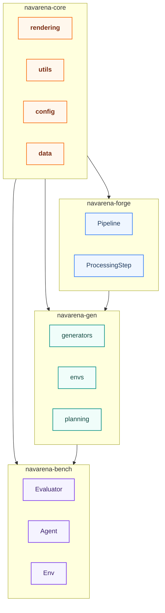

# Architecture Design

This document describes NavArena's overall architecture, the four sub-projects, data flow, and technology stack.

## Four Sub-Projects Relationship

| Project | Responsibility | Dependencies |
|---------|----------------|--------------|
| **navarena-core** | Shared core: rendering (gsplat), config, data structures, utilities | - |
| **navarena-forge** | Asset preprocessing: PLY → V1 format (coordinate norm, occupancy grid, nav region) | navarena-core |
| **navarena-gen** | Data generation: multi-task Episode generation (PointNav, VLN, etc.), Parquet write | navarena-core, V1 assets |
| **navarena-bench** | Evaluation: 3D GS env, agent driver, metrics, replay | navarena-core, V1 assets, Episode data |

## Data Flow

1. **Asset preprocessing**: Raw 3DGS PLY via `coordinate_normalize` → `pcd_to_map` → `valid_region_estimate` → `compress_ply`, producing `manifest.json`, `aligned.ply`, `nav_map.pgm`, `nav_mask.png`, etc.
2. **Data generation**: Load scenes from V1 assets, sample starts and goals, plan A* trajectories, optionally generate VLN instructions, write Parquet.
3. **Evaluation**: Load Episodes, drive agents in 3D GS env, compute SR, SPL, NE, optionally generate replay video.

## Technology Stack

| Layer | Technology |
|-------|-------------|
| **Workspace** | uv workspace (Python dependency management) |
| **Rendering** | gsplat (3D Gaussian Splatting), PIL |
| **Data** | PyArrow/Parquet, NumPy, PyTorch |
| **Config** | YAML, Pydantic |
| **Docs** | MkDocs Material, i18n |

## Extension Points

All modules use a registry for extensibility:

- **navarena-forge**: `@StepRegistry.register` for new Pipeline steps
- **navarena-gen**: `BaseGenerator`, `BaseSimEnv`, `BaseInstructionGenerator` for new tasks, envs, instruction types
- **navarena-bench**: `Evaluator`, `Env`, `Agent`, `Metric` for new evaluators, envs, agents, metrics

See [Extending Guide](../navarena-bench/extending.md) for details.
