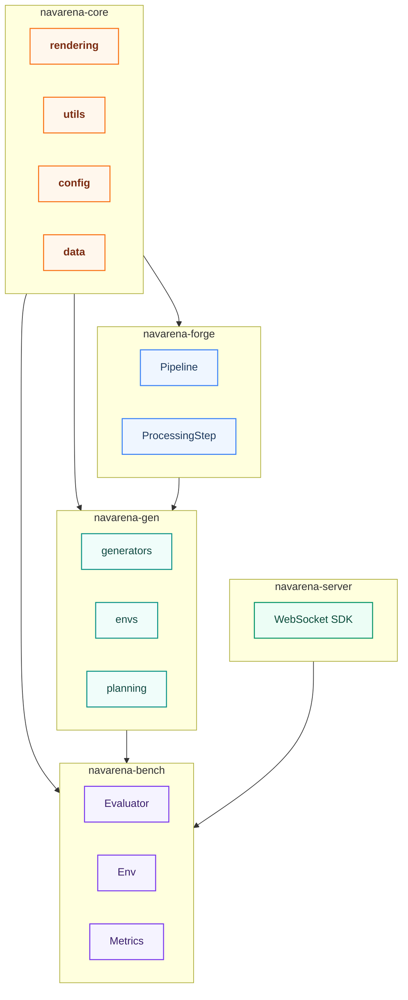
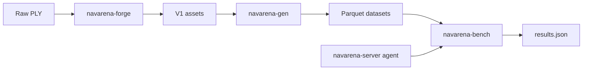

# Architecture Design

NavArena’s workspace includes **shared libraries**, **asset tooling**, **dataset generation**, a **WebSocket agent SDK**, and **evaluation**.

## Components

| Project | Responsibility | Dependencies |
|---------|----------------|--------------|
| **navarena-core** | Config, Parquet episode model, GS rendering utilities, path resolution | — |
| **navarena-forge** | PLY → V1 assets | navarena-core |
| **navarena-gen** | Multi-task Parquet datasets | navarena-core, V1 assets |
| **navarena-server** | Agent WebSocket server SDK | numpy, msgpack, websockets |
| **navarena-bench** | Task protocols, GS env, metrics, `results.json` | navarena-core, navarena-server, episodes |

Policies run **outside** the bench repo — implement `NavigationModelServer` and point bench `server.url` at your process.

## Data flow

## Technology stack

| Layer | Technology |
|-------|------------|
| Workspace | uv, optional conda (`environment.yml`) |
| Rendering | gsplat / navarena-core GS helpers |
| Data | PyArrow, Parquet, NumPy |
| Config | YAML + dataclass-style configs (`navarena_core.config`) |
| Agent I/O | WebSocket, msgpack |

## Extension points

- **navarena-forge**: `ProcessingStep` registry  
- **navarena-gen**: generators, envs, instruction strategies  
- **navarena-bench**: `Env`, `Evaluator`, `GoalVerifier`, `Metric`, `Dataset` entry points  
- **navarena-server**: subclass `NavigationModelServer`

See [Extending](../navarena-bench/extending.md).
