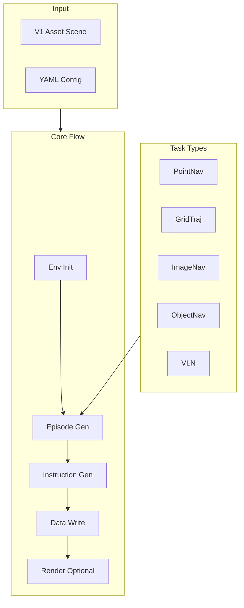

# Data Generator Overview

The Data Generator (**navarena-gen**) produces **Parquet** navigation datasets from **V1** 3D Gaussian Splatting scenes. Supported **`task_type`** values: **PointNav**, **GridTraj**, **ImageNav**, **ObjectNav**, and **VLN** (instruction-following). Grid-based sampling and **A\*** planning apply to PointNav / ImageNav / ObjectNav / VLN-style episodes; **GridTraj** uses a different trajectory pattern (see [Pipeline Stages](pipeline.md)).

!!! info "Prerequisites"
    Complete [asset preprocessing](../asset-preprocessing/) so scenes exist under `$NAVARENA_DATA_DIR/assets/` (manifest.json, nav_map.pgm, nav_map.yaml, etc.).

## Core Features

- **Multi-task** — `pointnav`, `gridtraj`, `imagenav`, `objectnav`, `vln`
- **GS environment** — 3DGS implemented; Habitat / Isaac adapters are placeholders
- **V1 assets** — Reads unified scene layout from `$NAVARENA_DATA_DIR/assets/`
- **VLN instructions** — Strategies: `simple_direction`, `path_based`, `object_goal`; languages via `language` (e.g. `zh-CN`, `en-US`) in config
- **Parallel generation** — Optional multi-worker episode generation
- **Crash recovery** — Checkpoint + `--resume`
- **Explorer** — Optional web UI (`scripts/run_viewer.py`)

## Architecture



## Data generation flow (logical)

1. **Environment init** — Load manifest, maps, optional labels / nav mask; build planner where needed.
2. **Episode generation** — Task-specific generators (grid sampling, goals, GT path — see [Pipeline Stages](pipeline.md)).
3. **Instruction generation** — VLN tasks attach `Instruction` records via configured strategy.
4. **Data write** — Streaming Parquet chunks with checkpoints.
5. **Rendering (optional)** — `render_episodes.py` for goal images / trajectory videos under `videos/`.

## Output structure

Resolved under **`$NAVARENA_DATA_DIR/datasets/{dataset_name}/{scene_path}/{task_type}/`** (see `GeneratorConfig.get_output_base_dir()` in code). Example:

```
datasets/{dataset_name}/
├── dataset_meta.json
└── {scene_path}/                    # e.g. x2robot/17dc3367
    ├── scene_meta.json
    └── {task_type}/                 # pointnav | gridtraj | imagenav | objectnav | vln
        ├── meta/
        │   ├── info.json
        │   └── episodes.parquet
        ├── data/
        │   └── chunk-000000/        # zero-padded chunk index (typical layout)
        │       ├── trajectories.parquet
        │       └── episodes.parquet
        └── videos/                  # optional; from render_episodes.py
            ├── goal_images/         # ImageNav etc.
            └── ...
```

## Episode format (logical)

Parquet stores the same information as the logical episode model (positions, goals, `gt_path`, optional `instructions`). See [Navigation Training Data Format](../definitions/nav-data-format.md).

**Quaternion convention:** use **`[x, y, z, w]`** in examples unless a specific subsystem documents otherwise.

## Use cases

1. **Training data** — Large-scale PointNav / VLN / ObjectNav corpora  
2. **Evaluation sets** — Held-out scenes / splits via `split`  
3. **Visualization** — Render MP4s under `videos/` for debugging  

## Dependencies

Requires preprocessed **V1** assets ([navarena-forge](../asset-preprocessing/)) and the NavArena Python environment (`conda` env `navarena`, `uv sync`).

**See also**: [Pipeline Stages](pipeline.md) · [Configuration](configuration.md) · [Batch Processing](batch-processing.md)
