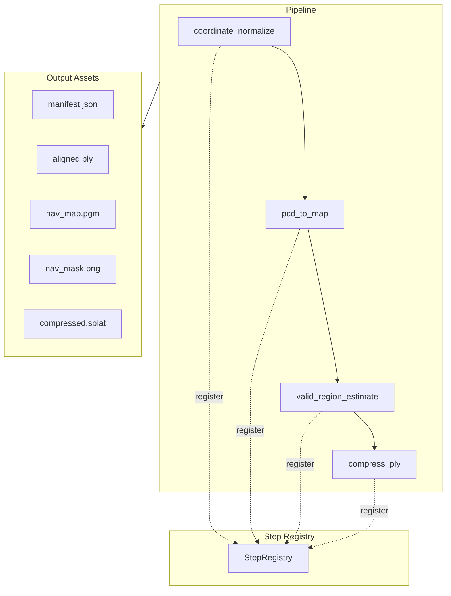

# Asset Preprocessing Overview

Asset preprocessing (NavArena-Forge / navarena_forge) is a modular pipeline that converts raw 3D Gaussian Splatting scenes into standardized embodied navigation assets. It transforms PLY point clouds into coordinate-aligned scenes, occupancy grids, navigable region masks, and optional compressed formats for use by the data generator and evaluation framework.

## Project Scope

- **Input**: Raw 3DGS PLY point clouds (from InteriorGS, ScanNet++, SceneSplat, etc.)
- **Output**: Standardized scene directories in the V1 unified asset format

## Core Architecture



### Design Patterns

1. **Template Method** - `ProcessingStep` base class enforces `validate → process → save` flow
2. **Pipeline** - Chains steps, manages intermediate artifacts and error handling
3. **Registry** - Steps auto-register via `@StepRegistry.register("name")` decorator
4. **Strategy** - Algorithms (RANSAC, Alpha Shapes) are decoupled from steps

### Adding New Steps

To add a step:

1. Create a class inheriting `ProcessingStep` under `steps/`
2. Register with `@StepRegistry.register("my_step")`
3. Import in `steps/__init__.py` and add to `pipeline.yaml`

## V1 Unified Asset Format

Each processed scene directory follows this structure:

```
{dataset}/{scene_id}/
├── manifest.json          # Metadata and provenance (schema v1.0)
├── source.ply             # Original 3DGS point cloud
├── aligned.ply           # Coordinate-normalized PLY
├── nav_map.pgm           # 2D occupancy grid (ROS-compatible)
├── nav_map.yaml           # Map config
├── nav_mask.png           # Navigable region mask
├── compressed.splat       # Compact binary (32 bytes/Gaussian, optional)
├── labels.json           # Semantic labels (optional)
└── structure.json        # Floor plan (optional)
```

### Scene ID Generation

Scene ID is the first 8 hex characters of `SHA-256("{dataset}:{original_name}")`:

- The same `(original_name, dataset)` always yields the same ID
- Example: `InteriorGS:scene_001` → `a1b2c3d4`

### Fixed Filenames

The above filenames are fixed; they are not prefixed by scene_id, for consistent downstream parsing.

## Next Steps

- Learn about **[Pipeline Steps](pipeline-steps.md)**
- See **[Configuration](configuration.md)**
- Use **[CLI Commands](cli.md)** to process scenes
- Browse assets with the **[Web Viewer](web-viewer.md)**
