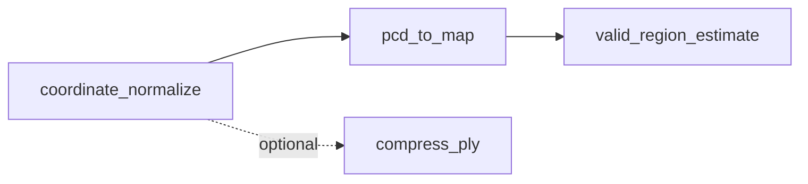

# Pipeline Steps

The asset preprocessing pipeline consists of four steps executed in order. The first three are core and required; the fourth is optional PLY compression.

## Step 1: coordinate_normalize

### Purpose

Normalize the 3D scene coordinate system so the ground plane aligns with Z=0.

### Algorithm

- RANSAC ground plane fitting
- Compute 4×4 extrinsic matrix so ground normal is [0, 0, 1] and ground height is Z=0
- Apply transform to point cloud

### Input / Output

| Input | Output |
|-------|--------|
| `source.ply` or any PLY | `aligned.ply` |

### Config Example

```yaml
ransac:
  distance_threshold: 0.02    # RANSAC distance threshold (meters)
  ransac_n: 3
  num_iterations: 1000

height_range: [-0.05, 0.05]   # Ground point height range

z_filter:
  auto_estimate: true
  z_min: null
  z_max: null
```

---

## Step 2: pcd_to_map

### Purpose

Project point cloud to a 2D occupancy grid map for path planning and collision detection.

### Algorithm

- Project 3D points to 2D (X–Y plane)
- Filter by height relative to ground (default 0.1m–0.8m)
- Output ROS-compatible PGM + YAML

### Input / Output

| Input | Output |
|-------|--------|
| `aligned.ply` | `nav_map.pgm`, `nav_map.yaml` |

### Config Example

```yaml
map:
  resolution: 0.05            # Resolution (meters per pixel)
  margins: [1.0, 1.0, 1.0, 1.0]
  occupied_threshold: 10
  invert: false

height_filter:
  min_z: 0.1                  # Height filter lower bound
  max_z: 0.8                  # Height filter upper bound
```

---

## Step 3: valid_region_estimate

### Purpose

Estimate navigable region from the PGM map and generate `nav_mask.png`.

### Algorithm

- DBSCAN outlier removal
- Alpha Shapes concave hull
- Write contour to PNG mask (255=navigable, 0=not)

### Input / Output

| Input | Output |
|-------|--------|
| `nav_map.pgm`, `nav_map.yaml` | `nav_mask.png` |

### Config Example

```yaml
parameters:
  occupied_threshold: 255
  dbscan_eps: 5.0              # DBSCAN neighborhood radius (meters)
  dbscan_min_samples: 1000
  alpha: 0.6                   # Alpha Shapes parameter
```

!!! note "Non-Fatal"
    This step is marked `fatal: false`; the pipeline continues if it fails.

---

## Step 4: compress_ply (Optional)

### Purpose

Convert PLY to compact `.splat` format for the web viewer and fast loading.

### Algorithm

- Each Gaussian compressed to 32 bytes
- Prune low-opacity Gaussians by threshold
- Sort by importance for progressive loading

### Input / Output

| Input | Output |
|-------|--------|
| `aligned.ply` or `source.ply` | `compressed.splat` |

This step is not in the default pipeline; run the `compress` command to batch-convert.

---

## Step Dependencies



!!! tip "Next Steps"
    - See **[Configuration](configuration.md)**
    - Use **[CLI Commands](cli.md)** to run the pipeline
