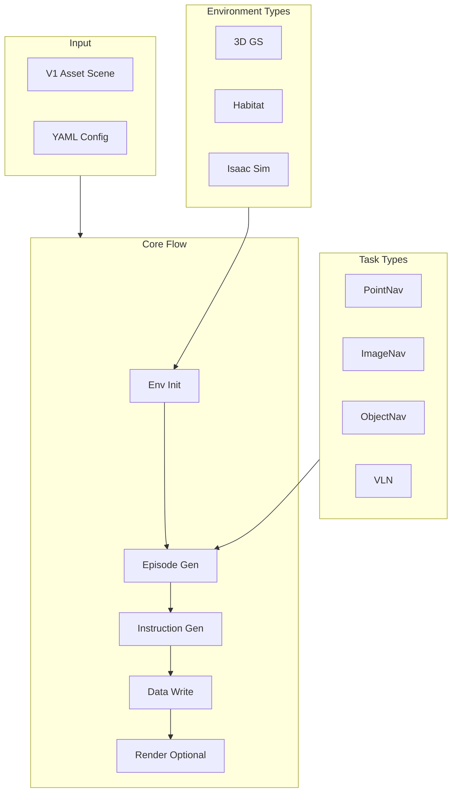

# Data Generator Overview

The Data Generator (navarena-gen) is a multi-task Vision-Language Navigation (VLN) data generation framework for PointNav, ImageNav, ObjectNav, and VLN tasks. It generates high-quality Episode data from 3D Gaussian Splatting scenes using grid sampling, path planning, and instruction generation.

!!! info "Prerequisites"
    Before using the Data Generator, complete [asset preprocessing](../asset-preprocessing/overview.md) to convert raw 3DGS scenes to V1 unified asset format (manifest.json, nav_map.pgm, etc.). V1 assets should be located under `$NAVARENA_DATA_DIR/assets/`.

## Core Features

- **Multi-Task Support** - PointNav, ImageNav, ObjectNav, VLN
- **Multi-Environment Support** - 3D Gaussian Splatting (implemented), Habitat / Isaac (placeholder)
- **V1 Asset Format** - Reads unified `navarena_assets` (manifest.json, nav_map.pgm, etc.)
- **Flexible Instruction Generation** - Strategy pattern: simple_direction, path_based, object_goal; Chinese and English
- **Parallel Processing** - Multi-worker episode generation and parallel I/O
- **Web Viewer** - Interactive data browsing

## Architecture



## Data Generation Flow

1. **Environment Init** - Load manifest.json, nav_map.pgm, nav_map.yaml from V1 assets; optionally labels.json, nav_mask.png
2. **Episode Generation** - Task-specific generators: grid start sampling + goal sampling + GT trajectory planning (A*)
3. **Instruction Generation** - VLN uses Strategy pattern: simple_direction / path_based / object_goal; zh-CN, en-US
4. **Data Write** - Episodes JSON + GT trajectory files
5. **Rendering (Optional)** - Goal images (ImageNav), trajectory videos

## Output Structure

```
navarena_data/
├── dataset_meta.json                   # Dataset-level metadata
└── scenes/
    └── {scene_id}/
        ├── scene_meta.json
        └── {task_type}/               # pointnav/imagenav/objectnav/vln
            ├── {split}.json
            ├── gt_trajectories/
            │   └── {split}_{idx}_gt.json
            ├── goal_images/           # ImageNav only
            └── rendered_videos/
```

## Episode Format

```json
{
  "episode_id": "train_000001",
  "scene_path": "x2robot/17dc3367",
  "task_type": "vln",
  "start_state": {
    "position": [1.5, -0.8, 0.0],
    "rotation": [0.0, 0.0, 0.0, 1.0]
  },
  "goals": [...],
  "instructions": [
    {"instruction_text": "Walk about 8 meters to the northeast", "language": "en-US"}
  ],
  "gt_path": {
    "trajectory_file": "gt_trajectories/train_000001_gt.json",
    "stats": {"geodesic_distance": 8.0, "num_steps": 25}
  }
}
```

## Use Cases

1. **Training Data** - Generate Episodes for VLN models
2. **Evaluation Data** - Generate PointNav, ImageNav, ObjectNav, VLN evaluation sets
3. **Trajectory Rendering** - Visualize GT trajectories in videos

## Dependencies

The data generator depends on **asset preprocessing** output in V1 format. Use [navarena-forge](../asset-preprocessing/overview.md) first to preprocess scenes.

!!! tip "Next Steps"
    - Learn about **[Pipeline Stages](pipeline.md)**
    - See **[Configuration](configuration.md)**
    - View **[Batch Processing](batch-processing.md)**
