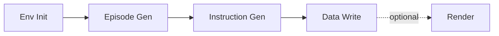

# Pipeline Stages

The data generation pipeline includes environment initialization, episode generation, instruction generation, data writing, and optional rendering. This document describes inputs, outputs, and logic for each stage.

## Stage 1: Environment Initialization

### Description

Load scene from V1 unified asset format (navarena_assets) and initialize path planner (A*).

### Input

- **scene_path**: Scene directory path (e.g. `navarena_assets/x2robot/17dc3367`)
- **V1 assets**: manifest.json (required), nav_map.pgm (required), nav_map.yaml (required), nav_mask.png (optional), labels.json (optional)

### Flow

1. Read manifest.json for scene_id, map_info
2. Load PGM occupancy grid and YAML config (resolution, origin)
3. Optionally load nav_mask.png, labels.json
4. Initialize A* path planner

### Output

- `SceneInfo`: scene_id, navigable_area, objects, map info
- Initialized `env` for episode generators

---

## Stage 2: Episode Generation

### Description

Generate Episodes by task type (PointNav, ImageNav, ObjectNav, VLN), including start, goals, and GT trajectory.

### Input

- **env**: Initialized simulation environment
- **task_config**: min_distance, max_distance, grid_spacing, instruction_type, etc.

### Flow

1. **Start sampling**: Grid sampling in navigable area by grid_spacing
2. **Goal sampling**: Sample goals with min/max distance constraints
3. **GT trajectory**: Two-stage planning (global A* + local smoothing)
4. **Task-specific logic**:
   - PointNav: Goal is 3D position
   - ImageNav: Goal is reference image (requires rendering)
   - ObjectNav: Goal is object category from labels.json
   - VLN: Natural language instruction needed

### Output

- List of Episode objects with start_state, goals, gt_path, instruction (VLN)

---

## Stage 3: Instruction Generation (VLN Only)

### Description

Generate natural language navigation instructions for VLN Episodes using a Strategy pattern.

### Instruction Types

| Type | Description |
|------|-------------|
| `simple_direction` | Direction + distance, e.g. "Walk about 8 meters to the northeast" |
| `path_based` | Step-by-step path, e.g. "Go forward, turn left, then forward" |
| `object_goal` | Object goal, e.g. "Find a bed" |

### Languages

- `zh-CN`: Chinese
- `en-US`: English

### Output

- Episode `instruction` field

---

## Stage 4: Data Writing

### Description

Write Episodes to disk: Episodes JSON and GT trajectory files.

### Output Files

- `{split}.json`: Episode list
- `gt_trajectories/{split}_{idx}_gt.json`: GT trajectories
- `scene_meta.json`, `dataset_meta.json`

---

## Stage 5: Rendering (Optional)

### Description

Run separately via `scripts/render_episodes.py` to render ImageNav goal images or trajectory videos.

### Input

- GT trajectory directory
- Scene path
- Camera config (configs/examples/camera.yaml)

### Output

- `goal_images/`: ImageNav goal images
- `rendered_videos/`: Multi-camera trajectory videos

---

## Stage Dependencies

## Next Steps

- See **[Configuration](configuration.md)**
- View **[Batch Processing](batch-processing.md)**
