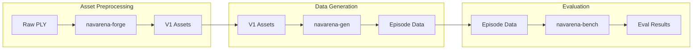
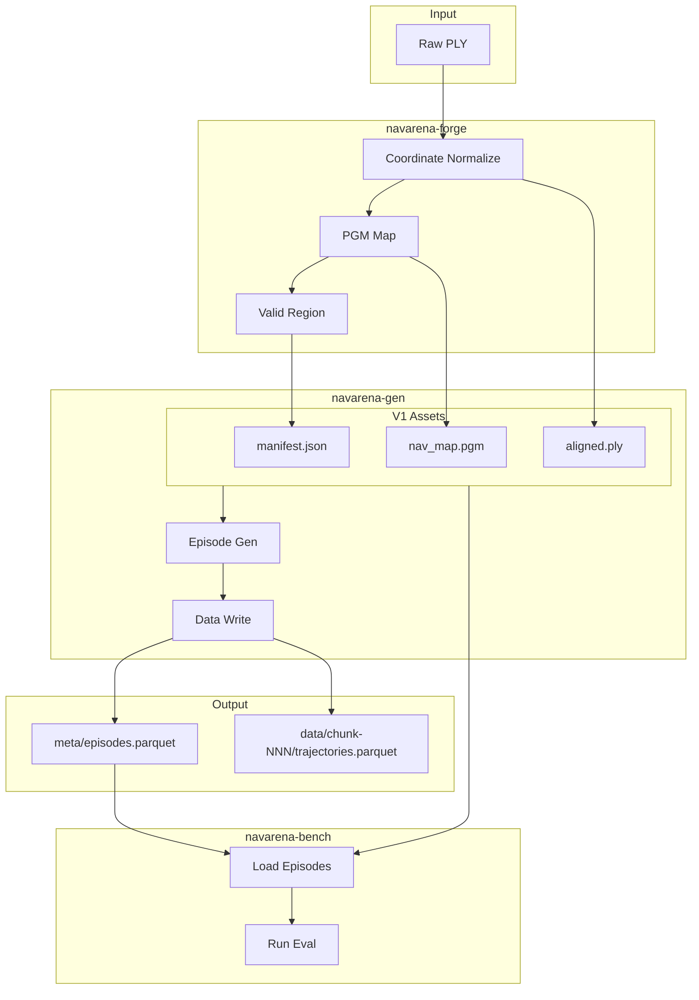

# Core Concepts

This document introduces the core concepts, terminology, and workflows of the NavArena embodied navigation infrastructure to help users understand the overall architecture.

## 1. NavArena Workflow

NavArena provides a complete toolchain from 3DGS scenes to navigation model evaluation:



1. **Asset Preprocessing** (navarena-forge): Convert raw 3DGS PLY to V1 unified asset format
2. **Data Generation** (navarena-gen): Generate training/evaluation Episode data from V1 assets
3. **Evaluation** (navarena-bench): Evaluate navigation models in simulation

## 2. Core Terminology

| Term | Description |
|------|-------------|
| **Episode** | A complete navigation task instance with start, goal, optional instructions, and GT trajectory |
| **Scene** | A 3D scene corresponding to a V1 asset directory. Identified by `dataset/scene_id` (e.g. `x2robot/17dc3367`) |
| **V1 Asset Format** | Unified scene asset directory structure with manifest.json, aligned.ply, nav_map.pgm, nav_map.yaml, nav_mask.png, etc. |
| **GT Trajectory** | Ground Truth trajectory from start to goal, used for training and evaluation |
| **Split** | Data split: train, val_seen, val_unseen, test |
| **Task Type** | pointnav (point goal), imagenav (image goal), objectnav (object goal), vln (vision-language navigation) |
| **scene_path** | Scene relative path in form `{dataset}/{scene_id}`, relative to `$NAVARENA_DATA_DIR/assets/` |

## 3. Sub-Project Responsibilities

| Project | Responsibility |
|---------|----------------|
| **navarena-core** | Core library; rendering, planning; dependency of forge, gen, bench |
| **navarena-forge** | Asset preprocessing; converts raw 3DGS to V1 format |
| **navarena-gen** | Data generation; Episodes, GT trajectories, goal images, rendered videos |
| **navarena-bench** | Evaluation framework; loads Episodes, runs agents in 3D GS env, computes metrics |

## 4. NAVARENA_DATA_DIR Layout

```
$NAVARENA_DATA_DIR/
├── shared/                    # Shared config
│   ├── camera.yaml           # Camera config
│   └── ...
├── assets/                    # V1 format scene assets
│   ├── x2robot/
│   │   └── 17dc3367/
│   │       ├── manifest.json
│   │       ├── aligned.ply
│   │       ├── nav_map.pgm
│   │       ├── nav_map.yaml
│   │       └── nav_mask.png
│   └── scannetpp/
│       └── ...
└── datasets/                  # Generated datasets (navarena-gen output, Parquet v1.0.0)
    └── {dataset_name}/
        └── {scene_path}/     # e.g. x2robot/17dc3367
            └── {task_type}/
                ├── meta/
                │   ├── info.json
                │   └── episodes.parquet
                ├── data/
                │   └── chunk-NNN/
                │       ├── trajectories.parquet
                │       └── episodes.parquet
                └── goal_images/   # ImageNav only (optional)
```

- **assets/**: Preprocessed scenes from navarena-forge; used by navarena-gen and navarena-bench
- **datasets/**: Output from navarena-gen (chunked Parquet storage); navarena-bench loads Episodes from here

## 5. Data Flow



## 6. Related Documentation

- [3D GS Asset Specification](gs-assets.md) - V1 asset format details
- [Navigation Training Data Format](nav-data-format.md) - Training data specification
- [Navigation Evaluation Data Format](eval-data-format.md) - Evaluation Episode and trajectory format
