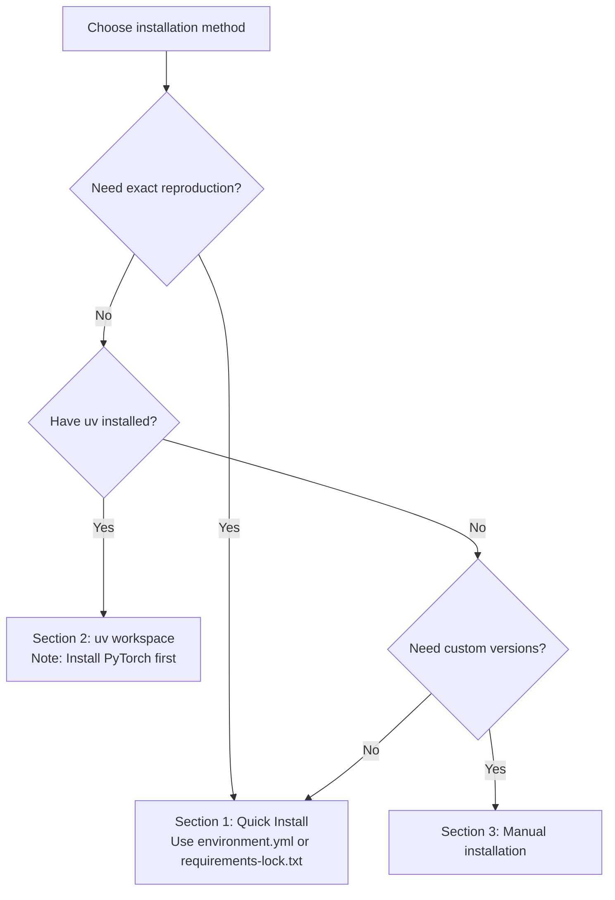

# Installation Guide

This page guides you through the installation and configuration of the NavArena embodied navigation infrastructure. NavArena uses a uv workspace to manage four sub-projects: **Core Library** (navarena-core), **Asset Preprocessing** (navarena-forge), **Data Generator** (navarena-gen), and **Evaluation Framework** (navarena-bench).

## System Requirements

Before starting, ensure your system meets the following requirements:

| Requirement | Version | Notes |
|-------------|---------|-------|
| Python | 3.9 | Pinned — numba/gsplat are Python-version sensitive |
| CUDA | ≥ 12.1 | 12.8 recommended (matches PyTorch 2.8) |
| GPU | NVIDIA (CUDA-capable) | Required for data generation and evaluation |
| OS | Linux | Ubuntu 20.04+ recommended |
| Conda | Miniforge recommended | Environment management |
| Node.js | ≥ 18 | Required for Web Viewer frontend (tested v25.2.1) |
| GCC/G++ | ≥ 7 | gsplat requires a C++ compiler |
| Git | Latest | For cloning repos and installing CLIP |

!!! warning "GPU Required"
    The Data Generator and Evaluation Framework require a CUDA-capable GPU. Ensure your system has the correct CUDA drivers installed.

## Choosing an Installation Method



## Version Strategy

NavArena provides three installation tiers for different needs:

| Tier | File | Use Case |
|------|------|----------|
| **Exact reproduction** | `requirements-lock.txt` | 100% reproduce the verified environment |
| **One-click setup** | `environment.yml` | Quick setup with conda + pip |
| **Manual install** | Section 3 below | Flexible version control (e.g., different CUDA) |

## 1. Quick Install (Exact Reproduction)

Install from lock files to guarantee exact match with the verified environment:

=== "Option A: environment.yml (Recommended)"

    ```bash
    # Create environment with Python 3.9 + Node.js + all pip packages
    conda env create -f environment.yml
    conda activate navarena

    # Install core library in editable mode
    pip install -e "navarena-core[rendering,export]"

    # Optional: install CLIP (for semantic detection, requires GitHub access)
    pip install git+https://github.com/ultralytics/CLIP.git
    ```

=== "Option B: Manual create + lock file"

    ```bash
    conda create -n navarena python=3.9 nodejs -c conda-forge -y
    conda activate navarena
    pip install -r requirements-lock.txt

    # Install core library in editable mode
    pip install -e "navarena-core[rendering,export]"

    # Optional: install CLIP (for semantic detection, requires GitHub access)
    pip install git+https://github.com/ultralytics/CLIP.git
    ```

!!! tip "About the lock file"
    `requirements-lock.txt` is an exact version snapshot exported from the verified environment (2026-03-03), containing PyTorch 2.8.0 + CUDA 12.8. The file header documents the generation date and environment info. CLIP has been separated into its own install step (requires cloning from GitHub, which can be unreliable in some network environments).

!!! note "environment.yml and navarena-core"
    Both Option A and Option B install pip packages from a lock file, but **navarena-core must be installed in editable mode separately** because it is a local workspace package. The `pip install -e "navarena-core[rendering,export]"` step is required for all Quick Install methods.

## 2. Install via uv Workspace

If you have [uv](https://github.com/astral-sh/uv) installed, use workspace mode to install all sub-projects at once:

!!! warning "Prerequisite: Install PyTorch First"
    uv workspace mode does not handle CUDA-specific index URLs. You **must install PyTorch manually** (Section 3.2) before running `uv sync`. Otherwise, uv will install CPU-only PyTorch.

```bash
cd NavArena

# Install uv (if not installed)
curl -LsSf https://astral.sh/uv/install.sh | sh

# Install PyTorch first (Section 3.2), then:
uv sync --all-packages

# Or use Makefile
make install
```

!!! info "uv vs pip"
    uv workspace mode automatically resolves inter-project dependencies. After PyTorch is installed, `uv sync` will install the remaining packages.

## 3. Manual Installation (Step by Step)

Manual installation gives you full control over each dependency version. Verified versions are annotated alongside each package for reference.

### 3.1 Create Conda Environment

```bash
conda create -n navarena python=3.9 -y
conda activate navarena
```

### 3.2 Install PyTorch

```bash
# Tested: torch==2.8.0+cu128, torchvision==0.23.0
pip install "torch>=2.8.0,<3.0" "torchvision>=0.23.0,<1.0" \
    --index-url https://download.pytorch.org/whl/cu128
```

!!! note "CUDA Versions"
    The command above installs PyTorch for CUDA 12.8. For other CUDA versions, replace `cu128` with the corresponding version (e.g., `cu121`, `cu124`) and ensure your system CUDA driver is compatible.

### 3.3 Install navarena-core

```bash
cd NavArena
pip install -e "navarena-core[rendering,export]"
```

navarena-core will automatically install these dependencies (torch must be installed first per Section 3.2):

| Package | Version Range | Tested Version | Purpose |
|---------|--------------|----------------|---------|
| numpy | ≥1.22.0 | 1.26.4 | Numerical computing |
| scipy | ≥1.9.1 | 1.13.1 | Scientific computing |
| Pillow | ≥8.0.0 | 11.3.0 | Image processing |
| PyYAML | ≥5.4.0 | 6.0.3 | YAML config parsing |
| pyarrow | ≥14.0.0 | 21.0.0 | Parquet data I/O |
| duckdb | ≥0.9.0 | 1.4.4 | Query engine |
| gsplat | ≥1.0.0 | 1.5.3 | 3DGS rendering (rendering extra) |
| plyfile | ≥1.0.0 | 1.1.3 | PLY file I/O (rendering extra) |
| imageio | ≥2.20.0 | 2.37.0 | Image/video I/O (rendering extra) |
| huggingface_hub | ≥0.20.0 | 1.2.3 | Model/dataset upload (export extra) |

### 3.4 Sub-project Dependencies

#### navarena-gen (Data Generation)

```bash
pip install "open3d>=0.17.0" "shapely>=2.0.0" "matplotlib>=3.3.0" \
    "imageio[ffmpeg]>=2.31.0" "imageio-ffmpeg>=0.5.0" "opencv-python>=4.5.0"
```

??? note "Tested versions"
    open3d==0.19.0, shapely==2.0.7, matplotlib==3.9.4, imageio==2.37.0, imageio-ffmpeg==0.6.0, opencv-python==4.11.0.86

#### navarena-bench (Evaluation Framework)

```bash
pip install "requests>=2.25.0" "scikit-image>=0.20.0" "skan>=0.9" \
    "networkx>=3.1" "imageio[ffmpeg]>=2.31.0" "decord>=0.6.0"
```

!!! warning "decord note"
    `decord` is not included in `requirements-lock.txt`. If using the quick install method, install it separately: `pip install decord`

??? note "Tested versions"
    requests==2.32.5, scikit-image==0.24.0, skan==0.13.0, networkx==3.2.1, imageio==2.37.0, imageio-ffmpeg==0.6.0

#### navarena-forge (Asset Preprocessing)

```bash
pip install "open3d>=0.17.0" "plyfile>=1.0.0" "scikit-learn>=1.0.0" "shapely>=2.0.0"
```

??? note "Tested versions"
    open3d==0.19.0, plyfile==1.1.3, scikit-learn==1.6.1, shapely==2.0.7

#### Web Viewer (Frontend + Backend)

```bash
# Backend dependencies
pip install "fastapi>=0.100.0" "uvicorn>=0.23.0" "python-multipart>=0.0.5" \
    "Flask>=3.0.0" "flask-cors>=4.0.0" "Flask-SocketIO>=5.0.0"

# Frontend dependencies (requires Node.js)
conda install -c conda-forge nodejs -y
cd navarena-gen/web/frontend && npm install && cd -
```

??? note "Tested versions"
    fastapi==0.115.0, uvicorn==0.30.0, python-multipart==0.0.9, Flask==3.1.2, flask-cors==6.0.1, Flask-SocketIO==5.5.1, Node.js v25.2.1

### 3.5 Optional Dependencies

#### Object Detection (ObjectNav Data Generation)

```bash
pip install "ultralytics>=8.0.0" "supervision>=0.20.0"
# Tested: ultralytics==8.3.228, supervision==0.27.0
```

#### CLIP (Semantic Detection)

```bash
pip install git+https://github.com/ultralytics/CLIP.git
```

#### Data Analysis Tools

```bash
pip install polars pandas plotly dash openpyxl numba
```

#### ViNT/GNM/NoMaD Agents (Evaluation Framework)

To use ViNT, GNM, or NoMaD pre-trained navigation agents:

```bash
# 1. Clone visualnav-transformer (alongside NavArena project)
git clone https://github.com/robodhruv/visualnav-transformer

# 2. Install extra dependencies
pip install wandb warmup_scheduler diffusers efficientnet_pytorch \
    einops vit_pytorch lmdb prettytable

# 3. Install diffusion_policy
pip install -e navarena-bench/src/diffusion_policy/
```

!!! tip "Skippable"
    If not using ViNT-style agents, skip the above. LocalAgent, RemoteAgent, etc. require no extra dependencies.

#### MkDocs Documentation

```bash
pip install -r navarena-doc/requirements.txt
```

## 4. Data and Environment Variables

### 4.1 Set NAVARENA_DATA_DIR

NavArena uses `NAVARENA_DATA_DIR` as the unified data root directory:

```bash
# Copy environment template
cp .env.example .env

# Edit .env to set data directory
# NAVARENA_DATA_DIR=/path/to/your/navarena-data-root
```

Or set the environment variable directly:

```bash
export NAVARENA_DATA_DIR=/path/to/your/navarena-data-root
```

### 4.2 Data Directory Structure

`NAVARENA_DATA_DIR` should contain the following subdirectories (symlinks are fine):

```
$NAVARENA_DATA_DIR/
├── assets/       # 3DGS scene assets (PLY files, occupancy grids, etc.)
│   ├── x2robot/
│   │   └── 17dc3367/
│   └── sage-3d/
│       └── 00666b7a/
├── datasets/     # Generated datasets (Parquet format)
└── shared/       # Shared resources
    ├── camera.yaml                    # Camera configuration
    └── visualnav-transformer/         # ViNT model weights (optional)
```

### 4.3 CUDA Setup

Ensure CUDA environment variables are correctly set:

```bash
export CUDA_HOME=/usr/local/cuda
export PATH=$CUDA_HOME/bin:$PATH
export LD_LIBRARY_PATH=$CUDA_HOME/lib64:$LD_LIBRARY_PATH
```

## 5. Verify Installation

### 5.1 Python Package Import Test

```bash
python -c "
import torch
print(f'PyTorch: {torch.__version__}')
print(f'CUDA available: {torch.cuda.is_available()}')
print(f'CUDA version: {torch.version.cuda}')

import navarena_core
print(f'navarena-core: OK')

import gsplat
print(f'gsplat: OK')

import open3d
print(f'open3d: {open3d.__version__}')

import duckdb
print(f'duckdb: {duckdb.__version__}')
"
```

Expected output (versions may vary slightly depending on installation method):

```
PyTorch: 2.8.0+cu128
CUDA available: True
CUDA version: 12.8
navarena-core: OK
gsplat: OK
open3d: 0.19.0
duckdb: 1.4.4
```

### 5.2 Run Examples

Run the following from the **NavArena repository root** with `NAVARENA_DATA_DIR` set:

```bash
# Data generator help
python navarena-gen/scripts/generate_data.py --help

# Generate PointNav data (example)
python navarena-gen/scripts/generate_data.py --config navarena-gen/configs/examples/pointnav_example.yaml

# Launch Web Viewer (data dir from env or via --data-dir)
python navarena-gen/scripts/run_viewer.py --data-dir $NAVARENA_DATA_DIR
# Open http://localhost:5173 in your browser
```

## 6. FAQ

!!! question "gsplat Compilation Failed"
    If gsplat fails to compile, check:

    1. CUDA version matches PyTorch: `python -c "import torch; print(torch.version.cuda)"`
    2. C++ compiler is installed: `gcc --version`
    3. Sufficient disk space (compilation requires temporary space)
    4. First `import gsplat` triggers JIT compilation which may take several minutes

!!! question "CUDA Version Mismatch"
    Ensure the installed PyTorch version is compatible with your system CUDA driver:
    ```bash
    nvidia-smi              # Check max CUDA version supported by driver
    python -c "import torch; print(torch.cuda.is_available()); print(torch.version.cuda)"
    ```
    The driver's CUDA version must be ≥ the CUDA version PyTorch was compiled with.

!!! question "open3d Installation Failed"
    open3d only supports Python 3.8-3.11, and some systems may lack dependencies:
    ```bash
    # Ubuntu/Debian
    sudo apt-get install libgl1-mesa-glx libglib2.0-0
    ```

!!! question "Node.js / npm install Failed"
    The Web Viewer frontend requires Node.js. Install via conda:
    ```bash
    conda install -c conda-forge nodejs -y
    ```
    If `npm install` fails, try clearing the cache:
    ```bash
    cd navarena-gen/web/frontend
    rm -rf node_modules package-lock.json
    npm install
    ```

!!! question "`conda env create` fails due to network issues"
    A common cause is GitHub-based dependencies (like CLIP) failing to download. `requirements-lock.txt` has separated CLIP into an optional post-install step, so it will not block the main installation.

    `requirements-lock.txt` has a built-in Alibaba Cloud pip mirror (`--index-url https://mirrors.aliyun.com/pypi/simple/`) for fast downloads in China. If you still encounter issues, try an alternative mirror:
    ```bash
    # Temporary mirror override
    pip install -i https://pypi.tuna.tsinghua.edu.cn/simple -r requirements-lock.txt

    # conda mirror
    conda config --add channels https://mirrors.tuna.tsinghua.edu.cn/anaconda/cloud/conda-forge/
    ```

    If CLIP installation fails (`ConnectionResetError`), retry later or use a proxy:
    ```bash
    # Retry
    pip install git+https://github.com/ultralytics/CLIP.git

    # Via proxy
    pip install --proxy http://your-proxy:port git+https://github.com/ultralytics/CLIP.git
    ```
    CLIP is only needed for semantic detection (ObjectNav). Core features like PointNav/ImageNav/VLN work without it.

!!! question "Permission Errors"
    If you encounter permission-related errors:
    ```bash
    pip install --user -e .
    ```

!!! tip "Next Steps"
    After installation, continue reading:

    - **[Quickstart](quickstart.md)** - Learn how to use all modules
    - **[Data Generator Overview](../data-generator/)** - Deep dive into the data generation workflow
    - **[Evaluation Framework Overview](../navarena-bench/)** - Learn about the evaluation framework architecture
