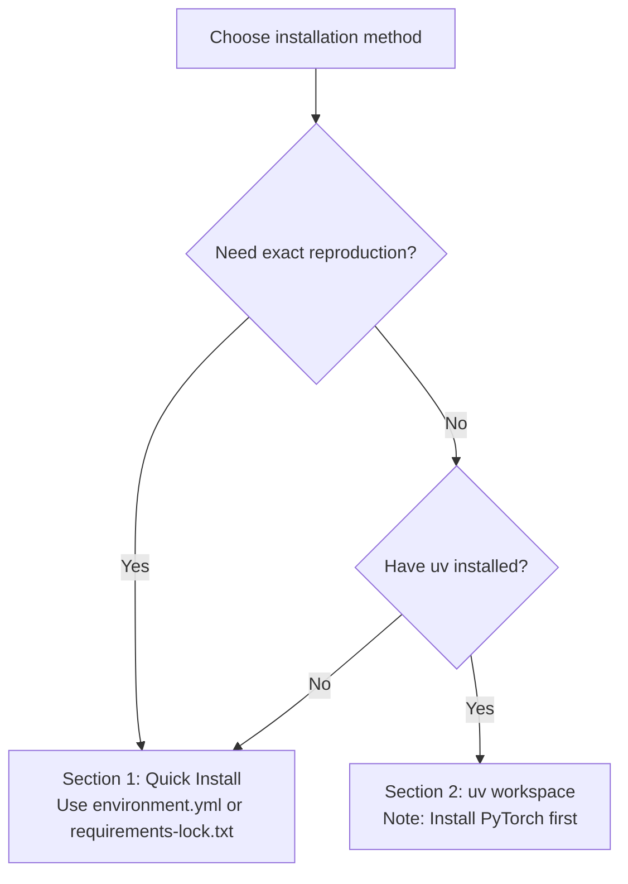

# Installation Guide

This page describes the installation and configuration of the NavArena embodied navigation infrastructure. NavArena uses a uv workspace to manage four sub-projects: **Core Library** (navarena-core), **Asset Preprocessing** (navarena-forge), **Data Generator** (navarena-gen), and **Evaluation Framework** (navarena-bench).

## System Requirements

Before starting, ensure your system meets the following requirements:

| Requirement | Version | Notes |
|-------------|---------|-------|
| Python | 3.9 | Pinned — numba/gsplat are Python-version sensitive |
| CUDA | ≥ 12.1 | 12.8 recommended (matches PyTorch 2.8) |
| GPU | NVIDIA (CUDA-capable) | Required for data generation and evaluation |
| OS | Linux | Ubuntu 20.04+ recommended |
| Conda | Miniforge recommended | Environment management |
| Node.js | ≥ 18 | Required for Web Viewer frontend (tested v25.2.1) |
| GCC/G++ | ≥ 7 | gsplat requires a C++ compiler |
| Git | Latest | For cloning repos and installing CLIP |

!!! warning "GPU Required"
    The Data Generator and Evaluation Framework require a CUDA-capable GPU. Ensure your system has the correct CUDA drivers installed.

## Choosing an Installation Method



## Version Strategy

NavArena provides two primary installation paths for different needs:

| Tier | File | Use Case |
|------|------|----------|
| **Exact reproduction** | `requirements-lock.txt` | 100% reproduce the verified environment |
| **One-click setup** | `environment.yml` | Quick setup with conda + pip |

## 1. Quick Install (Exact Reproduction)

Install from lock files to guarantee exact match with the verified environment:

=== "Option A: environment.yml (Recommended)"

    ```bash
    # Create environment with Python 3.9 + Node.js + all pip packages
    conda env create -f environment.yml
    conda activate navarena

    # Install core library in editable mode
    pip install -e "navarena-core[rendering,export]"

    # Optional: install CLIP (for semantic detection, requires GitHub access)
    pip install git+https://github.com/ultralytics/CLIP.git
    ```

=== "Option B: Manual create + lock file"

    ```bash
    conda create -n navarena python=3.9 nodejs -c conda-forge -y
    conda activate navarena
    pip install -r requirements-lock.txt

    # Install core library in editable mode
    pip install -e "navarena-core[rendering,export]"

    # Optional: install CLIP (for semantic detection, requires GitHub access)
    pip install git+https://github.com/ultralytics/CLIP.git
    ```

!!! tip "About the lock file"
    `requirements-lock.txt` is an exact version snapshot exported from the verified environment (2026-03-03), containing PyTorch 2.8.0 + CUDA 12.8. The file header documents the generation date and environment info. CLIP has been separated into its own install step (requires cloning from GitHub, which can be unreliable in some network environments).

!!! note "environment.yml and navarena-core"
    Both Option A and Option B install pip packages from a lock file, but **navarena-core must be installed in editable mode separately** because it is a local workspace package. The `pip install -e "navarena-core[rendering,export]"` step is required for all Quick Install methods.

## 2. Install via uv Workspace

If you have [uv](https://github.com/astral-sh/uv) installed, use workspace mode to install all sub-projects at once:

!!! warning "Prerequisite: Install PyTorch First"
    uv workspace mode does not handle CUDA-specific index URLs. You **must install PyTorch with pip in this environment first** (commands below) before running `uv sync`. Otherwise, uv will install CPU-only PyTorch.

```bash
# Tested: torch==2.8.0+cu128, torchvision==0.23.0
pip install "torch>=2.8.0,<3.0" "torchvision>=0.23.0,<1.0" \
    --index-url https://download.pytorch.org/whl/cu128
```

!!! note "CUDA Versions"
    The command above installs PyTorch for CUDA 12.8. For other CUDA versions, replace `cu128` with the corresponding version (e.g., `cu121`, `cu124`) and ensure your system CUDA driver is compatible.

```bash
cd NavArena

# Install uv (if not installed)
curl -LsSf https://astral.sh/uv/install.sh | sh

uv sync --all-packages

# Or use Makefile
make install
```

!!! info "uv vs pip"
    uv workspace mode automatically resolves inter-project dependencies. After PyTorch is installed, `uv sync` will install the remaining packages.

## 3. Data and Environment Variables

### 3.1 Set NAVARENA_DATA_DIR

NavArena uses `NAVARENA_DATA_DIR` as the unified data root directory:

```bash
# Copy environment template
cp .env.example .env

# Edit .env to set data directory
# NAVARENA_DATA_DIR=/path/to/your/navarena-data-root
```

Or set the environment variable directly:

```bash
export NAVARENA_DATA_DIR=/path/to/your/navarena-data-root
```

### 3.2 Data Directory Structure

`NAVARENA_DATA_DIR` should contain the following subdirectories (symlinks are fine):

```
$NAVARENA_DATA_DIR/
├── assets/       # 3DGS scene assets (PLY files, occupancy grids, etc.)
│   ├── x2robot/
│   │   └── 17dc3367/
│   └── sage-3d/
│       └── 00666b7a/
├── datasets/     # Generated datasets (Parquet format)
└── shared/       # Shared resources
    ├── camera.yaml                    # Camera configuration
    └── visualnav-transformer/         # ViNT model weights (optional)
```

### 3.3 CUDA Setup

Ensure CUDA environment variables are correctly set:

```bash
export CUDA_HOME=/usr/local/cuda
export PATH=$CUDA_HOME/bin:$PATH
export LD_LIBRARY_PATH=$CUDA_HOME/lib64:$LD_LIBRARY_PATH
```

## 4. Verify Installation

### 4.1 Python Package Import Test

```bash
python -c "
import torch
print(f'PyTorch: {torch.__version__}')
print(f'CUDA available: {torch.cuda.is_available()}')
print(f'CUDA version: {torch.version.cuda}')

import navarena_core
print(f'navarena-core: OK')

import gsplat
print(f'gsplat: OK')

import open3d
print(f'open3d: {open3d.__version__}')

import duckdb
print(f'duckdb: {duckdb.__version__}')
"
```

Expected output (versions may vary slightly depending on installation method):

```
PyTorch: 2.8.0+cu128
CUDA available: True
CUDA version: 12.8
navarena-core: OK
gsplat: OK
open3d: 0.19.0
duckdb: 1.4.4
```

### 4.2 Run Examples

Run the following from the **NavArena repository root** with `NAVARENA_DATA_DIR` set:

```bash
# Data generator help
python navarena-gen/scripts/generate_data.py --help

# Generate PointNav data (example)
python navarena-gen/scripts/generate_data.py --config navarena-gen/configs/examples/pointnav_example.yaml

# Launch Web Viewer (data dir from env or via --data-dir)
python navarena-gen/scripts/run_viewer.py --data-dir $NAVARENA_DATA_DIR
# Open http://localhost:5173 in your browser
```

## 5. FAQ

!!! tip "Next Steps"
    After installation, continue reading:

    - **[Quickstart](quickstart.md)** - Learn how to use all modules
    - **[Data Generator Overview](../data-generator/)** - Deep dive into the data generation workflow
    - **[Evaluation Framework Overview](../navarena-bench/)** - Learn about the evaluation framework architecture
