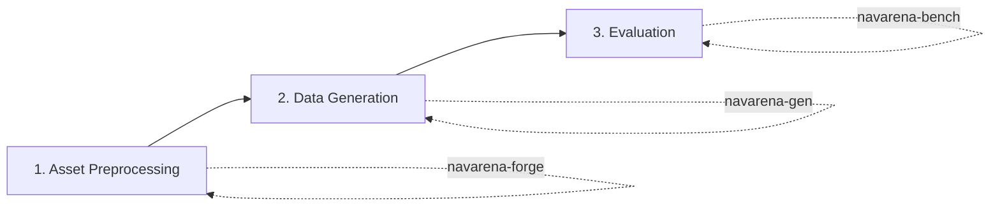

# User Guide

This guide is organized by the NavArena workflow, helping you complete the full pipeline from raw scenes to evaluation results.

## Three-Module Workflow



## Module Entries

| Step | Module | Description |
|------|--------|--------------|
| 1 | [Asset Preprocessing](../asset-preprocessing/) | Convert raw 3DGS PLY to V1 unified asset format |
| 2 | [Data Generator](../data-generator/) | Generate PointNav, VLN, etc. Episode data in preprocessed scenes |
| 3 | [Evaluation Framework](../navarena-bench/) | Evaluate navigation models on generated data |

## Full Workflow Example

```bash
# 1. Asset preprocessing (raw PLY -> V1 format)
cd navarena-forge
python -m navarena_forge run-pipeline --config navarena_forge/configs/pipeline.yaml \
    --scene-dir /path/to/raw_scenes/17dc3367 --source-dataset x2robot

# 2. Data generation
cd navarena-gen
python scripts/generate_data.py --config configs/examples/pointnav_example.yaml

# 3. Run evaluation
cd navarena-bench
python -m navarena_bench.scripts.eval --config configs/eval/default_eval.yaml

# 4. Generate replay
python scripts/replay_eval.py --results eval_results/ --output replay.mp4
```

## Common Scenarios

- **Quick single-scene test**: Use `--num-episodes 5` for generation, `--num-episodes 10` for evaluation
- **Batch preprocessing**: Use the [CLI batch command](../asset-preprocessing/cli.md)
- **Remote / ViNT agents**: Set `agent_type: "remote"` or `agent_type: "vint"` in eval config; see [Agents](../navarena-bench/agents.md)

!!! tip "Next Steps"
    Choose the module documentation based on your goals, or refer to [Core Concepts](../definitions/concepts.md) for architecture and terminology.
