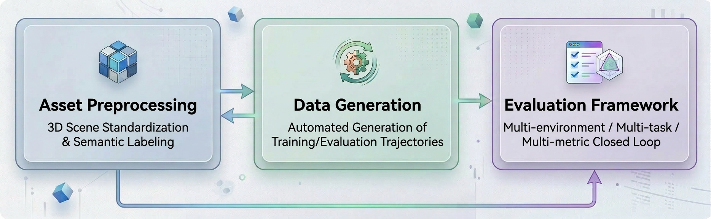

  <!-- 底层：网格点阵纹理 -->
  

  <!-- 中层：浮动几何体 -->
  <svg class="hero-floating-shapes" xmlns="http://www.w3.org/2000/svg" viewBox="0 0 800 320" preserveAspectRatio="xMidYMid slice">
    <!-- 浮动六边形 1 -->
    <polygon class="float-shape shape-1" points="120,40 150,22 180,40 180,76 150,94 120,76" stroke="rgba(255,255,255,0.15)" stroke-width="1.5" fill="none"/>
    <!-- 浮动六边形 2 -->
    <polygon class="float-shape shape-2" points="620,60 658,38 696,60 696,104 658,126 620,104" stroke="rgba(255,255,255,0.1)" stroke-width="1.5" fill="none"/>
    <!-- 浮动六边形 3（大） -->
    <polygon class="float-shape shape-3" points="680,180 730,151 780,180 780,238 730,267 680,238" stroke="rgba(255,255,255,0.08)" stroke-width="2" fill="none"/>
    <!-- 浮动圆形 1 -->
    <circle class="float-shape shape-4" cx="80" cy="220" r="35" stroke="rgba(255,255,255,0.08)" stroke-width="1.5" fill="none"/>
    <!-- 浮动圆形 2 -->
    <circle class="float-shape shape-5" cx="400" cy="30" r="20" stroke="rgba(255,255,255,0.12)" stroke-width="1.5" fill="none"/>
  </svg>
  <!-- 上层：导航路径描绘动画 -->
  <svg class="hero-nav-path" xmlns="http://www.w3.org/2000/svg" viewBox="0 0 800 320" preserveAspectRatio="xMidYMid slice">
    <circle cx="100" cy="260" r="4" fill="rgba(255,255,255,0.4)"/>
    <polyline class="draw-path" points="100,260 200,180 320,210 440,140 560,170 680,90" stroke="rgba(255,255,255,0.3)" stroke-width="2" stroke-linecap="round" stroke-linejoin="round" fill="none"/>
    <circle cx="680" cy="90" r="4" fill="rgba(255,255,255,0.6)"/>
  </svg>
  <!-- 内容层 -->
  

    <svg class="hero-logo" xmlns="http://www.w3.org/2000/svg" viewBox="0 0 48 48" width="64" height="64" fill="none">
      <defs><linearGradient id="hl-grad" x1="0" y1="0" x2="48" y2="48" gradientUnits="userSpaceOnUse"><stop offset="0%" stop-color="#ffffff"/><stop offset="100%" stop-color="#b2ebf2"/></linearGradient></defs>
      <polygon points="24,3 42,13.5 42,34.5 24,45 6,34.5 6,13.5" stroke="url(#hl-grad)" stroke-width="2.5" stroke-linejoin="round" fill="none"/>
      <circle cx="13" cy="35" r="2.5" fill="url(#hl-grad)"/>
      <polyline points="13,35 18,26 26,30 35,13" stroke="url(#hl-grad)" stroke-width="2.5" stroke-linecap="round" stroke-linejoin="round" fill="none"/>
      <polyline points="29.5,15 35,13 37,19" stroke="url(#hl-grad)" stroke-width="2.5" stroke-linecap="round" stroke-linejoin="round" fill="none"/>
    </svg>
    <h1>NavArena</h1>
    
Embodied Navigation Infrastructure

    
Automated Asset Processing · Data Generation · Evaluation

    

      <a href="getting-started/installation/" class="md-button md-button--primary">Get Started</a>
      <a href="reference/" class="md-button">API Reference</a>
    

  

## System Framework

## Who Should Read This

- **New users** → Start with [Getting Started](getting-started/installation/)
- **Data engineers** → Focus on [Asset Preprocessing](asset-preprocessing/) and [Data Generator](data-generator/)
- **Researchers** → Focus on [Evaluation Framework](navarena-bench/)
- **Developers** → See [Extending Guide](navarena-bench/extending/) and [API Reference](reference/)

## Core Modules

  

    

      <svg xmlns="http://www.w3.org/2000/svg" viewBox="0 0 48 48" width="48" height="48" fill="none">
        <defs><linearGradient id="if-grad" x1="0" y1="0" x2="48" y2="48" gradientUnits="userSpaceOnUse"><stop offset="0%" stop-color="#0d47a1"/><stop offset="100%" stop-color="#00bcd4"/></linearGradient></defs>
        <polygon points="24,3 42,13.5 42,34.5 24,45 6,34.5 6,13.5" stroke="url(#if-grad)" stroke-width="2" stroke-linejoin="round" fill="none"/>
        <circle cx="24" cy="24" r="6" stroke="url(#if-grad)" stroke-width="2" fill="none"/><circle cx="24" cy="24" r="2" stroke="url(#if-grad)" stroke-width="1.5" fill="none"/>
        <line x1="24" y1="13" x2="24" y2="16" stroke="url(#if-grad)" stroke-width="2" stroke-linecap="round"/><line x1="24" y1="32" x2="24" y2="35" stroke="url(#if-grad)" stroke-width="2" stroke-linecap="round"/>
        <line x1="13" y1="24" x2="16" y2="24" stroke="url(#if-grad)" stroke-width="2" stroke-linecap="round"/><line x1="32" y1="24" x2="35" y2="24" stroke="url(#if-grad)" stroke-width="2" stroke-linecap="round"/>
        <line x1="15.8" y1="15.8" x2="17.9" y2="17.9" stroke="url(#if-grad)" stroke-width="2" stroke-linecap="round"/><line x1="30.1" y1="30.1" x2="32.2" y2="32.2" stroke="url(#if-grad)" stroke-width="2" stroke-linecap="round"/>
        <line x1="32.2" y1="15.8" x2="30.1" y2="17.9" stroke="url(#if-grad)" stroke-width="2" stroke-linecap="round"/><line x1="17.9" y1="30.1" x2="15.8" y2="32.2" stroke="url(#if-grad)" stroke-width="2" stroke-linecap="round"/>
      </svg>
    

    <h3>Asset Preprocessing</h3>
    
Convert raw 3DGS scenes to standardized assets with coordinate normalization, PGM map generation, valid region estimation, V1 unified format, and web viewer.

    <a href="asset-preprocessing/">View Docs →</a>
  

  

    

      <svg xmlns="http://www.w3.org/2000/svg" viewBox="0 0 48 48" width="48" height="48" fill="none">
        <defs><linearGradient id="ig-grad" x1="0" y1="0" x2="48" y2="48" gradientUnits="userSpaceOnUse"><stop offset="0%" stop-color="#0d47a1"/><stop offset="100%" stop-color="#00bcd4"/></linearGradient></defs>
        <polygon points="24,3 42,13.5 42,34.5 24,45 6,34.5 6,13.5" stroke="url(#ig-grad)" stroke-width="2" stroke-linejoin="round" fill="none"/>
        <line x1="16" y1="32" x2="24" y2="20" stroke="url(#ig-grad)" stroke-width="1.5" stroke-linecap="round"/><line x1="24" y1="20" x2="32" y2="26" stroke="url(#ig-grad)" stroke-width="1.5" stroke-linecap="round"/>
        <line x1="32" y1="26" x2="24" y2="32" stroke="url(#ig-grad)" stroke-width="1.5" stroke-linecap="round"/><line x1="16" y1="32" x2="24" y2="32" stroke="url(#ig-grad)" stroke-width="1.5" stroke-linecap="round"/>
        <circle cx="16" cy="32" r="2.5" fill="url(#ig-grad)"/><circle cx="24" cy="20" r="2.5" fill="url(#ig-grad)"/><circle cx="32" cy="26" r="2.5" fill="url(#ig-grad)"/><circle cx="24" cy="32" r="2.5" fill="url(#ig-grad)"/>
        <rect x="20" y="12" width="3" height="5" rx="1" fill="url(#ig-grad)" opacity="0.6"/><rect x="25" y="10" width="3" height="7" rx="1" fill="url(#ig-grad)"/>
      </svg>
    

    <h3>Data Generator</h3>
    
Generate data for PointNav, ImageNav, ObjectNav, VLN and more. Multi-task pipeline, 3D GS scene rendering, and parallel episode generation.

    <a href="data-generator/">View Docs →</a>
  

  

    

      <svg xmlns="http://www.w3.org/2000/svg" viewBox="0 0 48 48" width="48" height="48" fill="none">
        <defs><linearGradient id="ib-grad" x1="0" y1="0" x2="48" y2="48" gradientUnits="userSpaceOnUse"><stop offset="0%" stop-color="#0d47a1"/><stop offset="100%" stop-color="#00bcd4"/></linearGradient></defs>
        <polygon points="24,3 42,13.5 42,34.5 24,45 6,34.5 6,13.5" stroke="url(#ib-grad)" stroke-width="2" stroke-linejoin="round" fill="none"/>
        <circle cx="24" cy="25" r="11" stroke="url(#ib-grad)" stroke-width="1.5" fill="none" opacity="0.5"/><circle cx="24" cy="25" r="7" stroke="url(#ib-grad)" stroke-width="1.5" fill="none" opacity="0.75"/>
        <circle cx="24" cy="25" r="2.5" fill="url(#ib-grad)"/>
        <line x1="24" y1="9" x2="24" y2="18" stroke="url(#ib-grad)" stroke-width="2" stroke-linecap="round"/>
        <polyline points="21,12 24,9 27,12" stroke="url(#ib-grad)" stroke-width="2" stroke-linecap="round" stroke-linejoin="round" fill="none"/>
      </svg>
    

    <h3>Evaluation Framework</h3>
    
Evaluation framework based on 3D Gaussian Splatting and occupancy grids, supporting multiple tasks and agents (ViNT, GNM, NoMaD) with replay and visualization.

    <a href="navarena-bench/">View Docs →</a>
  

## Troubleshooting & Support

- See [Troubleshooting](troubleshooting/)
- Submit an [Issue](https://github.com/EI-Nav/NavArena/issues) on GitHub

## Contributing

We welcome help in these areas:

- **Code and features**: Improvements to the core library, asset preprocessing, data generator, and evaluation framework; bug fixes, new tasks/agents/metrics, performance, and extensibility
- **Documentation and examples**: User guides and tutorials, keeping Chinese and English in sync, corrections, and best practices
- **Feedback and collaboration**: [Issues](https://github.com/EI-Nav/NavArena/issues) for bug reports, usage questions, or feature discussion

For environment setup and Fork/PR workflow, see [Contributing](dev/contributing/).

---

!!! tip "Next Steps"
    Start with the [Installation Guide](getting-started/installation/) or [Quickstart](getting-started/quickstart/) to get up and running.
