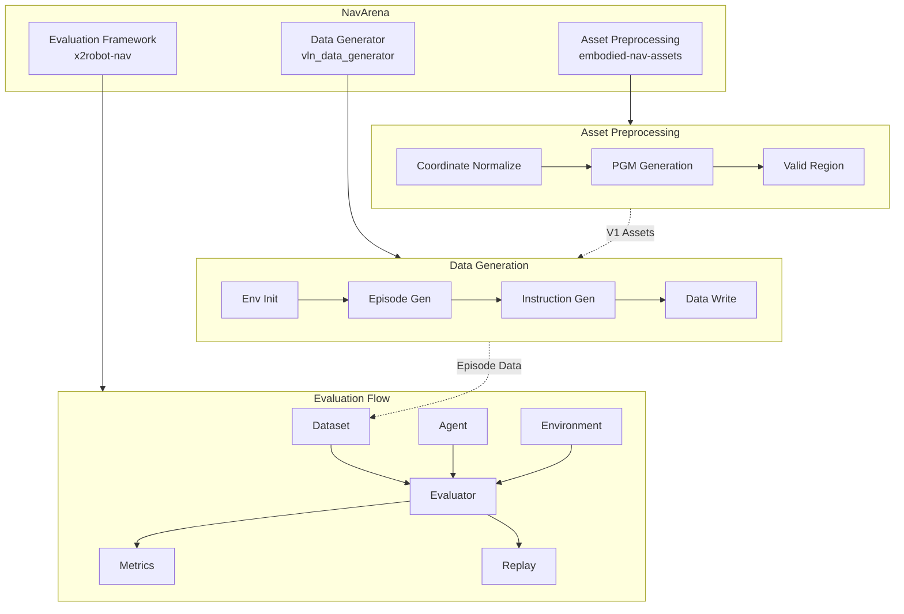

<div class="hero reveal">
  <div class="hero-content">
    <h1>NavArena</h1>
    <p>Embodied Navigation Full-Stack Solution</p>
    <div class="hero-buttons">
      <a href="getting-started/installation/" class="md-button md-button--primary">Get Started</a>
      <a href="api/reference/" class="md-button">API Reference</a>
    </div>
  </div>
</div>

Welcome to the NavArena embodied navigation project developer documentation! This documentation provides complete project guides, API references, and best practices.

## Core Modules

<div class="feature-grid">
  <div class="feature-card reveal">
    <div class="feature-card-icon">🔧</div>
    <h3>Asset Preprocessing</h3>
    <p>Convert raw 3DGS scenes to standardized assets with coordinate normalization, PGM map generation, valid region estimation, V1 unified format, and web viewer.</p>
    <a href="asset-preprocessing/overview.md">View Docs →</a>
  </div>
  <div class="feature-card reveal">
    <div class="feature-card-icon">📊</div>
    <h3>Data Generator</h3>
    <p>Generate data for PointNav, ImageNav, ObjectNav, VLN and more. Multi-task pipeline, 3D GS scene rendering, and parallel episode generation.</p>
    <a href="data-generator/overview.md">View Docs →</a>
  </div>
  <div class="feature-card reveal">
    <div class="feature-card-icon">🎯</div>
    <h3>Evaluation Framework</h3>
    <p>Evaluation framework based on 3D Gaussian Splatting and occupancy grids, supporting multiple tasks and agents (ViNT, GNM, NoMaD) with replay and visualization.</p>
    <a href="x2robot-nav/overview.md">View Docs →</a>
  </div>
</div>

## Documentation Structure

### Getting Started

If you are new to NavArena, start here:

- **[Installation Guide](getting-started/installation.md)** - Learn how to install and configure both projects
- **[Quickstart](getting-started/quickstart.md)** - Get started quickly with simple examples

### Specifications

Learn about the project's data format specifications:

- **[3D GS Asset Specification](definitions/gs-assets.md)** - Unified format definition for 3D Gaussian Splatting scene assets
- **[Navigation Training Data Format](definitions/nav-data-format.md)** - Directory structure and Episode format for training data
- **[Navigation Evaluation Data Format](definitions/eval-data-format.md)** - Episode and trajectory format for evaluation data

### Asset Preprocessing · Data Generator · Evaluation Framework

Overview docs: [Asset Preprocessing](asset-preprocessing/overview.md) · [Data Generator](data-generator/overview.md) · [Evaluation Framework](x2robot-nav/overview.md)

### API Reference

- **[API Reference](api/reference.md)** - General API reference manual
- **[Data Generator API](api/data-generator-api.md)** - Data generator API documentation
- **[Evaluation Framework API](api/x2robot-nav-api.md)** - Evaluation framework API documentation

## Project Architecture



## Key Features

!!! success "Core Features"
    - **Modular Design** - Easy to extend and maintain
    - **High-Quality Rendering** - Based on 3D Gaussian Splatting
    - **Complete Toolchain** - From data generation to model evaluation
    - **Comprehensive Documentation** - Detailed API and usage guides
    - **Active Community** - Continuous updates and maintenance

## Quick Examples

=== "Asset Preprocessing"

    ```bash
    cd embodied-nav-assets
    python -m gs_asset_normalizer batch --scenes-root /path/to/scenes \
        --config pipeline.yaml --source-dataset InteriorGS
    ```

=== "Data Generation"

    ```bash
    cd vln_data_generator
    python scripts/generate_data.py --config configs/examples/pointnav_example.yaml

    # Parallel generation
    python scripts/generate_data.py --config configs/examples/vln_zh_example.yaml \
        --parallel --num-workers 4
    ```

=== "Evaluation"

    ```bash
    # Run evaluation
    python scripts/eval.py --config configs/eval/default_eval.yaml

    # Generate replay video
    python scripts/replay_eval.py --results eval_results/ --output replay.mp4
    ```

## Getting Help & Contributing

If you encounter issues during use, you can get help through:

- Browsing the relevant sections of this documentation
- Reading the project README files
- Submitting an Issue on GitHub
- Contacting the project maintainers

We welcome community contributions! If you find documentation errors or wish to add new content, fork this repository, create your feature branch, commit your changes, and submit a Pull Request.

## Related Projects

- **embodied-nav-assets** - Asset preprocessing pipeline
- **vln_data_generator** - Data generation tool
- **x2robot-nav** - Evaluation framework
- **visualnav-transformer** - ViNT/GNM/NoMaD model support

---

Ready to get started? Let's begin with the [Installation Guide](getting-started/installation.md)!
