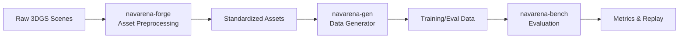

<div class="hero reveal">
  <div class="hero-content">
    <h1>NavArena</h1>
    <p>Embodied Navigation Infrastructure</p>
    <p class="hero-subtitle">Automated Asset Processing · Data Generation · Evaluation</p>
    <div class="hero-buttons">
      <a href="getting-started/installation/" class="md-button md-button--primary">Get Started</a>
      <a href="reference/" class="md-button">API Reference</a>
    </div>
  </div>
</div>

Welcome to NavArena documentation! NavArena provides asset automation, data generation, and navigation evaluation capabilities. This documentation includes complete usage guides, API references, and best practices.

## Workflow Overview



## Who Should Read This

- **New users** → Start with [Getting Started](getting-started/installation/)
- **Data engineers** → Focus on [Asset Preprocessing](asset-preprocessing/) and [Data Generator](data-generator/)
- **Researchers** → Focus on [Evaluation Framework](navarena-bench/)
- **Developers** → See [Extending Guide](navarena-bench/extending/) and [API Reference](reference/)

## Core Modules

<div class="feature-grid">
  <div class="feature-card reveal">
    <div class="feature-card-icon">🔧</div>
    <h3>Asset Preprocessing</h3>
    <p>Convert raw 3DGS scenes to standardized assets with coordinate normalization, PGM map generation, valid region estimation, V1 unified format, and web viewer.</p>
    <a href="asset-preprocessing/">View Docs →</a>
  </div>
  <div class="feature-card reveal">
    <div class="feature-card-icon">📊</div>
    <h3>Data Generator</h3>
    <p>Generate data for PointNav, ImageNav, ObjectNav, VLN and more. Multi-task pipeline, 3D GS scene rendering, and parallel episode generation.</p>
    <a href="data-generator/">View Docs →</a>
  </div>
  <div class="feature-card reveal">
    <div class="feature-card-icon">🎯</div>
    <h3>Evaluation Framework</h3>
    <p>Evaluation framework based on 3D Gaussian Splatting and occupancy grids, supporting multiple tasks and agents (ViNT, GNM, NoMaD) with replay and visualization.</p>
    <a href="navarena-bench/">View Docs →</a>
  </div>
</div>

## Quick Examples

=== "Asset Preprocessing"

    ```bash
    cd navarena-forge
    python -m navarena_forge batch --scenes-root /path/to/scenes \
        --config pipeline.yaml --source-dataset InteriorGS
    ```

=== "Data Generation"

    ```bash
    cd navarena-gen
    python scripts/generate_data.py --config configs/examples/pointnav_example.yaml

    # Parallel generation
    python scripts/generate_data.py --config configs/examples/vln_zh_example.yaml \
        --parallel --num-workers 4 --batch-size 20
    ```

=== "Evaluation"

    ```bash
    cd navarena-bench
    # Run evaluation
    python -m navarena_bench.scripts.eval --config configs/eval/default_eval.yaml

    # Generate replay video
    python scripts/replay_eval.py --results eval_results/ --output replay.mp4
    ```

## Getting Help

- Browse this documentation and module READMEs
- Submit an [Issue](https://github.com/EI-Nav/NavArena-Doc/issues) on GitHub

## Contributing

1. Fork this repository
2. Create a feature branch
3. Commit your changes and open a Pull Request

---

!!! tip "Next Steps"
    Start with the [Installation Guide](getting-started/installation/) or [Quickstart](getting-started/quickstart/) to get up and running.
