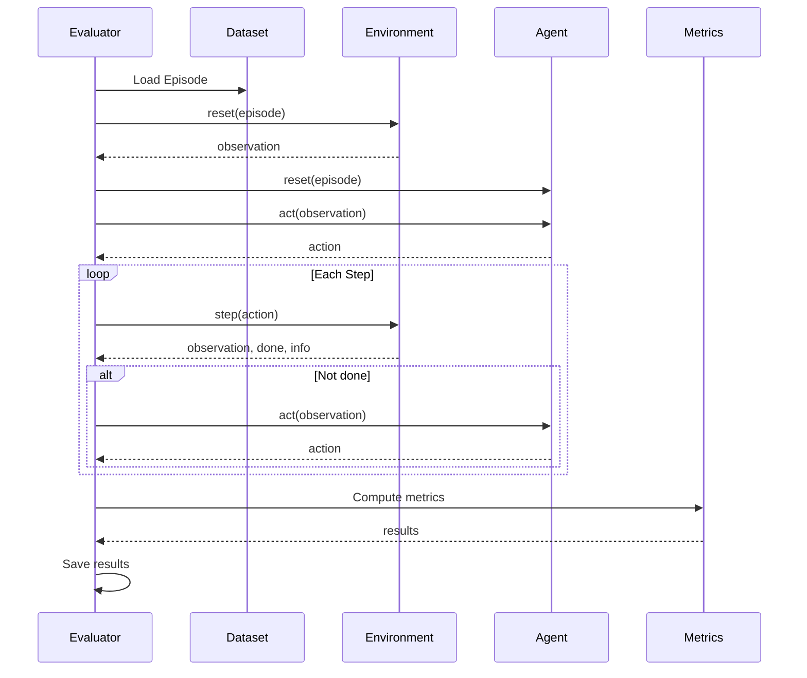

# Evaluator Module

The evaluator module coordinates the environment, agent, and dataset for evaluation, computes metrics, and saves results.

## Overview

The evaluator is a core component of the evaluation framework, responsible for:

- **Manage Evaluation Flow** - Coordinate environment, agent, and dataset
- **Run Evaluation Loop** - Execute episodes and collect data
- **Compute Metrics** - Success rate, SPL, etc.
- **Save Results** - Save evaluation results and trajectories

## Evaluator Types

### PointNavEvaluator

Point goal navigation evaluator for reaching specified 3D positions.

#### Configuration

```yaml
eval_type: "pointnav"

task:
  task_type: "pointnav"
  task_settings:
    success_distance: 0.5  # Success distance (meters)
```

#### Episode Format

```json
{
  "episode_id": "001",
  "scene_path": "x2robot/17dc3367",
  "task_type": "pointnav",
  "start_state": {
    "position": [0.0, 0.0, 0.0],
    "rotation": [0.0, 0.0, 0.0, 1.0]
  },
  "goals": [
    {
      "goal_type": "position",
      "position": [5.0, 0.0, 0.0],
      "rotation": [0.0, 0.0, 0.383, 0.924]
    }
  ]
}
```

#### Metrics

- **Success Rate (SR)**: Success rate
- **Success weighted by Path Length (SPL)**: Path-length weighted success
- **Navigation Error (NE)**: Navigation error

### ObjectNavEvaluator

Object goal navigation evaluator for finding objects of a given category.

#### Configuration

```yaml
eval_type: "objectnav"

task:
  task_type: "objectnav"
  task_settings:
    success_distance: 0.5
    object_categories: ["bed", "chair", "table"]
```

#### Episode Format

```json
{
  "episode_id": "001",
  "scene_path": "x2robot/17dc3367",
  "task_type": "objectnav",
  "start_state": {
    "position": [0.0, 0.0, 0.0],
    "rotation": [0.0, 0.0, 0.0, 1.0]
  },
  "goals": [
    {
      "goal_type": "object",
      "object_category": "bed",
      "object_id": "bed_0",
      "position": [5.0, 0.0, 0.0]
    }
  ]
}
```

### ImageNavEvaluator

Image goal navigation evaluator for reaching a goal defined by an image.

#### Configuration

```yaml
eval_type: "imagenav"

task:
  task_type: "imagenav"
  task_settings:
    success_distance: 0.5
    success_angle: 0.5  # Success angle (radians)
```

#### Episode Format

```json
{
  "episode_id": "001",
  "scene_path": "x2robot/17dc3367",
  "task_type": "imagenav",
  "start_state": {
    "position": [-6.0, -1.58, 0.0],
    "rotation": [0.0, 0.0, 0.383, 0.924]
  },
  "goals": [
    {
      "goal_type": "image",
      "image_goal": {
        "image_path": "goal_images/train_000001_goal.jpg"
      },
      "position": [-0.9, -0.5, 0.0],
      "rotation": [0.0, 0.0, -0.383, 0.924]
    }
  ]
}
```

### VLNEvaluator

Vision-Language Navigation evaluator for instruction-following navigation.

#### Configuration

```yaml
eval_type: "vln"

task:
  task_type: "languagenav"

agent:
  agent_type: "language_nav"
  model_settings:
    waypoint_tolerance: 0.3
    voronoi_closeness: 0.5
```

#### VLN Episode Format

VLN requires an `instructions` field as an array of objects:

```json
{
  "episode_id": "001",
  "scene_path": "x2robot/17dc3367",
  "task_type": "vln",
  "start_state": {
    "position": [0.0, 0.0, 0.0],
    "rotation": [0.0, 0.0, 0.0, 1.0]
  },
  "instructions": [
    {
      "instruction_text": "Walk about 8 meters to the northeast",
      "language": "en-US"
    }
  ],
  "goals": [
    {
      "goal_type": "position",
      "position": [5.0, 3.0, 0.0]
    }
  ]
}
```

## Evaluation Flow



## Evaluation Configuration

### Full Config Example

```yaml
eval_type: "pointnav"

# Environment config
env:
  env_type: "gs"
  env_settings:
    scene_dir: "/path/to/scenes"
    camera_config: "/path/to/camera.yaml"
    enable_occupancy: true
    success_distance: 0.5
    gpu_id: null
    enable_depth: true
    enable_rgb: true
    camera_names: ["face", "left", "right"]
    image_width: 640
    image_height: 480

# Agent config
agent:
  agent_type: "local"
  model_path: "/path/to/model.pth"
  model_settings: {}
  device: null

# Task config
task:
  task_type: "pointnav"
  task_settings:
    success_distance: 0.5

# Dataset config
dataset:
  dataset_type: "episode"
  dataset_path: "navarena_data/episodes.json"
  shuffle: false

# Evaluation settings
eval_settings:
  num_episodes: 100
  output_path: "./eval_results"
  max_steps_per_episode: 500
  save_trajectories: false
  save_video: false
```

## Running Evaluation

### Command Line

```bash
python scripts/eval.py --config configs/eval/default_eval.yaml
```

### Override Config

```bash
python scripts/eval.py \
    --config configs/eval/default_eval.yaml \
    --num-episodes 50 \
    --output-dir ./my_results
```

### Python API

```python
from navarena_bench.evaluator import Evaluator
from navarena_bench.configs.eval_config import EvalCfg
import yaml

# Load config
with open("configs/eval/default_eval.yaml", "r") as f:
    config_dict = yaml.safe_load(f)

config = EvalCfg(**config_dict)

# Create evaluator
evaluator = Evaluator.init(config)

# Run evaluation
results = evaluator.evaluate()

# View results
print(f"Success Rate: {results['success_rate']:.2%}")
print(f"SPL: {results['spl']:.2%}")
```

## Evaluation Results

### Result Format

After evaluation, results are saved in the output directory:

```
eval_results/
├── results.json           # Overall results
├── episode_results.json   # Per-episode results
└── trajectories/          # Trajectories (if saved)
    ├── episode_001.json
    └── ...
```

### Overall Results

```json
{
  "num_episodes": 100,
  "success_rate": 0.75,
  "spl": 0.68,
  "navigation_error": 0.32,
  "avg_path_length": 4.5,
  "avg_geodesic_distance": 3.2,
  "avg_num_steps": 45
}
```

### Episode Results

```json
{
  "episode_id": "001",
  "scene_path": "scene_001",
  "success": true,
  "path_length": 4.2,
  "geodesic_distance": 3.0,
  "final_distance": 0.3,
  "num_steps": 42,
  "status": "success"
}
```

## Metric Definitions

### Success Rate (SR)

Success rate: fraction of episodes that reach the goal.

```
SR = (successful episodes) / (total episodes)
```

### Success weighted by Path Length (SPL)

Path-length weighted success, accounting for efficiency.

```
SPL = (1/N) * Σ(S_i * L_i / max(L_i, G_i))

Where:
- N: Total episodes
- S_i: Episode i success (1 or 0)
- L_i: Episode i path length
- G_i: Episode i shortest path length
```

### Navigation Error (NE)

Navigation error: average distance from final position to goal.

```
NE = (1/N) * Σ(distance_to_goal_i)
```

## Custom Evaluators

### Implement Custom Evaluator

```python
from navarena_bench.evaluator.base import Evaluator
from navarena_bench.configs.eval_config import EvalCfg

@Evaluator.register("my_eval")
class MyEvaluator(Evaluator):
    def __init__(self, config: EvalCfg):
        super().__init__(config)
        # Initialize
        
    def eval_episode(self, episode):
        """Evaluate single episode"""
        # Evaluation logic
        result = {
            "episode_id": episode["episode_id"],
            "success": True,
            "metric1": 0.5,
            "metric2": 0.8
        }
        return result
```

### Use Custom Evaluator

```yaml
eval_type: "my_eval"
```

```python
# Import custom evaluator so it registers
import my_evaluator_module

evaluator = Evaluator.init(config)
```

## FAQ

!!! question "Slow evaluation"
    Reduce `num_episodes` or `max_steps_per_episode`, disable trajectory saving.

!!! question "Out of memory"
    Disable trajectory saving (`save_trajectories: false`), reduce parallelism.

!!! question "Metric calculation error"
    Check task config and ensure `success_distance` is reasonable.

!!! question "Episode format error"
    Validate episode JSON and ensure required fields exist.

!!! tip "Next Steps"
    - Learn about the **[Replay Module](replay.md)**
    - Learn how to **[Extend the Framework](extending.md)**
    - View the **[Environment Module](environment.md)** in detail
