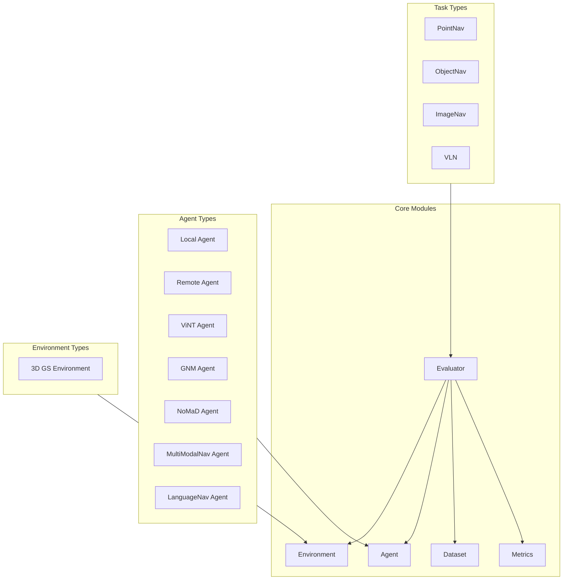
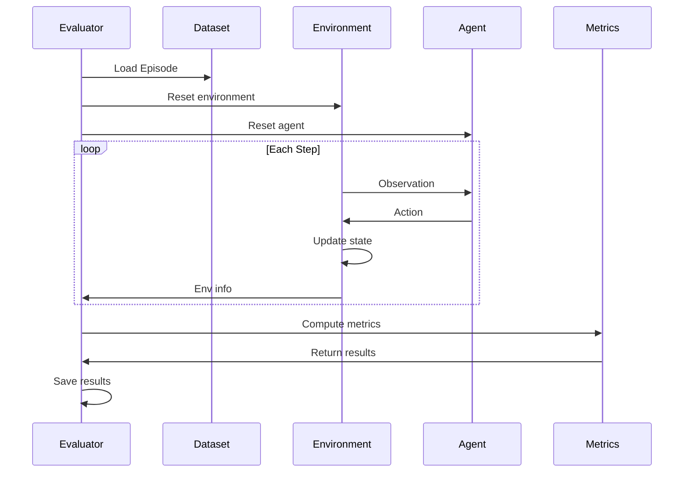

# Evaluation Framework Overview

navarena-bench is a navigation model evaluation framework based on 3D Gaussian Splatting and occupancy grids. It provides a modular, extensible evaluation system supporting multiple navigation tasks and agent types.

!!! info "Prerequisites"
    Before running evaluation, prepare: ① V1 format scene assets (under `$NAVARENA_DATA_DIR/assets/`); ② Episode data conforming to the [evaluation data format](../definitions/eval-data-format.md).

## Core Features

The evaluation framework provides:

- **Modular Design** - Registration-based, easy to extend with new environments, tasks, evaluators, agents, and metrics
- **3D GS Rendering** - High-quality rendering with gsplat
- **Collision Detection** - Collision detection based on occupancy grid map
- **Multi-Task Support** - PointNav, ObjectNav, ImageNav, VLN
- **Multi-Agent Support** - Local, Remote, ViNT, GNM, NoMaD, MultiModalNav, LanguageNav
- **Replay Visualization** - Evaluation result replay and visualization

## Architecture



## Core Components

### Evaluator

The evaluator coordinates the environment, agent, and dataset for evaluation.

**Main functions:**
- Manage evaluation flow
- Coordinate environment, agent, and dataset
- Compute evaluation metrics
- Record evaluation results

**Supported evaluators:**
- `PointNavEvaluator` - Point goal navigation evaluation
- `ObjectNavEvaluator` - Object goal navigation evaluation
- `ImageNavEvaluator` - Image goal navigation evaluation
- `VLNEvaluator` - Vision-Language Navigation evaluation

### Environment

The environment provides the navigation simulation interface, including rendering and collision detection.

**Main functions:**
- 3D GS scene rendering
- Occupancy grid collision detection
- Robot state management
- Goal validation

**Supported environments:**
- `GaussianSplattingEnv` - 3D GS environment

### Agent

The agent is the interface to navigation models, supporting multiple implementations.

**Main functions:**
- Receive environment observations
- Generate navigation actions
- Manage model state

**Supported agents:**
- `LocalAgent` - Local model agent
- `RemoteAgent` - Remote service agent
- `ViNTAgent` - ViNT model agent
- `GNMAgent` - GNM model agent
- `NoMaDAgent` - NoMaD model agent
- `MultiModalNavAgent` - Multi-modal navigation (language/image/object goals)
- `LanguageNavAgent` - Language navigation agent (Voronoi-based path planning)

### Dataset

The dataset manages episode data for evaluation.

**Main functions:**
- Load episode data
- Data format validation
- Data iteration

**Supported datasets:**
- `EpisodeDataset` - Episode format dataset

### Metrics

Metrics compute navigation performance indicators.

**Main functions:**
- Success Rate (SR)
- Success weighted by Path Length (SPL)
- Navigation Error (NE)

**Supported metrics:**
- `NavigationMetrics` - Navigation metrics

## Data Flow



## Registration Mechanism

The framework uses a decorator registration mechanism for easy extension:

### Register Environment

```python
from navarena_bench.env.base import Env

@Env.register("my_env")
class MyEnvironment(Env):
    def __init__(self, env_config, task_config):
        super().__init__(env_config, task_config)
    # ... implement interface methods
```

### Register Agent

```python
from navarena_bench.agent.base import Agent

@Agent.register("my_agent")
class MyAgent(Agent):
    def __init__(self, config):
        super().__init__(config)
    # ... implement interface methods
```

### Register Evaluator

```python
from navarena_bench.evaluator.base import Evaluator

@Evaluator.register("my_eval")
class MyEvaluator(Evaluator):
    def __init__(self, config):
        super().__init__(config)
    # ... implement interface methods
```

## Episode Data Format

The framework uses a standard Episode JSON format:

```json
{
  "episodes": [
    {
      "episode_id": "train_000001",
      "scene_path": "x2robot/17dc3367",
      "task_type": "pointnav",
      "start_state": {
        "position": [0.0, 0.0, 0.0],
        "rotation": [0.0, 0.0, 0.0, 1.0]
      },
      "goals": [
        {
          "goal_type": "position",
          "position": [5.0, 0.0, 0.0],
          "rotation": [0.0, 0.0, 0.383, 0.924]
        }
      ]
    }
  ]
}
```

**Field descriptions:**
- `episode_id`: Episode unique identifier
- `scene_path`: Scene path (relative to `$NAVARENA_DATA_DIR/assets/`)
- `task_type`: Task type (pointnav | imagenav | objectnav | vln)
- `start_state`: Start state, quaternion format `[qx, qy, qz, qw]`
- `goals`: Goal list, must include `goal_type` (position | image | object)

## Evaluation Configuration

Evaluation is configured via YAML:

```yaml
eval_type: "pointnav"

env:
  env_type: "gs"
  env_settings:
    camera_config: "${NAVARENA_DATA_DIR}/shared/camera.yaml"
    enable_occupancy: true
    success_distance: 0.5

agent:
  agent_type: "local"
  model_settings: {}
  device: null

task:
  task_type: "pointnav"

dataset:
  dataset_type: "episode"
  dataset_path: "$NAVARENA_DATA_DIR/datasets/navarena_dataset_v1/x2robot/17dc3367/pointnav"

eval_settings:
  num_episodes: 100
  output_path: "./eval_results"
  max_steps_per_episode: 500
```

## Usage Flow

### 1. Prepare Data

Create an episode dataset in the correct format.

### 2. Configure Evaluation

Edit the evaluation configuration file.

### 3. Run Evaluation

```bash
python -m navarena_bench.scripts.eval --config configs/eval/default_eval.yaml
```

### 4. View Results

Results are saved in the output directory:
- Evaluation metrics JSON
- Trajectory data (optional)
- Replay data (optional)

### 5. Generate Replay

```bash
python scripts/replay_eval.py --results eval_results/ --output replay.mp4
```

## Extensibility

The framework is designed for high extensibility:

- **New environment**: Subclass `Env` and register
- **New agent**: Subclass `Agent` and register
- **New evaluator**: Subclass `Evaluator` and register
- **New metric**: Subclass `Metric` and register
- **New replayer**: Subclass `BaseReplayer` and register

!!! tip "Next Steps"
    - Learn about the **[Environment Module](environment.md)**
    - See how to configure the **[Agent Module](agents.md)**
    - View **[Evaluator Module](evaluators.md)** usage
    - Learn about the **[Replay Module](replay.md)**
    - Learn how to **[Extend the Framework](extending.md)**
