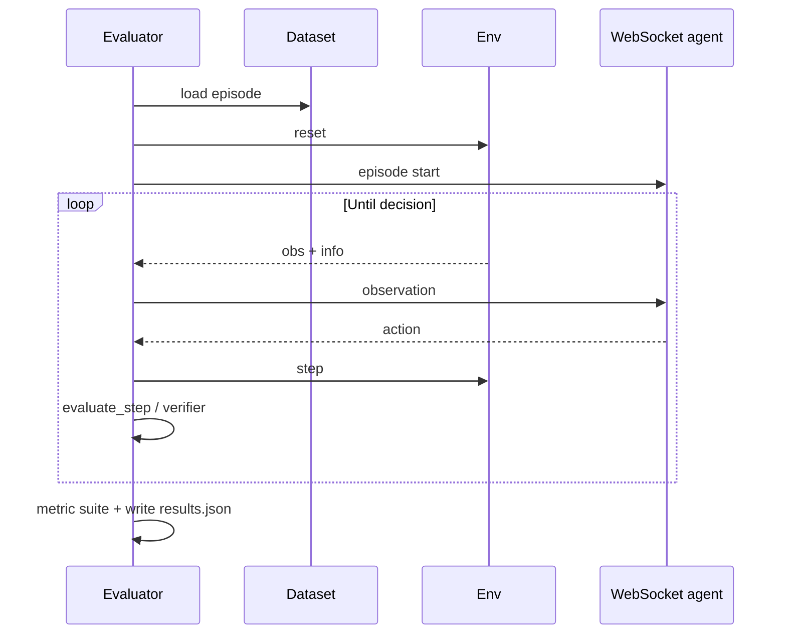

# Evaluator module

Evaluators orchestrate **dataset → environment → WebSocket agent**, implement the **task protocol** (success / termination / metrics profile), and write **`results.json`**. There is **no** `VLNEvaluator` in the current codebase — only **`pointnav`**, **`objectnav`**, and **`imagenav`**.

## Built-in evaluators

Registered evaluator types match `eval_type` / task wiring:

| Task | Typical `success_policy` | Verifier |
|------|---------------------------|----------|
| `pointnav` | `geometric_distance` or `explicit_stop` | Not used |
| `objectnav` | `verifier` when using semantic checks; configs may use geometric defaults for smoke tests | `object_semantic`, `object_position`, `image_similarity` |
| `imagenav` | `geometric_distance` (goal image is observational) | Not used for success |

ObjectNav episodes that require semantic success must configure `task.verifier` consistently with `success_policy` / `termination_policy`. If the protocol requires a verifier and none is configured, evaluation fails at startup.

## Task protocol and metrics profiles

Each evaluator exposes a `TaskProtocol` (`task_type`, `success_policy`, `termination_policy`, `metrics_profile`, `requires_verifier`, …). Metric suites resolve **profiles** such as:

- `pointnav_standard` → `sr`, `spl`, `soft_spl`, `ne`, `cr`, `avg_steps`
- `objectnav_standard` / `imagenav_standard` → include `osr` instead of some geometric-only metrics where applicable

You can pass **`eval_settings.metrics`** to override the profile list (each name must be registered and compatible with the task).

## Configuration example

Minimal shape (from `configs/eval/default_eval.yaml`; adjust paths):

```yaml
eval_type: "pointnav"

env:
  env_type: "gs"
  env_settings:
    camera_config: "${NAVARENA_DATA_DIR}/shared/camera.yaml"
    success_distance: 0.5
    robot_radius: 0.4

server:
  url: "ws://localhost:8765"
  timeout: 30.0
  image_format: "jpeg"

task:
  task_type: "pointnav"
  success_policy: "geometric_distance"
  termination_policy: "success_or_timeout"
  metrics_profile: "pointnav_standard"

dataset:
  dataset_type: "episode"
  dataset_path: "${NAVARENA_DATA_DIR}/datasets/.../pointnav"

eval_settings:
  action_space: "waypoint"
  num_episodes: 10
  batch_size: 1
  output_path: "./eval_results"
  max_steps_per_episode: 500
  save_trajectories: true
```

ObjectNav with verifier (illustrative):

```yaml
task:
  task_type: "objectnav"
  success_policy: "verifier"
  termination_policy: "verifier_or_timeout"
  metrics_profile: "objectnav_standard"
  verifier:
    verifier_type: "object_semantic"
```

## Evaluation flow



## Running

```bash
navarena-bench-eval --config navarena-bench/configs/eval/default_eval.yaml
```

Overrides:

```bash
navarena-bench-eval --config navarena-bench/configs/eval/default_eval.yaml \
  --num-episodes 5 --output-dir ./out --metrics sr,spl,ne
```

## Python API

```python
from navarena_bench.evaluator import Evaluator

evaluator = Evaluator.init(config)
evaluator.eval()   # runs async loop internally; persists results to output_path
# Return value: None — read results.json on disk
```

Do not assign a return value from `eval()`.

## Output: `results.json`

The run writes a **single** protocol-versioned JSON (not separate `summary.json` + `episode_results.json` as older docs described). Top-level sections typically include:

- `meta` — framework version, protocol version, task, policies, verifier, config snapshot
- `run_summary` — aggregate counters
- `metric_results` — aggregated metrics
- `episode_results` — per-episode records
- `artifacts` — optional paths

When geodesic distance is unavailable, SPL may fall back to Euclidean; check `meta` for audit flags described in the bench README.

## Custom evaluators

Subclass `Evaluator` and implement:

- `build_protocol() -> TaskProtocol`
- `prepare_episode_context(episode, observation, recorder) -> dict`
- `evaluate_step(... ) -> EpisodeDecision | None`
- `finalize_episode(...) -> EpisodeDecision`

Optional hooks: `augment_observation`, `prepare_episodes_for_batch`, etc.

See [Extending](extending.md) and the `navarena_bench.evaluator` implementations in the bench repository.

## Metric definitions (brief)

- **SR** — Success rate  
- **SPL / SoftSPL** — Success weighted by path length (classical SPL definitions; see bench implementation)  
- **NE** — Navigation error  
- **OSR** — Object success (ObjectNav / ImageNav contexts)  
- **CR** — Collision rate  
- **DTW / NDTW** — Trajectory shape metrics when enabled  
- **Smoothness** — Motion smoothness  
- **avg_steps** — Average episode length  

**See also**: [Agent connection](agents.md) · [Environment](environment.md) · [Replay](replay.md) · [Extending](extending.md)
