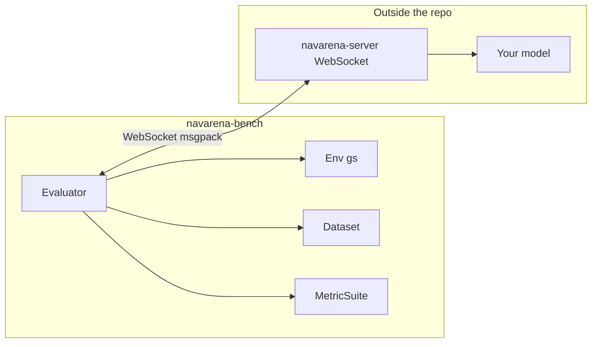
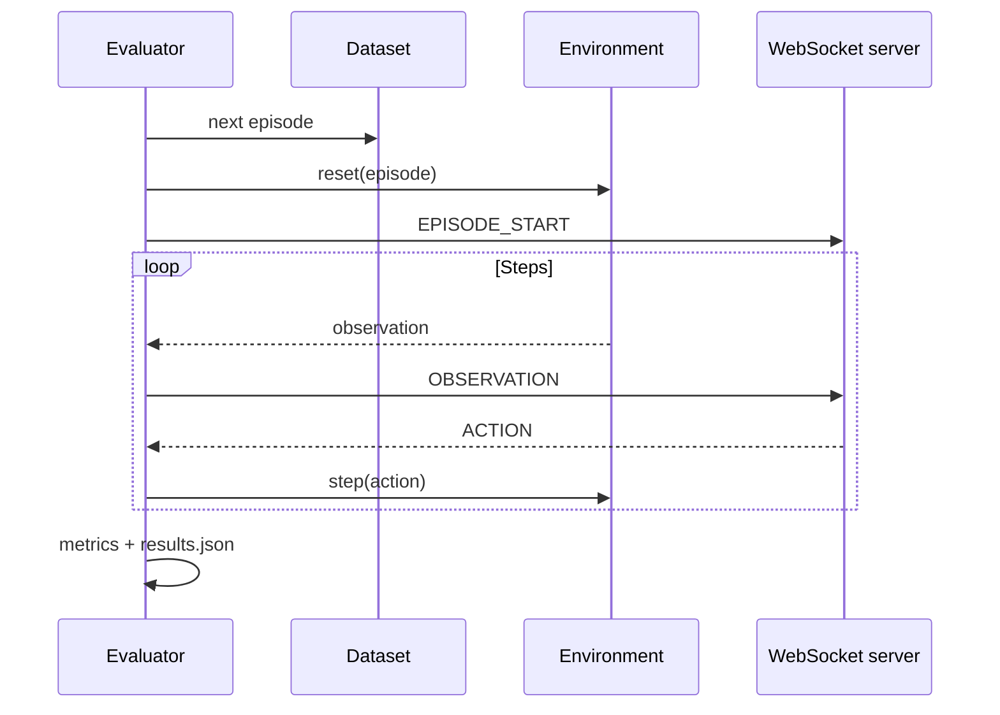

# Evaluation Framework Overview

navarena-bench is a **task-protocol-first** navigation evaluation framework built on 3D Gaussian Splatting rendering and occupancy-grid collision. The **evaluator** defines success, termination, and metrics; the **environment** only reports facts (pose, collision, distances). Your **navigation model** runs as a separate **WebSocket server** ([navarena-server](../navarena-server/index.md)); the bench connects to it as a client.

!!! info "Prerequisites"
    Before evaluation: ① V1 scene assets under `$NAVARENA_DATA_DIR/assets/`; ② Episode Parquet data matching the [evaluation data format](../definitions/eval-data-format.md); ③ A running model server at the URL in `server.url`.

## Core Features

- **WebSocket model server** — Bench drives the env; your agent implements `NavigationModelServer` and listens on `ws://...`
- **3D GS rendering** — `gs` environment via gsplat / navarena-core
- **Occupancy collision** — Inflated robot footprint (`robot_radius`)
- **Tasks** — `pointnav`, `objectnav`, `imagenav` (built-in evaluators)
- **Protocol-versioned output** — Single `results.json` per run (`evaluation_protocol_version` 2.x)
- **Optional Hub** — `navarena-bench-hub` for browsing runs (install with `[hub]`)

## Architecture



## Built-in task types

| `task_type` | Evaluator | Notes |
|-------------|-----------|--------|
| `pointnav` | PointNav | Position goals; geometric or explicit-stop success |
| `objectnav` | ObjectNav | Optional semantic verifier (`object_semantic`, `object_position`, `image_similarity`) |
| `imagenav` | ImageNav | Goal image in observation; success uses geometric distance like PointNav |

VLN is **not** implemented as a bench evaluator; generate VLN data with navarena-gen if needed for training, but evaluation here is limited to the three types above.

## Metrics

Metrics are **registered by name** and grouped into **profiles** (`pointnav_standard`, `objectnav_standard`, `imagenav_standard`). Registered metrics include:

`sr`, `spl`, `soft_spl`, `ne`, `osr`, `cr`, `dtw`, `ndtw`, `smoothness`, `avg_steps`

Default profiles use subsets (e.g. `pointnav_standard`: `sr`, `spl`, `soft_spl`, `ne`, `cr`, `avg_steps`). You can override with `eval_settings.metrics` (comma-separated or list) if every metric is compatible with the task.

## Data flow



## Registration (extensions)

You can register **environments**, **evaluators**, **verifiers**, **metrics**, and **datasets** via Python decorators or `importlib` entry points. There is **no** in-repo `Agent` class; agents live in **navarena-server**.

See [Extending](extending.md).

## Episode data

Episodes are loaded from Parquet (see [evaluation data format](../definitions/eval-data-format.md)), not a giant JSON file. Quaternions in assets and messages use **`[x, y, z, w]`** unless noted otherwise in the WebSocket layer.

## Evaluation configuration (sketch)

```yaml
eval_type: "pointnav"

env:
  env_type: "gs"
  env_settings:
    camera_config: "${NAVARENA_DATA_DIR}/shared/camera.yaml"
    success_distance: 0.5
    robot_radius: 0.4

server:
  url: "ws://localhost:8765"
  timeout: 30.0
  image_format: "jpeg"

task:
  task_type: "pointnav"
  success_policy: "geometric_distance"
  termination_policy: "success_or_timeout"
  metrics_profile: "pointnav_standard"

dataset:
  dataset_type: "episode"
  dataset_path: "${NAVARENA_DATA_DIR}/datasets/.../pointnav"

eval_settings:
  action_space: "waypoint"   # required: "waypoint" | "velocity"
  num_episodes: 10
  batch_size: 1
  output_path: "./eval_results"
  max_steps_per_episode: 500
  save_trajectories: true
```

## Usage

From the NavArena repo root (with `navarena` env):

```bash
conda run -n navarena navarena-bench-eval --config navarena-bench/configs/eval/default_eval.yaml
```

List registered components:

```bash
navarena-bench-eval --list envs
navarena-bench-eval --list evaluators
navarena-bench-eval --list metrics
```

Resume a run:

```bash
navarena-bench-eval --config navarena-bench/configs/eval/default_eval.yaml --output-dir ./eval_results --resume
```

## Outputs

Primary artifact: **`results.json`** under `eval_settings.output_path`, containing `meta`, `run_summary`, `metric_results`, `episode_results`, and optional `artifacts`. Trajectories / replay folders appear when recording options are enabled.

Optional **NavArena Hub** (after `pip install -e "navarena-bench[hub]"`):

```bash
navarena-bench-hub
```

## See also

- [Environment](environment.md) — `GaussianSplattingEnv` facts and config
- [Agent connection](agents.md) — How the bench talks to your server
- [Evaluators](evaluators.md) — Task protocols and `results.json`
- [Replay](replay.md) — `ReplayLoader` and recorded formats
- [Extending](extending.md) — Env, evaluator, verifier, metric, dataset
- [Model Server SDK](../navarena-server/index.md) — Implementing the WebSocket agent
