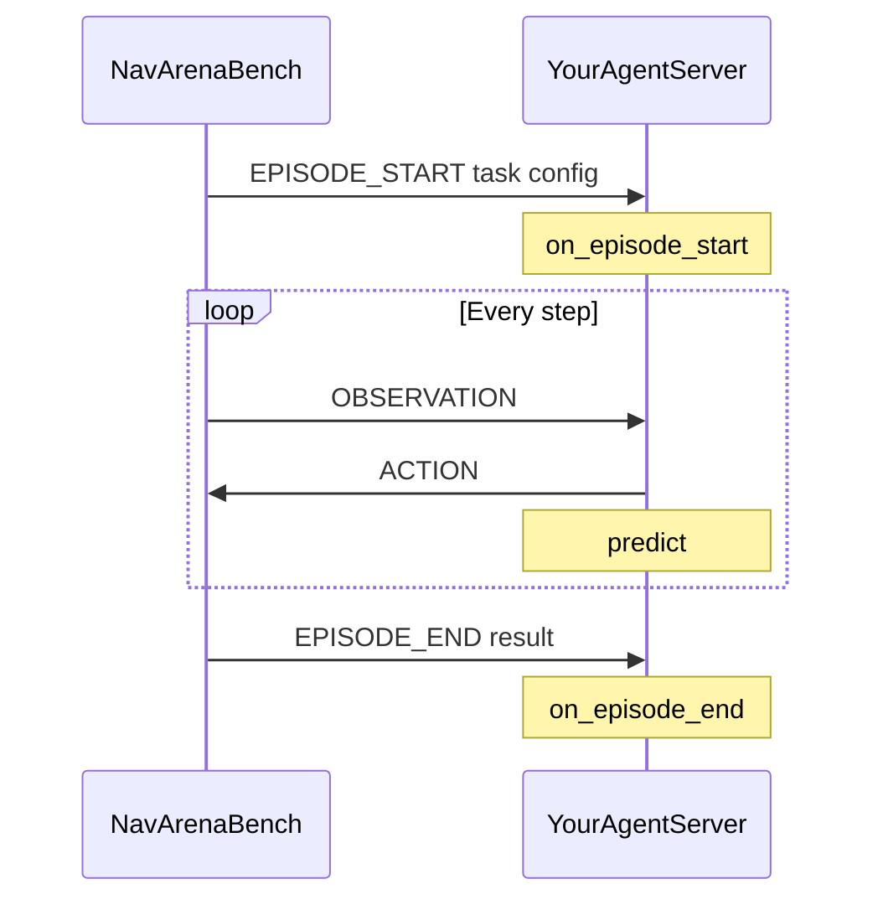

# Model Server SDK (navarena-server)

Lightweight **WebSocket + msgpack** SDK for navigation agents used with **navarena-bench**. The bench is the **client**; your code is the **server** that implements `predict()`.

Repository: [NavArena-Server](https://github.com/EI-Nav/NavArena-Server) (also vendored in the NavArena workspace as `navarena-server/`).

## Architecture

```
          ┌──────────────────┐  WebSocket (msgpack)  ┌──────────────────┐
          │  NavArena Bench  │ ◄──────────────────►  │  Your Agent      │
          │  (evaluation     │                       │  (model server)  │
          │   driver)        │                       │                  │
          └──────────────────┘                       └──────────────────┘
```



## Install

**Python >= 3.9**

```bash
git clone https://github.com/EI-Nav/NavArena-Server.git
cd NavArena-Server
pip install -e .
```

From the NavArena monorepo (recommended):

```bash
conda activate navarena
uv sync --all-packages
```

Core dependencies: `websockets`, `msgpack`, `anyio`, `numpy`, `Pillow`.

## Quick start

### 1. Implement an agent

```python
from navarena_server import NavigationModelServer, serve

class MyAgent(NavigationModelServer):
    async def predict(self, observation, ctx):
        return {"waypoints": [{"x": 0.25, "y": 0.0, "yaw": 0.0}]}

if __name__ == "__main__":
    serve(MyAgent(), host="0.0.0.0", port=8000)
```

### 2. Run the server

```bash
python my_agent.py
# Listening on ws://0.0.0.0:8000
```

### 3. Point navarena-bench at it

Set `server.url` in your eval YAML to `ws://<host>:<port>` and match `eval_settings.action_space` (see below). See [Evaluation overview](../navarena-bench/index.md) and [Agent connection](../navarena-bench/agents.md).

## NavigationModelServer

Abstract base class — you **must** implement `async def predict(...)`. Optional hooks:

| Method | Purpose |
|--------|---------|
| `predict(observation, ctx)` | **Required** — return action dict each step |
| `on_episode_start(payload, ctx)` | Reset buffers, load per-episode state |
| `on_episode_end(result, ctx)` | Logging / cleanup |

```python
from navarena_server import NavigationModelServer

class MyAgent(NavigationModelServer):

    async def predict(self, observation: dict, ctx) -> dict:
        ...

    async def on_episode_start(self, payload: dict, ctx) -> None:
        ...

    async def on_episode_end(self, result: dict, ctx) -> None:
        ...
```

## SessionContext

`ctx` fields:

| Property | Type | Description |
|----------|------|-------------|
| `session_id` | `str` | WebSocket connection id |
| `episode_id` | `str` | Current episode id |
| `step` | `int` | Step index from 0 |
| `is_first` | `bool` | First step of episode |
| `task` | `dict` | Payload from EPISODE_START (includes `task_type`, etc.) |
| `mode` | `str` | `"sync"` or `"realtime"` |
| `slot_id` | `str` or `None` | Batch slot when `batch_size` &gt; 1 |

## serve() / serve_async()

```python
from navarena_server import serve, serve_async

serve(agent, host="0.0.0.0", port=8000)

# In an existing asyncio app:
await serve_async(agent, host="0.0.0.0", port=8000)
```

## Action spaces

Actions must match **`eval_settings.action_space`** in the bench YAML: **`waypoint`** or **`velocity`**.

### Waypoint

```python
async def predict(self, observation, ctx):
    return {
        "waypoints": [
            {"x": 0.25, "y": 0.0, "yaw": 0.0},
        ]
    }
```

| Field | Meaning |
|-------|---------|
| `x` | Forward displacement (m) |
| `y` | Lateral displacement (m) |
| `yaw` | Heading change (rad) |

### Velocity

```python
async def predict(self, observation, ctx):
    return {"v": 0.5, "w": 0.1, "dt": 0.1}
```

| Field | Meaning |
|-------|---------|
| `v` | Linear velocity (m/s) |
| `w` | Angular velocity (rad/s) |
| `dt` | Command duration (s) |

## Observation format

Common fields:

| Field | Description |
|-------|-------------|
| `rgb` | `np.ndarray` (H, W, 3) uint8 — may be keyed by camera name depending on bench version |
| `depth` | Optional depth map |
| `pose` | Position + rotation |

Task-specific:

| Field | When |
|-------|------|
| `goal_category` | ObjectNav |
| `goal_image` | ImageNav |

NumPy arrays use msgpack codecs; images may be compressed for transport.

## Batch mode

For batched GPU inference, override `batch_predict`:

```python
class BatchAgent(NavigationModelServer):

    async def predict(self, observation, ctx):
        return self._infer_single(observation)

    async def batch_predict(self, observations, contexts):
        """observations: {slot_id: obs}, contexts: {slot_id: ctx} -> {slot_id: action}"""
        ...
```

Optional: `on_batch_episode_start`, `on_batch_episode_end` (default implementations forward to single-episode hooks per slot).

## Examples (upstream repo)

| Example | Task | Action space |
|---------|------|----------------|
| `examples/random_waypoint_agent.py` | PointNav | Waypoint |
| `examples/random_velocity_agent.py` | PointNav | Velocity |
| `examples/objectnav_waypoint_agent.py` | ObjectNav | Waypoint |
| `examples/imagenav_velocity_agent.py` | ImageNav | Velocity |

```bash
python examples/random_waypoint_agent.py --port 8000
```

## Development

```
navarena-server/
├── navarena_server/
│   ├── server/base.py    # NavigationModelServer, SessionContext
│   ├── server/serve.py
│   └── protocol/         # messages, codecs, connection
├── examples/
└── tests/
```

```bash
pip install -e .
pytest
```

## License

MIT — see upstream repository.

**See also**: [Evaluation overview](../navarena-bench/index.md) · [Agent connection](../navarena-bench/agents.md)
