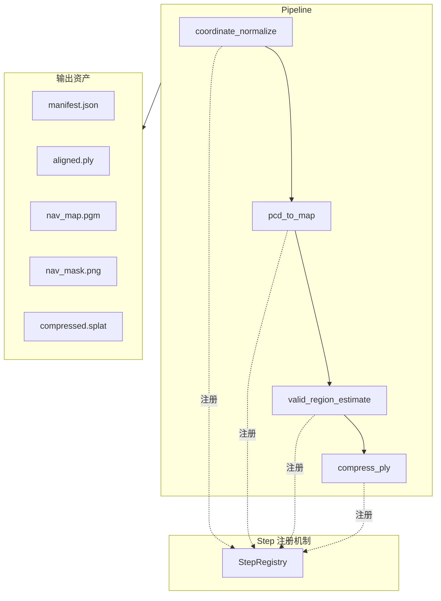

# 资产预处理概述

资产预处理（embodied-nav-assets / gs_asset_normalizer）是将原始 3D Gaussian Splatting 场景转换为标准化具身导航资产的一套模块化 Pipeline。它将 PLY 点云转换为坐标对齐、占据栅格、可导航区域掩码以及可选的压缩格式，供数据生成器和评测框架使用。

## 项目定位

- **输入**：原始 3DGS PLY 点云（来自 InteriorGS、ScanNet++、SceneSplat 等）
- **输出**：符合 V1 统一资产格式的标准化场景目录

## 核心架构



### 设计模式

1. **模板方法** - `ProcessingStep` 基类统一 `validate → process → save` 流程
2. **Pipeline** - 串联多个 Step，管理中间产物与错误处理
3. **注册机制** - 使用 `@StepRegistry.register("name")` 装饰器自动注册步骤
4. **策略模式** - 算法（RANSAC、Alpha Shapes 等）与 Step 解耦，可替换

### 扩展新步骤

新增 Step 只需三步：

1. 在 `steps/` 下创建继承 `ProcessingStep` 的类
2. 使用 `@StepRegistry.register("my_step")` 注册
3. 在 `steps/__init__.py` 中导入，并在 `pipeline.yaml` 中加入该步骤

## V1 统一资产格式

每个处理后的场景目录结构如下：

```
{dataset}/{scene_id}/
├── manifest.json          # 元数据与溯源信息（schema v1.0）
├── source.ply             # 原始 3DGS 点云
├── aligned.ply            # 坐标归一化后的 PLY
├── nav_map.pgm            # 2D 占据栅格地图（ROS 兼容）
├── nav_map.yaml           # 地图配置
├── nav_mask.png           # 可导航区域掩码
├── compressed.splat       # 紧凑二进制格式（32 bytes/Gaussian，可选）
├── labels.json            # 语义标签（可选）
└── structure.json         # 平面图信息（可选）
```

### Scene ID 生成规则

Scene ID 由 `SHA-256("{dataset}:{original_name}")` 的前 8 位十六进制字符串组成：

- 同一 `(original_name, dataset)` 始终得到相同的 ID
- 示例：`InteriorGS:scene_001` → `a1b2c3d4`

### 固定文件名

上述文件名均为固定名称，不按 scene_id 前缀，便于下游统一解析。

## 下一步

- 了解 **[Pipeline 步骤](pipeline-steps.md)** 的详细说明
- 学习 **[配置说明](configuration.md)**
- 使用 **[CLI 命令](cli.md)** 处理场景
- 通过 **[Web 查看器](web-viewer.md)** 浏览资产
