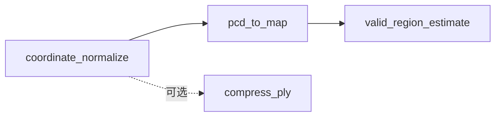

# Pipeline 步骤详解

资产预处理 Pipeline 包含四个处理步骤，按顺序执行。前三个为核心必需步骤，第四个为可选的 PLY 压缩步骤。

## 步骤 1: coordinate_normalize（坐标归一化）

### 功能

将 3D 场景坐标系归一化，使地面平面与 Z=0 对齐。

### 算法

- 使用 RANSAC 拟合地面平面
- 计算 4×4 外参矩阵，使地面法向为 [0, 0, 1]，地面高度为 Z=0
- 对点云应用变换矩阵

### 输入 / 输出

| 输入 | 输出 |
|------|------|
| `source.ply` 或任意 PLY | `aligned.ply` |

### 配置示例

```yaml
ransac:
  distance_threshold: 0.02    # RANSAC 距离阈值（米）
  ransac_n: 3
  num_iterations: 1000

height_range: [-0.05, 0.05]   # 地面点高度范围

z_filter:
  auto_estimate: true
  z_min: null
  z_max: null
```

---

## 步骤 2: pcd_to_map（点云转地图）

### 功能

将点云投影为 2D 占据栅格地图，用于路径规划与碰撞检测。

### 算法

- 将 3D 点云投影到 2D 平面（X-Y）
- 按相对地面高度过滤（默认 0.1m～0.8m）
- 生成 ROS 兼容的占据栅格地图（PGM）与 YAML 元数据

### 输入 / 输出

| 输入 | 输出 |
|------|------|
| `aligned.ply` | `nav_map.pgm`、`nav_map.yaml` |

### 配置示例

```yaml
map:
  resolution: 0.05            # 分辨率（米/像素）
  margins: [1.0, 1.0, 1.0, 1.0]
  occupied_threshold: 10
  invert: false

height_filter:
  min_z: 0.1                  # 相对地面高度过滤下限
  max_z: 0.8                  # 相对地面高度过滤上限
```

---

## 步骤 3: valid_region_estimate（可导航区域估计）

### 功能

从占据栅格地图中自动估计可导航区域，生成 `nav_mask.png`。

### 算法

- 使用 DBSCAN 去除离群点
- 使用 Alpha Shapes 计算凹包轮廓
- 将轮廓写入 PNG 掩码（255=可导航，0=不可导航）

### 输入 / 输出

| 输入 | 输出 |
|------|------|
| `nav_map.pgm`、`nav_map.yaml` | `nav_mask.png` |

### 配置示例

```yaml
parameters:
  occupied_threshold: 255
  dbscan_eps: 5.0              # DBSCAN 邻域半径（米）
  dbscan_min_samples: 1000
  alpha: 0.6                   # Alpha Shapes 参数
```

!!! note "非致命步骤"
    该步骤标记为 `fatal: false`，失败时 Pipeline 仍继续执行。

---

## 步骤 4: compress_ply（可选，PLY 压缩）

### 功能

将 PLY 转为紧凑的 `.splat` 格式，用于 Web 查看器与快速加载。

### 算法

- 每个 Gaussian 压缩为 32 字节
- 按透明度阈值剪枝低不透明度的点
- 按重要性排序，支持渐进加载

### 输入 / 输出

| 输入 | 输出 |
|------|------|
| `aligned.ply` 或 `source.ply` | `compressed.splat` |

该步骤不在默认 Pipeline 中，需通过 `compress` 命令单独批量执行。

---

## 步骤依赖关系



**参见**：[配置说明](configuration.md) · [CLI 命令](cli.md)
