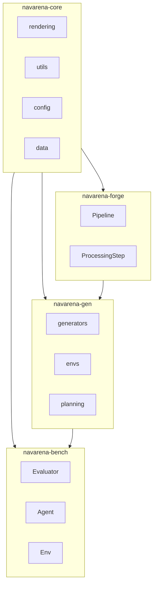
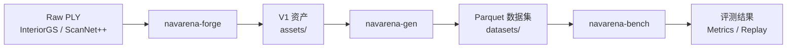

# 架构设计

本文档说明 NavArena 的整体架构、四子项目关系、数据流与技术栈。

## 四子项目关系

| 项目 | 职责 | 依赖 |
|------|------|------|
| **navarena-core** | 共享核心库：渲染（gsplat）、配置管理、数据结构、工具函数 | - |
| **navarena-forge** | 资产预处理：PLY → V1 格式（坐标归一化、占据栅格、可导航区域） | navarena-core |
| **navarena-gen** | 数据生成：多任务 Episode 生成（PointNav、VLN 等）、Parquet 写入 | navarena-core、V1 资产 |
| **navarena-bench** | 评测框架：3D GS 环境、智能体驱动、指标计算、回放 | navarena-core、V1 资产、Episode 数据 |

## 数据流

1. **资产预处理**：原始 3DGS PLY 经过 `coordinate_normalize` → `pcd_to_map` → `valid_region_estimate` → `compress_ply`，产出 `manifest.json`、`aligned.ply`、`nav_map.pgm`、`nav_mask.png` 等。
2. **数据生成**：从 V1 资产加载场景，采样起点与目标，规划 A* 轨迹，可选生成 VLN 指令，写入 Parquet。
3. **评测**：加载 Episode，在 3D GS 环境中驱动智能体导航，计算 SR、SPL、NE 等指标，可选生成回放视频。

## 技术栈

| 层级 | 技术 |
|------|------|
| **工作空间** | uv workspace（Python 依赖管理） |
| **渲染** | gsplat（3D Gaussian Splatting）、PIL |
| **数据结构** | PyArrow / Parquet、NumPy、PyTorch |
| **配置** | YAML、Pydantic |
| **文档** | MkDocs Material、i18n 多语言 |

## 扩展点

各模块均采用注册机制，便于扩展：

- **navarena-forge**：`@StepRegistry.register` 注册新 Pipeline 步骤
- **navarena-gen**：`BaseGenerator`、`BaseSimEnv`、`BaseInstructionGenerator` 注册新任务、环境、指令类型
- **navarena-bench**：`Evaluator`、`Env`、`Agent`、`Metric` 注册新评测器、环境、智能体、指标

详见 [扩展指南](../navarena-bench/extending.md)。
