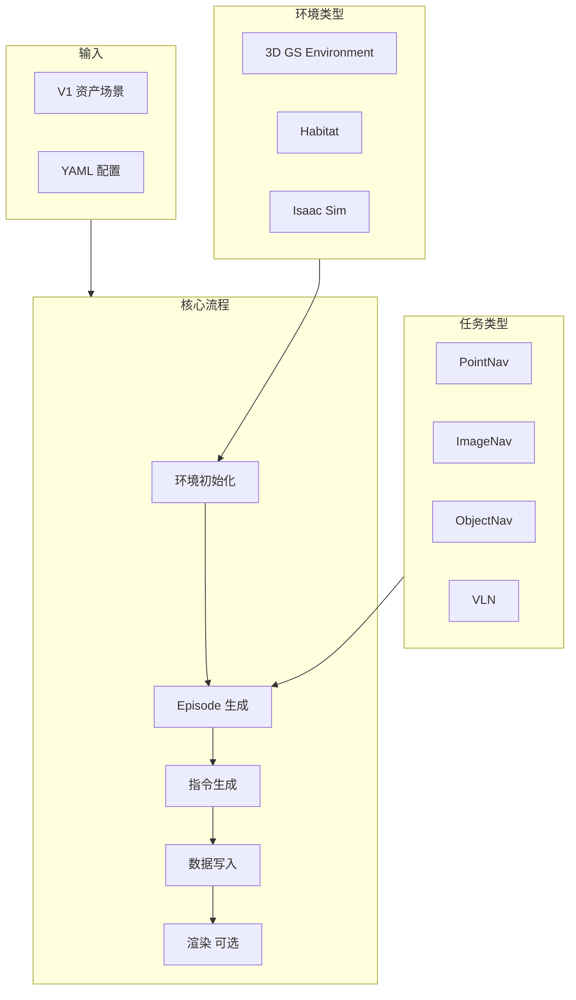

# 数据生成器概述

数据生成器（navarena-gen）是多任务视觉语言导航（VLN）数据生成框架，用于生成 PointNav、ImageNav、ObjectNav、VLN 等任务的训练和评测数据集。基于 3D Gaussian Splatting 场景，采用网格采样、路径规划与指令生成等模块生成高质量 Episode 数据。

!!! info "前提条件"
    使用数据生成器前，需先通过 [资产预处理](../asset-preprocessing/) 将原始 3DGS 场景转换为 V1 统一资产格式（manifest.json、nav_map.pgm 等）。V1 资产应位于 `$NAVARENA_DATA_DIR/assets/` 下。

## 核心功能

- **多任务支持** - PointNav、ImageNav、ObjectNav、VLN
- **多环境支持** - 3D Gaussian Splatting（已实现）、Habitat / Isaac（占位）
- **V1 资产格式** - 读取 `navarena_assets` 统一格式（manifest.json、nav_map.pgm 等）
- **灵活指令生成** - Strategy 模式，支持 simple_direction、path_based、object_goal，中英文
- **并行处理** - 多 Worker Episode 生成
- **断点续传** - 轻量级 checkpoint，崩溃后可从上次进度恢复
- **Web 查看器** - 交互式浏览生成数据

## 架构设计



## 数据生成流程

1. **环境初始化** - 从 V1 资产加载 manifest.json、nav_map.pgm、nav_map.yaml，可选 labels.json、nav_mask.png
2. **Episode 生成** - 任务特定生成器：网格起点采样 + 目标采样 + GT 轨迹规划（A*）
3. **指令生成** - VLN 使用 Strategy 模式：simple_direction / path_based / object_goal，支持 zh-CN、en-US
4. **数据写入** - 流式写入 Parquet 分块（meta/episodes.parquet + data/chunk-NNN/trajectories.parquet），支持 checkpoint 断点续传
5. **渲染（可选）** - 目标图像（ImageNav）、轨迹视频

## 输出目录结构

所有路径相对于 `$NAVARENA_DATA_DIR`：

```
datasets/{dataset_name}/
├── dataset_meta.json                   # 数据集级元数据
└── {scene_path}/                       # 如 x2robot/17dc3367
    ├── scene_meta.json                 # 场景元数据
    └── {task_type}/                    # pointnav/imagenav/objectnav/vln
        ├── meta/
        │   ├── info.json               # 任务级元信息
        │   └── episodes.parquet        # Episode 索引（Parquet v1.0.0）
        ├── data/
        │   └── chunk-NNN/              # 分块存储（默认每块 1000 episodes）
        │       ├── trajectories.parquet
        │       └── episodes.parquet
        ├── goal_images/                # ImageNav 目标图像（可选）
        └── rendered_videos/            # 渲染视频（可选）
```

## Episode 格式（逻辑结构）

Parquet 存储的 Episode 在应用层可理解为：

```json
{
  "episode_id": "train_000001",
  "scene_path": "x2robot/17dc3367",
  "task_type": "vln",
  "start_state": {
    "position": [1.5, -0.8, 0.0],
    "rotation": [0.0, 0.0, 0.0, 1.0]
  },
  "goals": [...],
  "instructions": [
    {"instruction_text": "向东北方向走约 8 米", "language": "zh-CN"}
  ],
  "gt_path": {
    "stats": {"geodesic_distance": 8.0, "num_steps": 25}
  }
}
```

实际存储：`meta/episodes.parquet` 与 `data/chunk-NNN/trajectories.parquet`，通过 `chunk_index` 关联。详见 [导航训练数据格式](../definitions/nav-data-format.md)。

## 使用场景

1. **训练数据生成** - 为 VLN 模型生成训练 Episode
2. **评测数据生成** - 生成 PointNav、ImageNav、ObjectNav、VLN 评测集
3. **轨迹渲染** - 生成 GT 轨迹可视化视频

## 依赖关系

数据生成器依赖 **资产预处理** 输出的 V1 格式场景。请先使用 [navarena-forge](../asset-preprocessing/) 完成场景预处理。

!!! tip "下一步"
    - 了解 **[Pipeline 阶段](pipeline.md)** 的详细说明
    - 学习如何 **[配置](configuration.md)** 数据生成
    - 查看 **[批量处理](batch-processing.md)** 用法
