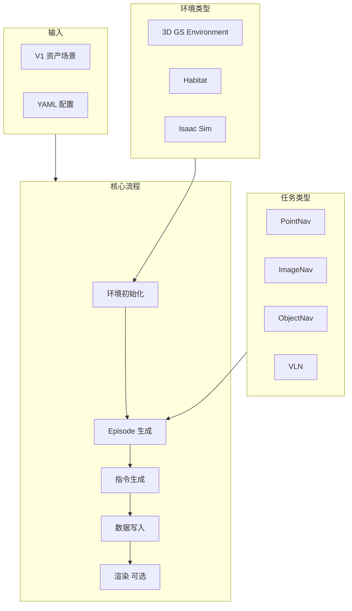

# 数据生成器概述

数据生成器（navarena-gen）是多任务视觉语言导航（VLN）数据生成框架，用于生成 PointNav、ImageNav、ObjectNav、VLN 等任务的训练和评测数据集。基于 3D Gaussian Splatting 场景，采用网格采样、路径规划与指令生成等模块生成高质量 Episode 数据。

## 核心功能

- **多任务支持** - PointNav、ImageNav、ObjectNav、VLN
- **多环境支持** - 3D Gaussian Splatting（已实现）、Habitat / Isaac（占位）
- **V1 资产格式** - 读取 `navarena_assets` 统一格式（manifest.json、nav_map.pgm 等）
- **灵活指令生成** - Strategy 模式，支持 simple_direction、path_based、object_goal，中英文
- **并行处理** - 多 Worker Episode 生成、并行 I/O 写入
- **Web 查看器** - 交互式浏览生成数据

## 架构设计



## 数据生成流程

1. **环境初始化** - 从 V1 资产加载 manifest.json、nav_map.pgm、nav_map.yaml，可选 labels.json、nav_mask.png
2. **Episode 生成** - 任务特定生成器：网格起点采样 + 目标采样 + GT 轨迹规划（A*）
3. **指令生成** - VLN 使用 Strategy 模式：simple_direction / path_based / object_goal，支持 zh-CN、en-US
4. **数据写入** - Episodes JSON + GT 轨迹文件
5. **渲染（可选）** - 目标图像（ImageNav）、轨迹视频

## 输出目录结构

```
navarena_data/
├── dataset_meta.json                   # 数据集级元数据
└── scenes/
    └── {scene_id}/
        ├── scene_meta.json             # 场景元数据
        └── {task_type}/                # pointnav/imagenav/objectnav/vln
            ├── {split}.json            # Episodes 文件
            ├── gt_trajectories/        # GT 轨迹文件
            │   └── {split}_{idx}_gt.json
            ├── goal_images/            # ImageNav 目标图像
            └── rendered_videos/        # 渲染视频
```

## Episode 格式

```json
{
  "episode_id": "train_000001",
  "scene_path": "navarena_assets/x2robot/17dc3367",
  "task_type": "vln",
  "start_state": {
    "position": [x, y, z],
    "rotation": [qx, qy, qz, qw]
  },
  "goals": [...],
  "instructions": [
    {"instruction_text": "向东北方向走约 8 米", "language": "zh-CN"}
  ],
  "gt_path": {
    "trajectory_file": "gt_trajectories/train_000001_gt.json",
    "stats": {"geodesic_distance": 8.0, "num_steps": 25}
  }
}
```

## 使用场景

1. **训练数据生成** - 为 VLN 模型生成训练 Episode
2. **评测数据生成** - 生成 PointNav、ImageNav、ObjectNav、VLN 评测集
3. **轨迹渲染** - 生成 GT 轨迹可视化视频

## 依赖关系

数据生成器依赖 **资产预处理** 输出的 V1 格式场景。请先使用 [navarena-forge](../asset-preprocessing/overview.md) 完成场景预处理。

## 下一步

- 了解 **[Pipeline 阶段](pipeline.md)** 的详细说明
- 学习如何 **[配置](configuration.md)** 数据生成
- 查看 **[批量处理](batch-processing.md)** 用法
