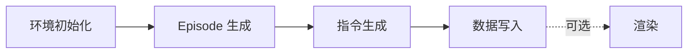

# Pipeline 阶段详解

数据生成 Pipeline 包含环境初始化、Episode 生成、指令生成、数据写入和可选渲染等阶段。本文档描述各阶段的输入、输出及处理逻辑。

## 阶段 1：环境初始化

### 描述

加载 V1 统一资产格式（navarena_assets）下的场景，初始化路径规划器（A*）。

### 输入

- **scene_path**：场景目录路径（如 `navarena_assets/x2robot/17dc3367`）
- **V1 资产文件**：
  - `manifest.json`（必需）
  - `nav_map.pgm`（必需）
  - `nav_map.yaml`（必需）
  - `nav_mask.png`（可选，可导航区域）
  - `labels.json`（可选，语义物体）

### 处理流程

1. 读取 `manifest.json` 获取 scene_id、map_info 等
2. 加载 PGM 占据栅格及 YAML 配置（resolution、origin）
3. 可选加载 `nav_mask.png`、`labels.json`
4. 初始化 A* 路径规划器

### 输出

- `SceneInfo`：scene_id、navigable_area、objects、地图信息等
- 可用的 `env` 实例，供 Episode 生成器使用

---

## 阶段 2：Episode 生成

### 描述

按任务类型（PointNav、ImageNav、ObjectNav、VLN）生成 Episode，包含起点、目标、GT 轨迹。

### 输入

- **env**：已初始化的仿真环境
- **task_config**：min_distance、max_distance、grid_spacing、instruction_type 等

### 处理流程

1. **起点采样**：在可导航区域内按 grid_spacing 网格采样
2. **目标采样**：按 min_distance、max_distance 等约束采样目标
3. **GT 轨迹规划**：两阶段（全局 A* + 局部平滑）
4. **任务特定逻辑**：
   - PointNav：目标为 3D 位置
   - ImageNav：目标为参考图像，需渲染
   - ObjectNav：目标为物体类别，从 labels.json 选取
   - VLN：需生成自然语言指令

### 输出

- Episode 对象列表，包含 start_state、goals、gt_path、instruction（VLN）等

---

## 阶段 3：指令生成（VLN 专用）

### 描述

为 VLN Episode 生成自然语言导航指令，采用 Strategy 模式，支持多种生成策略。

### 指令类型

| 类型 | 说明 |
|------|------|
| `simple_direction` | 方向 + 距离，如「向东北方向走约 8 米」 |
| `path_based` | 按路径步骤描述，如「向前走，左转，再向前」 |
| `object_goal` | 物体目标，如「找到一张床」 |

### 语言支持

- `zh-CN`：中文指令
- `en-US`：英文指令

### 输出

- Episode 的 `instruction` 字段

---

## 阶段 4：数据写入

### 描述

将 Episode 写入磁盘，包括 Episodes JSON 和 GT 轨迹文件。

### 输出文件

- `{split}.json`：Episodes 列表
- `gt_trajectories/{split}_{idx}_gt.json`：GT 轨迹
- `scene_meta.json`：场景元数据
- `dataset_meta.json`：数据集级元数据

---

## 阶段 5：渲染（可选）

### 描述

通过 `scripts/render_episodes.py` 单独执行，渲染 ImageNav 目标图像或轨迹视频。

### 输入

- GT 轨迹目录
- 场景路径
- 相机配置（configs/examples/camera.yaml）

### 输出

- `goal_images/`：ImageNav 目标图像
- `rendered_videos/`：多相机轨迹视频

---

## 阶段依赖关系

!!! tip "下一步"
    - 学习 **[配置说明](configuration.md)**
    - 查看 **[批量处理](batch-processing.md)**
