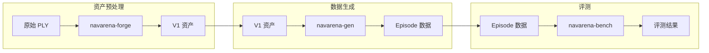
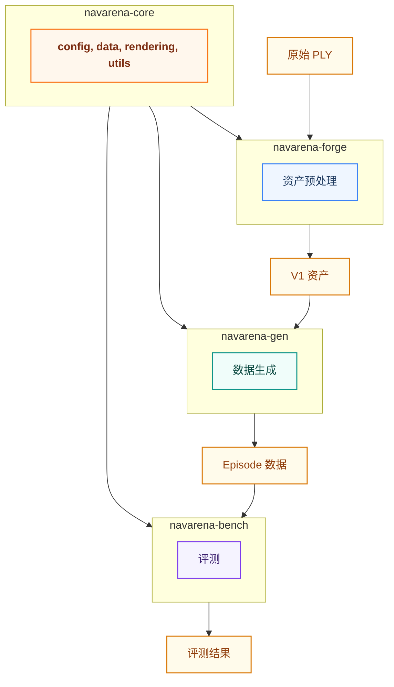
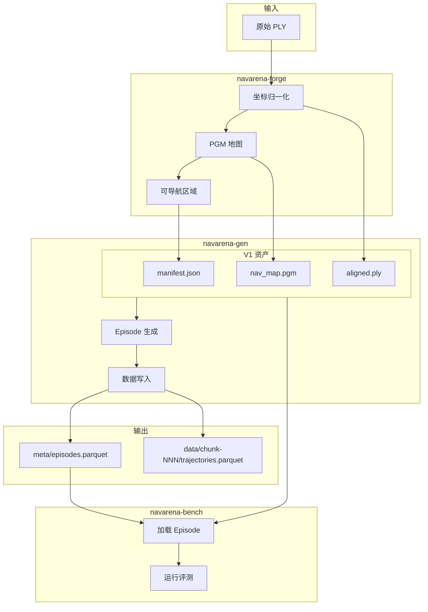

# 核心概念

本文档定义 NavArena 具身导航平台的核心概念、术语和工作流。

## 1. NavArena 整体工作流

NavArena 提供从 3DGS 场景到导航模型评测的完整工具链：



1. **资产预处理**（navarena-forge）：将原始 3DGS PLY 转换为 V1 统一资产格式
2. **数据生成**（navarena-gen）：基于 V1 资产生成训练/评测 Episode 数据
3. **评测**（navarena-bench）：在仿真环境中评测导航模型

## 2. 核心术语

| 术语 | 说明 |
|------|------|
| **Episode** | 一次完整的导航任务实例，包含起点、目标、可选指令和 GT 轨迹 |
| **Scene** | 一个 3D 场景，对应 V1 资产目录。由 `dataset/scene_id` 标识（如 `x2robot/17dc3367`） |
| **V1 资产格式** | 统一的场景资产目录结构，包含 manifest.json、aligned.ply、nav_map.pgm、nav_map.yaml、nav_mask.png 等 |
| **GT Trajectory** | Ground Truth 轨迹，从起点到目标的参考路径，用于训练和评测 |
| **Split** | 数据划分，如 train、val_seen、val_unseen、test |
| **Task Type** | 任务类型：pointnav（点目标）、imagenav（图像目标）、objectnav（物体目标）、vln（视觉语言导航） |
| **scene_path** | 场景相对路径，格式为 `{dataset}/{scene_id}`，相对于 `$NAVARENA_DATA_DIR/assets/` |

## 3. 四个子项目职责

| 项目 | 职责 |
|------|------|
| **navarena-core** | 核心库，提供渲染、规划等底层能力，被 forge、gen、bench 依赖 |
| **navarena-forge** | 资产预处理，将原始 3DGS 转为 V1 格式 |
| **navarena-gen** | 数据生成，产出 Episode、GT 轨迹、目标图像、渲染视频 |
| **navarena-bench** | 评测框架，加载 Episode，驱动智能体在 3D GS 环境中导航并计算指标 |

## 4. NAVARENA_DATA_DIR 目录结构全景

```
$NAVARENA_DATA_DIR/
├── shared/                    # 共享资源配置
│   ├── camera.yaml           # 相机配置
│   └── ...
├── assets/                    # V1 格式场景资产
│   ├── x2robot/
│   │   └── 17dc3367/
│   │       ├── manifest.json
│   │       ├── aligned.ply
│   │       ├── nav_map.pgm
│   │       ├── nav_map.yaml
│   │       └── nav_mask.png
│   └── scannetpp/
│       └── ...
└── datasets/                  # 生成的数据集（由 navarena-gen 输出，Parquet 格式 v1.0.0）
    └── {dataset_name}/
        └── {scene_path}/      # 如 x2robot/17dc3367
            └── {task_type}/
                ├── meta/
                │   ├── info.json
                │   └── episodes.parquet
                ├── data/
                │   └── chunk-NNN/
                │       ├── trajectories.parquet
                │       └── episodes.parquet
                └── goal_images/   # ImageNav 专用（可选）
```

- **assets/**：navarena-forge 预处理后的场景，navarena-gen 和 navarena-bench 都依赖此目录
- **datasets/**：navarena-gen 的输出目录（Parquet 分块存储），navarena-bench 从此加载 Episode

## 5. 子包依赖与数据流



navarena-core 为共享基础库；forge、gen、bench 均依赖它。数据流：PLY → V1 资产（forge）→ Episodes（gen）→ 评测结果（bench）。

## 6. 数据流详图



## 7. 相关文档

- [3D GS 资产规范](gs-assets.md) - V1 资产格式详细定义
- [导航训练数据格式](nav-data-format.md) - 训练数据完整规范
- [导航评测数据格式](eval-data-format.md) - 评测数据 Episode 与轨迹规范
