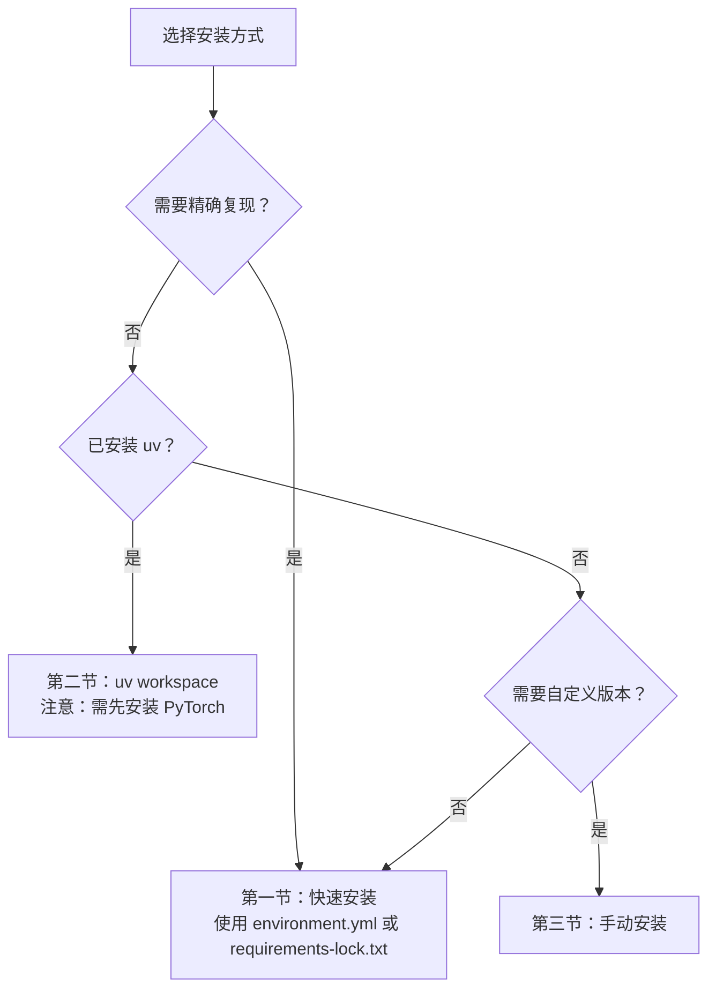

# 安装指南

本页面说明 NavArena 具身导航平台的安装与配置流程。NavArena 采用 uv 工作空间管理四个子项目：**核心库** (navarena-core)、**资产预处理** (navarena-forge)、**数据生成器** (navarena-gen) 和 **评测框架** (navarena-bench)。

## 系统要求

在开始安装之前，请确认系统满足以下要求：

| 要求 | 版本 | 说明 |
|------|------|------|
| Python | 3.9 | 锁定版本，numba/gsplat 对 Python 版本敏感 |
| CUDA | ≥ 12.1 | 推荐 12.8，与 PyTorch 2.8 对应 |
| GPU | NVIDIA（支持 CUDA） | 数据生成和评测必需 |
| 操作系统 | Linux | 推荐 Ubuntu 20.04+ |
| Conda | Miniforge 推荐 | 用于环境管理 |
| Node.js | ≥ 18 | Web Viewer 前端需要（已验证 v25.2.1） |
| GCC/G++ | ≥ 7 | gsplat 编译需要 C++ 编译器 |
| Git | 最新版 | 克隆仓库和安装 CLIP |

!!! warning "GPU 要求"
    数据生成器和评测框架需要 CUDA 支持的 GPU 才能正常运行。请确认系统已正确安装 CUDA 驱动。

## 选择安装方式



## 版本策略

NavArena 提供三层安装方式，适用于不同场景：

| 方式 | 文件 | 适用场景 |
|------|------|---------|
| **精确复现** | `requirements-lock.txt` | 需要 100% 复现已验证环境 |
| **一键创建** | `environment.yml` | 快速搭建，自动处理 conda + pip |
| **手动安装** | 本文档第 3 节 | 需要灵活控制版本（如适配新 CUDA） |

## 1. 快速安装（精确复现）

从锁定文件安装，保证与已验证环境完全一致：

=== "方式 A：environment.yml（推荐）"

    ```bash
    # 一键创建环境（包含 Python 3.9 + Node.js + 全部 pip 包）
    conda env create -f environment.yml
    conda activate navarena

    # 以 editable 模式安装核心库
    pip install -e "navarena-core[rendering,export]"

    # 可选：安装 CLIP（语义检测功能需要，需访问 GitHub）
    pip install git+https://github.com/ultralytics/CLIP.git
    ```

=== "方式 B：手动创建 + lock 文件"

    ```bash
    conda create -n navarena python=3.9 nodejs -c conda-forge -y
    conda activate navarena
    pip install -r requirements-lock.txt

    # 以 editable 模式安装核心库
    pip install -e "navarena-core[rendering,export]"

    # 可选：安装 CLIP（语义检测功能需要，需访问 GitHub）
    pip install git+https://github.com/ultralytics/CLIP.git
    ```

!!! tip "lock 文件说明"
    `requirements-lock.txt` 是从已验证的环境导出的精确版本快照（2026-03-03），包含 PyTorch 2.8.0 + CUDA 12.8。文件头部注明了生成日期和环境信息。CLIP 因需要从 GitHub 克隆（国内网络可能不稳定），已从 lock 文件中分离为单独安装步骤。

!!! note "environment.yml 与 navarena-core"
    方式 A 和方式 B 均从 lock 文件安装 pip 包，但 **navarena-core 需单独以可编辑模式安装**，因为它是本地工作空间包。所有快速安装方式都需执行 `pip install -e "navarena-core[rendering,export]"` 这一步。

## 2. 使用 uv 工作空间安装

若已安装 [uv](https://github.com/astral-sh/uv)，可以使用工作空间模式一次性安装所有子项目：

!!! warning "前置条件：先安装 PyTorch"
    uv 工作空间模式无法处理 CUDA 专用索引 URL。执行 `uv sync` 前**必须先手动安装 PyTorch**（第 3.2 节），否则 uv 会安装仅 CPU 版本。

```bash
cd NavArena

# 安装 uv（如未安装）
curl -LsSf https://astral.sh/uv/install.sh | sh

# 先按 3.2 节安装 PyTorch，再执行：
uv sync --all-packages

# 或使用 Makefile
make install
```

!!! info "uv vs pip"
    uv 工作空间模式可自动解析子项目依赖。安装 PyTorch 后，`uv sync` 会安装其余依赖。

## 3. 手动安装（分步说明）

手动安装允许逐项控制每个依赖的版本。每个关键包旁标注了已验证版本供参考。

### 3.1 创建 Conda 环境

```bash
conda create -n navarena python=3.9 -y
conda activate navarena
```

### 3.2 安装 PyTorch

```bash
# 已验证：torch==2.8.0+cu128, torchvision==0.23.0
pip install "torch>=2.8.0,<3.0" "torchvision>=0.23.0,<1.0" \
    --index-url https://download.pytorch.org/whl/cu128
```

!!! note "CUDA 版本"
    上述命令安装 CUDA 12.8 版本的 PyTorch。如需其他 CUDA 版本，请将 `cu128` 替换为对应版本（如 `cu121`、`cu124`），并确保系统 CUDA 驱动兼容。

### 3.3 安装 navarena-core

```bash
cd NavArena
pip install -e "navarena-core[rendering,export]"
```

navarena-core 将自动安装以下依赖（torch 需先按 3.2 节单独安装）：

| 包 | 版本范围 | 已验证版本 | 用途 |
|----|---------|-----------|------|
| numpy | ≥1.22.0 | 1.26.4 | 数值计算 |
| scipy | ≥1.9.1 | 1.13.1 | 科学计算 |
| Pillow | ≥8.0.0 | 11.3.0 | 图像处理 |
| PyYAML | ≥5.4.0 | 6.0.3 | 配置文件解析 |
| pyarrow | ≥14.0.0 | 21.0.0 | Parquet 数据读写 |
| duckdb | ≥0.9.0 | 1.4.4 | 数据查询引擎 |
| gsplat | ≥1.0.0 | 1.5.3 | 3DGS 渲染（rendering extra） |
| plyfile | ≥1.0.0 | 1.1.3 | PLY 文件读写（rendering extra） |
| imageio | ≥2.20.0 | 2.37.0 | 图像/视频 I/O（rendering extra） |
| huggingface_hub | ≥0.20.0 | 1.2.3 | 模型/数据集上传（export extra） |

### 3.4 各子项目依赖

#### navarena-gen（数据生成）

```bash
pip install "open3d>=0.17.0" "shapely>=2.0.0" "matplotlib>=3.3.0" \
    "imageio[ffmpeg]>=2.31.0" "imageio-ffmpeg>=0.5.0" "opencv-python>=4.5.0"
```

??? note "已验证版本"
    open3d==0.19.0, shapely==2.0.7, matplotlib==3.9.4, imageio==2.37.0, imageio-ffmpeg==0.6.0, opencv-python==4.11.0.86

#### navarena-bench（评估框架）

```bash
pip install "requests>=2.25.0" "scikit-image>=0.20.0" "skan>=0.9" \
    "networkx>=3.1" "imageio[ffmpeg]>=2.31.0" "decord>=0.6.0"
```

!!! warning "decord 注意"
    `decord` 未包含在 `requirements-lock.txt` 中。若使用快速安装方式，需额外安装：`pip install decord`

??? note "已验证版本"
    requests==2.32.5, scikit-image==0.24.0, skan==0.13.0, networkx==3.2.1, imageio==2.37.0, imageio-ffmpeg==0.6.0

#### navarena-forge（场景预处理）

```bash
pip install "open3d>=0.17.0" "plyfile>=1.0.0" "scikit-learn>=1.0.0" "shapely>=2.0.0"
```

??? note "已验证版本"
    open3d==0.19.0, plyfile==1.1.3, scikit-learn==1.6.1, shapely==2.0.7

#### Web Viewer（前端 + 后端）

```bash
# 后端依赖
pip install "fastapi>=0.100.0" "uvicorn>=0.23.0" "python-multipart>=0.0.5" \
    "Flask>=3.0.0" "flask-cors>=4.0.0" "Flask-SocketIO>=5.0.0"

# 前端依赖（需要 Node.js）
conda install -c conda-forge nodejs -y
cd navarena-gen/web/frontend && npm install && cd -
```

??? note "已验证版本"
    fastapi==0.115.0, uvicorn==0.30.0, python-multipart==0.0.9, Flask==3.1.2, flask-cors==6.0.1, Flask-SocketIO==5.5.1, Node.js v25.2.1

### 3.5 可选依赖

#### 目标检测（ObjectNav 数据生成）

```bash
pip install "ultralytics>=8.0.0" "supervision>=0.20.0"
# 已验证：ultralytics==8.3.228, supervision==0.27.0
```

#### CLIP（语义检测）

```bash
pip install git+https://github.com/ultralytics/CLIP.git
```

#### 数据分析工具

```bash
pip install polars pandas plotly dash openpyxl numba
```

#### ViNT/GNM/NoMaD 智能体（评测框架）

如需使用 ViNT、GNM 或 NoMaD 等预训练导航智能体：

```bash
# 1. 克隆 visualnav-transformer（与 NavArena 项目并列）
git clone https://github.com/robodhruv/visualnav-transformer

# 2. 安装额外依赖
pip install wandb warmup_scheduler diffusers efficientnet_pytorch \
    einops vit_pytorch lmdb prettytable

# 3. 安装 diffusion_policy
pip install -e navarena-bench/src/diffusion_policy/
```

!!! tip "可跳过"
    若不使用 ViNT 系列智能体，可跳过上述步骤。LocalAgent、RemoteAgent 等无需额外依赖。

#### MkDocs 文档构建

```bash
pip install -r navarena-doc/requirements.txt
```

## 4. 数据与环境变量配置

### 4.1 设置 NAVARENA_DATA_DIR

NavArena 使用 `NAVARENA_DATA_DIR` 作为统一数据根目录：

```bash
# 复制环境变量模板
cp .env.example .env

# 编辑 .env，设置数据目录
# NAVARENA_DATA_DIR=/path/to/your/navarena-data-root
```

或直接设置环境变量：

```bash
export NAVARENA_DATA_DIR=/path/to/your/navarena-data-root
```

### 4.2 数据目录结构

`NAVARENA_DATA_DIR` 下应包含以下子目录（可使用符号链接）：

```
$NAVARENA_DATA_DIR/
├── assets/       # 3DGS 场景资源（PLY 文件、占据栅格等）
│   ├── x2robot/
│   │   └── 17dc3367/
│   └── sage-3d/
│       └── 00666b7a/
├── datasets/     # 生成的数据集（Parquet 格式）
└── shared/       # 共享资源
    ├── camera.yaml                    # 相机配置
    └── visualnav-transformer/         # ViNT 模型权重（可选）
```

### 4.3 CUDA 设置

确保 CUDA 环境变量正确设置：

```bash
export CUDA_HOME=/usr/local/cuda
export PATH=$CUDA_HOME/bin:$PATH
export LD_LIBRARY_PATH=$CUDA_HOME/lib64:$LD_LIBRARY_PATH
```

## 5. 验证安装

### 5.1 Python 包导入测试

```bash
python -c "
import torch
print(f'PyTorch: {torch.__version__}')
print(f'CUDA available: {torch.cuda.is_available()}')
print(f'CUDA version: {torch.version.cuda}')

import navarena_core
print(f'navarena-core: OK')

import gsplat
print(f'gsplat: OK')

import open3d
print(f'open3d: {open3d.__version__}')

import duckdb
print(f'duckdb: {duckdb.__version__}')
"
```

预期输出（各版本号可能因安装方式略有不同）：

```
PyTorch: 2.8.0+cu128
CUDA available: True
CUDA version: 12.8
navarena-core: OK
gsplat: OK
open3d: 0.19.0
duckdb: 1.4.4
```

### 5.2 运行示例

以下命令均在 **NavArena 仓库根目录** 执行，且需已设置 `NAVARENA_DATA_DIR`：

```bash
# 数据生成器帮助信息
python navarena-gen/scripts/generate_data.py --help

# 生成 PointNav 数据（示例）
python navarena-gen/scripts/generate_data.py --config navarena-gen/configs/examples/pointnav_example.yaml

# 启动 Web Viewer（数据目录由环境变量指定，或传入 --data-dir）
python navarena-gen/scripts/run_viewer.py --data-dir $NAVARENA_DATA_DIR
# 浏览器访问 http://localhost:5173
```

## 6. 常见问题

!!! tip "下一步"
    安装完成后，继续阅读：

    - **[快速入门](quickstart.md)** - 了解如何使用各模块
    - **[数据生成器概述](../data-generator/)** - 深入了解数据生成流程
    - **[评测框架概述](../navarena-bench/)** - 了解评测框架架构
