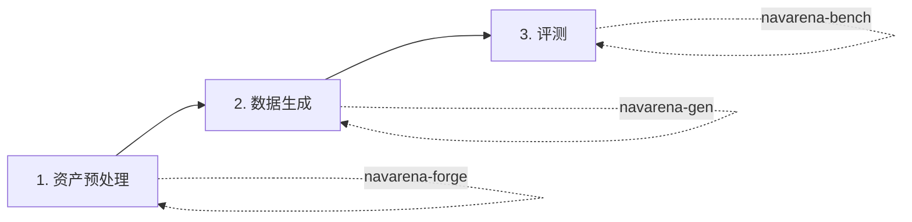

# 快速入门

本教程提供三个模块的**最小可运行示例**，帮助您快速验证环境。详细用法请参阅各模块用户指南。

!!! tip "路径占位符"
    将 `/path/to/scenes/` 或 `/path/to/raw_scenes/` 替换为你的实际数据目录。若需统一管理资产，可使用 `$NAVARENA_DATA_DIR/assets/{dataset}/{scene_id}/`（如 `$NAVARENA_DATA_DIR/assets/x2robot/17dc3367/`）。

## 端到端工作流总览



每步的前置条件依赖上一步产出：原始 PLY → V1 资产 → Episodes → 评测结果。

---

## 资产预处理

**前置条件**：原始 3DGS PLY 文件（如 `{scene_dir}/scene.ply`）。

**命令**：

```bash
cd navarena-forge
python -m navarena_forge run-pipeline \
    --config navarena_forge/configs/pipeline.yaml \
    --scene-dir /path/to/scenes/17dc3367 \
    --source-dataset x2robot
```

**期望输出**：管线**就地写入** `--scene-dir` 指定目录：`aligned.ply`、`nav_map.pgm`、`manifest.json`、`nav_map.yaml`、`nav_mask.png` 等。

!!! note "资产集中管理"
    输出不会自动写入 `$NAVARENA_DATA_DIR/assets/`。若需统一管理，请将场景目录放在 `$NAVARENA_DATA_DIR/assets/` 下并传入对应路径。批量处理见 [资产预处理 CLI](../asset-preprocessing/cli.md)。

---

## 数据生成

**前置条件**：已完成资产预处理（V1 资产），场景在 `$NAVARENA_DATA_DIR/assets/` 下。

**命令**：

```bash
cd navarena-gen
python scripts/generate_data.py --config configs/examples/pointnav_example.yaml
```

**期望输出**：Episodes 和轨迹写入 `$NAVARENA_DATA_DIR/datasets/`（或配置指定的输出路径）。可检查 `meta/episodes.parquet` 和 `data/chunk-*/trajectories.parquet`。

并行生成可使用 `--parallel --num-workers 4 --batch-size 20`。详见 [数据生成器配置](../data-generator/configuration.md)。

---

## 评测

**前置条件**：V1 资产 + 符合 [评测数据格式](../definitions/eval-data-format.md) 的 Episode。

**命令**：

```bash
cd navarena-bench
python -m navarena_bench.scripts.eval --config configs/eval/default_eval.yaml
```

**期望输出**：评测结果写入 `eval_results/`（或配置指定路径）。指标（SR、SPL 等）打印到控制台。

回放视频：`python scripts/replay_eval.py --results eval_results/ --output replay.mp4`。详见 [评测器模块](../navarena-bench/evaluators.md)。

---

!!! tip "下一步"
    - 查看 [用户指南](../guide/) 了解完整工作流
    - 深入 [数据生成器 Pipeline](../data-generator/pipeline.md)、[评测框架](../navarena-bench/)、[扩展指南](../navarena-bench/extending.md)
