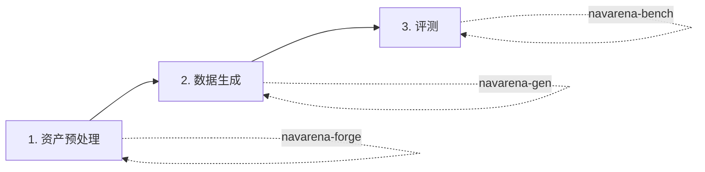

# 用户指南

本指南按 NavArena 的实际工作流组织，帮助您完成从原始场景到评测结果的完整流程。

## 三模块工作流



## 模块入口

| 步骤 | 模块 | 说明 |
|------|------|------|
| 1 | [资产预处理](../asset-preprocessing/) | 将原始 3DGS PLY 转为 V1 统一资产格式 |
| 2 | [数据生成器](../data-generator/) | 在预处理场景中生成 PointNav、VLN 等 Episode 数据 |
| 3 | [评测框架](../navarena-bench/) | 在生成数据上评估导航模型性能 |

## 完整工作流示例

```bash
# 1. 资产预处理（原始 PLY -> V1 格式）
cd navarena-forge
python -m navarena_forge run-pipeline --config navarena_forge/configs/pipeline.yaml \
    --scene-dir /path/to/raw_scenes/17dc3367 --source-dataset x2robot

# 2. 数据生成
cd navarena-gen
python scripts/generate_data.py --config configs/examples/pointnav_example.yaml

# 3. 运行评测
cd navarena-bench
python -m navarena_bench.scripts.eval --config configs/eval/default_eval.yaml

# 4. 生成回放
python scripts/replay_eval.py --results eval_results/ --output replay.mp4
```

## 常见场景

- **快速单场景测试**：数据生成用 `--num-episodes 5`，评测用 `--num-episodes 10`
- **批量预处理**：使用 [CLI batch 命令](../asset-preprocessing/cli.md) 批量处理
- **远程 / ViNT 智能体**：在评测配置中设置 `agent_type: "remote"` 或 `agent_type: "vint"`，详见 [智能体模块](../navarena-bench/agents.md)

!!! tip "下一步"
    根据您的目标选择对应模块的文档深入阅读，或参考 [核心概念](../definitions/concepts.md) 理解整体架构与术语。
