<div class="hero reveal">
  <!-- 底层：网格点阵纹理 -->
  <div class="hero-bg-pattern"></div>
  <!-- 中层：浮动几何体 -->
  <svg class="hero-floating-shapes" xmlns="http://www.w3.org/2000/svg" viewBox="0 0 800 320" preserveAspectRatio="xMidYMid slice">
    <polygon class="float-shape shape-1" points="120,40 150,22 180,40 180,76 150,94 120,76" stroke="rgba(255,255,255,0.15)" stroke-width="1.5" fill="none"/>
    <polygon class="float-shape shape-2" points="620,60 658,38 696,60 696,104 658,126 620,104" stroke="rgba(255,255,255,0.1)" stroke-width="1.5" fill="none"/>
    <polygon class="float-shape shape-3" points="680,180 730,151 780,180 780,238 730,267 680,238" stroke="rgba(255,255,255,0.08)" stroke-width="2" fill="none"/>
    <circle class="float-shape shape-4" cx="80" cy="220" r="35" stroke="rgba(255,255,255,0.08)" stroke-width="1.5" fill="none"/>
    <circle class="float-shape shape-5" cx="400" cy="30" r="20" stroke="rgba(255,255,255,0.12)" stroke-width="1.5" fill="none"/>
  </svg>
  <!-- 上层：导航路径描绘动画 -->
  <svg class="hero-nav-path" xmlns="http://www.w3.org/2000/svg" viewBox="0 0 800 320" preserveAspectRatio="xMidYMid slice">
    <circle cx="100" cy="260" r="4" fill="rgba(255,255,255,0.4)"/>
    <polyline class="draw-path" points="100,260 200,180 320,210 440,140 560,170 680,90" stroke="rgba(255,255,255,0.3)" stroke-width="2" stroke-linecap="round" stroke-linejoin="round" fill="none"/>
    <circle cx="680" cy="90" r="4" fill="rgba(255,255,255,0.6)"/>
  </svg>
  <!-- 内容层 -->
  <div class="hero-content">
    <svg class="hero-logo" xmlns="http://www.w3.org/2000/svg" viewBox="0 0 48 48" width="64" height="64" fill="none">
      <defs><linearGradient id="hl-grad" x1="0" y1="0" x2="48" y2="48" gradientUnits="userSpaceOnUse"><stop offset="0%" stop-color="#ffffff"/><stop offset="100%" stop-color="#b2ebf2"/></linearGradient></defs>
      <polygon points="24,3 42,13.5 42,34.5 24,45 6,34.5 6,13.5" stroke="url(#hl-grad)" stroke-width="2.5" stroke-linejoin="round" fill="none"/>
      <circle cx="13" cy="35" r="2.5" fill="url(#hl-grad)"/>
      <polyline points="13,35 18,26 26,30 35,13" stroke="url(#hl-grad)" stroke-width="2.5" stroke-linecap="round" stroke-linejoin="round" fill="none"/>
      <polyline points="29.5,15 35,13 37,19" stroke="url(#hl-grad)" stroke-width="2.5" stroke-linecap="round" stroke-linejoin="round" fill="none"/>
    </svg>
    <h1>NavArena</h1>
    <p>具身导航基础设施</p>
    <p class="hero-subtitle">资产自动化处理 · 数据生成 · 导航评测</p>
    <div class="hero-buttons">
      <a href="getting-started/installation/" class="md-button md-button--primary">快速开始</a>
      <a href="reference/" class="md-button">API 参考</a>
    </div>
  </div>
</div>

欢迎来到 NavArena 文档！NavArena 提供资产自动化处理、数据生成和导航评测能力，本文档包含完整的使用指南、API 参考和最佳实践。

## 整体工作流

```mermaid
flowchart LR
    classDef data    fill:#EFF6FF,stroke:#3B82F6,stroke-width:1.5px,color:#1E3A5F
    classDef module  fill:#F0FDFA,stroke:#0D9488,stroke-width:1.5px,color:#0F4C43,font-weight:600
    classDef output  fill:#F5F3FF,stroke:#7C3AED,stroke-width:1.5px,color:#3B1F6E

    A["Raw 3DGS Scenes"]:::data --> B["navarena-forge\nAsset Preprocessing"]:::module
    B --> C["Standardized Assets"]:::data
    C --> D["navarena-gen\nData Generator"]:::module
    D --> E["Training/Eval Data"]:::data
    E --> F["navarena-bench\nEvaluation"]:::module
    F --> G["Metrics & Replay"]:::output
```



## 谁应该阅读本文档

- **新用户** → 从 [快速开始](getting-started/installation/) 入手
- **数据工程师** → 关注 [资产预处理](asset-preprocessing/) 与 [数据生成器](data-generator/)
- **研究人员** → 关注 [评测框架](navarena-bench/)
- **开发者** → 查阅 [扩展指南](navarena-bench/extending/) 与 [API 参考](reference/)

## 核心模块

<div class="feature-grid">
  <div class="feature-card reveal">
    <div class="feature-card-icon">
      <svg xmlns="http://www.w3.org/2000/svg" viewBox="0 0 48 48" width="48" height="48" fill="none">
        <defs><linearGradient id="if-grad" x1="0" y1="0" x2="48" y2="48" gradientUnits="userSpaceOnUse"><stop offset="0%" stop-color="#0d47a1"/><stop offset="100%" stop-color="#00bcd4"/></linearGradient></defs>
        <polygon points="24,3 42,13.5 42,34.5 24,45 6,34.5 6,13.5" stroke="url(#if-grad)" stroke-width="2" stroke-linejoin="round" fill="none"/>
        <circle cx="24" cy="24" r="6" stroke="url(#if-grad)" stroke-width="2" fill="none"/><circle cx="24" cy="24" r="2" stroke="url(#if-grad)" stroke-width="1.5" fill="none"/>
        <line x1="24" y1="13" x2="24" y2="16" stroke="url(#if-grad)" stroke-width="2" stroke-linecap="round"/><line x1="24" y1="32" x2="24" y2="35" stroke="url(#if-grad)" stroke-width="2" stroke-linecap="round"/>
        <line x1="13" y1="24" x2="16" y2="24" stroke="url(#if-grad)" stroke-width="2" stroke-linecap="round"/><line x1="32" y1="24" x2="35" y2="24" stroke="url(#if-grad)" stroke-width="2" stroke-linecap="round"/>
        <line x1="15.8" y1="15.8" x2="17.9" y2="17.9" stroke="url(#if-grad)" stroke-width="2" stroke-linecap="round"/><line x1="30.1" y1="30.1" x2="32.2" y2="32.2" stroke="url(#if-grad)" stroke-width="2" stroke-linecap="round"/>
        <line x1="32.2" y1="15.8" x2="30.1" y2="17.9" stroke="url(#if-grad)" stroke-width="2" stroke-linecap="round"/><line x1="17.9" y1="30.1" x2="15.8" y2="32.2" stroke="url(#if-grad)" stroke-width="2" stroke-linecap="round"/>
      </svg>
    </div>
    <h3>资产预处理</h3>
    <p>将原始 3DGS 场景转换为标准化资产，支持坐标归一化、PGM 地图生成、可导航区域估计，提供 V1 统一资产格式与 Web 查看器。</p>
    <a href="asset-preprocessing/">查看文档 →</a>
  </div>
  <div class="feature-card reveal">
    <div class="feature-card-icon">
      <svg xmlns="http://www.w3.org/2000/svg" viewBox="0 0 48 48" width="48" height="48" fill="none">
        <defs><linearGradient id="ig-grad" x1="0" y1="0" x2="48" y2="48" gradientUnits="userSpaceOnUse"><stop offset="0%" stop-color="#0d47a1"/><stop offset="100%" stop-color="#00bcd4"/></linearGradient></defs>
        <polygon points="24,3 42,13.5 42,34.5 24,45 6,34.5 6,13.5" stroke="url(#ig-grad)" stroke-width="2" stroke-linejoin="round" fill="none"/>
        <line x1="16" y1="32" x2="24" y2="20" stroke="url(#ig-grad)" stroke-width="1.5" stroke-linecap="round"/><line x1="24" y1="20" x2="32" y2="26" stroke="url(#ig-grad)" stroke-width="1.5" stroke-linecap="round"/>
        <line x1="32" y1="26" x2="24" y2="32" stroke="url(#ig-grad)" stroke-width="1.5" stroke-linecap="round"/><line x1="16" y1="32" x2="24" y2="32" stroke="url(#ig-grad)" stroke-width="1.5" stroke-linecap="round"/>
        <circle cx="16" cy="32" r="2.5" fill="url(#ig-grad)"/><circle cx="24" cy="20" r="2.5" fill="url(#ig-grad)"/><circle cx="32" cy="26" r="2.5" fill="url(#ig-grad)"/><circle cx="24" cy="32" r="2.5" fill="url(#ig-grad)"/>
        <rect x="20" y="12" width="3" height="5" rx="1" fill="url(#ig-grad)" opacity="0.6"/><rect x="25" y="10" width="3" height="7" rx="1" fill="url(#ig-grad)"/>
      </svg>
    </div>
    <h3>数据生成器</h3>
    <p>支持 PointNav、ImageNav、ObjectNav、VLN 等任务的数据生成，多任务 Pipeline、3D GS 场景渲染与并行 Episode 生成。</p>
    <a href="data-generator/">查看文档 →</a>
  </div>
  <div class="feature-card reveal">
    <div class="feature-card-icon">
      <svg xmlns="http://www.w3.org/2000/svg" viewBox="0 0 48 48" width="48" height="48" fill="none">
        <defs><linearGradient id="ib-grad" x1="0" y1="0" x2="48" y2="48" gradientUnits="userSpaceOnUse"><stop offset="0%" stop-color="#0d47a1"/><stop offset="100%" stop-color="#00bcd4"/></linearGradient></defs>
        <polygon points="24,3 42,13.5 42,34.5 24,45 6,34.5 6,13.5" stroke="url(#ib-grad)" stroke-width="2" stroke-linejoin="round" fill="none"/>
        <circle cx="24" cy="25" r="11" stroke="url(#ib-grad)" stroke-width="1.5" fill="none" opacity="0.5"/><circle cx="24" cy="25" r="7" stroke="url(#ib-grad)" stroke-width="1.5" fill="none" opacity="0.75"/>
        <circle cx="24" cy="25" r="2.5" fill="url(#ib-grad)"/>
        <line x1="24" y1="9" x2="24" y2="18" stroke="url(#ib-grad)" stroke-width="2" stroke-linecap="round"/>
        <polyline points="21,12 24,9 27,12" stroke="url(#ib-grad)" stroke-width="2" stroke-linecap="round" stroke-linejoin="round" fill="none"/>
      </svg>
    </div>
    <h3>评测框架</h3>
    <p>基于 3D Gaussian Splatting 和占据栅格的评测框架，支持多种导航任务与智能体（ViNT、GNM、NoMaD），含回放与可视化。</p>
    <a href="navarena-bench/">查看文档 →</a>
  </div>
</div>

## 快速示例

=== "资产预处理"

    ```bash
    cd navarena-forge
    python -m navarena_forge batch --scenes-root /path/to/scenes \
        --config pipeline.yaml --source-dataset InteriorGS
    ```

=== "数据生成"

    ```bash
    cd navarena-gen
    python scripts/generate_data.py --config configs/examples/pointnav_example.yaml

    # 并行生成
    python scripts/generate_data.py --config configs/examples/vln_zh_example.yaml \
        --parallel --num-workers 4 --batch-size 20
    ```

=== "评测"

    ```bash
    cd navarena-bench
    # 运行评测
    python -m navarena_bench.scripts.eval --config configs/eval/default_eval.yaml

    # 生成回放视频
    python scripts/replay_eval.py --results eval_results/ --output replay.mp4
    ```

## 获取帮助

- 查阅本文档及各模块 README
- 在 GitHub 提交 [Issue](https://github.com/EI-Nav/NavArena-Doc/issues)

## 参与贡献

1. Fork 本仓库
2. 创建功能分支
3. 提交更改并发起 Pull Request

---

!!! tip "下一步"
    从 [安装指南](getting-started/installation/) 开始，或查看 [快速入门](getting-started/quickstart/) 快速上手。
