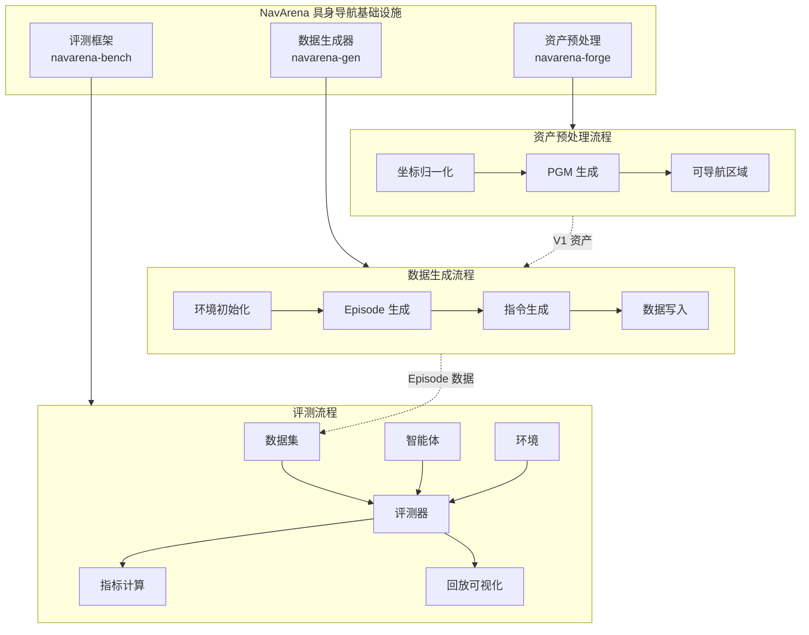

<div class="hero reveal">
  <div class="hero-content">
    <h1>NavArena</h1>
    <p>具身导航基础设施</p>
    <p class="hero-subtitle">资产自动化处理 · 数据生成 · 导航评测</p>
    <div class="hero-buttons">
      <a href="getting-started/installation/" class="md-button md-button--primary">快速开始</a>
      <a href="api/reference/" class="md-button">API 参考</a>
    </div>
  </div>
</div>

欢迎来到 NavArena 具身导航基础设施的开发者文档！NavArena 提供资产自动化处理、数据生成和导航评测基础设施，本文档包含完整的使用指南、API 参考和最佳实践。

## 核心模块

<div class="feature-grid">
  <div class="feature-card reveal">
    <div class="feature-card-icon">🔧</div>
    <h3>资产预处理</h3>
    <p>将原始 3DGS 场景转换为标准化资产，支持坐标归一化、PGM 地图生成、可导航区域估计，提供 V1 统一资产格式与 Web 查看器。</p>
    <a href="asset-preprocessing/overview/">查看文档 →</a>
  </div>
  <div class="feature-card reveal">
    <div class="feature-card-icon">📊</div>
    <h3>数据生成器</h3>
    <p>支持 PointNav、ImageNav、ObjectNav、VLN 等任务的数据生成，多任务 Pipeline、3D GS 场景渲染与并行 Episode 生成。</p>
    <a href="data-generator/overview/">查看文档 →</a>
  </div>
  <div class="feature-card reveal">
    <div class="feature-card-icon">🎯</div>
    <h3>评测框架</h3>
    <p>基于 3D Gaussian Splatting 和占据栅格的评测框架，支持多种导航任务与智能体（ViNT、GNM、NoMaD），含回放与可视化。</p>
    <a href="navarena-bench/overview/">查看文档 →</a>
  </div>
</div>

## 文档结构

### 快速开始

如果您是第一次使用 NavArena，建议从这里开始：

- **[安装指南](getting-started/installation/)** - 了解如何安装和配置各模块
- **[快速入门](getting-started/quickstart/)** - 通过简单示例快速上手

### 规范定义

了解项目的数据格式规范：

- **[核心概念](definitions/concepts/)** - 术语、工作流与目录结构全景
- **[3D GS 资产规范](definitions/gs-assets/)** - 3D Gaussian Splatting 场景资产的统一格式定义
- **[导航训练数据格式](definitions/nav-data-format/)** - 训练数据的目录结构与 Episode 格式
- **[导航评测数据格式](definitions/eval-data-format/)** - 评测数据的 Episode 与轨迹格式

### 资产预处理 · 数据生成器 · 评测框架

详细文档入口： [资产预处理概述](asset-preprocessing/overview/) · [数据生成器概述](data-generator/overview/) · [评测框架概述](navarena-bench/overview/)

### API 参考

- **[API 文档](api/reference/)** - 通用 API 参考手册
- **[数据生成器 API](api/data-generator-api/)** - 数据生成器 API 文档
- **[评测框架 API](api/navarena-bench-api/)** - 评测框架 API 文档

## 项目架构



## 特性亮点

!!! success "核心特性"
    - **模块化设计** - 易于扩展和维护
    - **高质量渲染** - 基于 3D Gaussian Splatting
    - **基础设施工具链** - 资产处理、数据生成、模型评测全覆盖
    - **丰富的文档** - 详细的 API 和使用指南
    - **可扩展架构** - 注册机制驱动，易于集成新环境、任务和智能体

## 快速示例

=== "资产预处理"

    ```bash
    cd navarena-forge
    python -m navarena_forge batch --scenes-root /path/to/scenes \
        --config pipeline.yaml --source-dataset InteriorGS
    ```

=== "数据生成"

    ```bash
    cd navarena-gen
    python scripts/generate_data.py --config configs/examples/pointnav_example.yaml

    # 并行生成
    python scripts/generate_data.py --config configs/examples/vln_zh_example.yaml \
        --parallel --num-workers 4
    ```

=== "评测"

    ```bash
    cd navarena-bench
    # 运行评测
    python scripts/eval.py --config configs/eval/default_eval.yaml

    # 生成回放视频
    python scripts/replay_eval.py --results eval_results/ --output replay.mp4
    ```

## 获取帮助与贡献

如果您在使用过程中遇到问题，可以通过以下方式获取帮助：

- 查阅本文档的相关章节
- 查看项目的 README 文件
- 在 GitHub 上提交 Issue
- 联系项目维护者

我们欢迎社区贡献！如果您发现文档中的错误或希望添加新内容，请 Fork 本仓库、创建特性分支、提交更改并发起 Pull Request。

## 相关项目

- **navarena-forge** - 资产预处理 Pipeline
- **navarena-gen** - 数据生成工具
- **navarena-bench** - 评测框架
- **visualnav-transformer** - ViNT/GNM/NoMaD 模型支持

---

准备好了吗？让我们从[安装指南](getting-started/installation/)开始吧！
