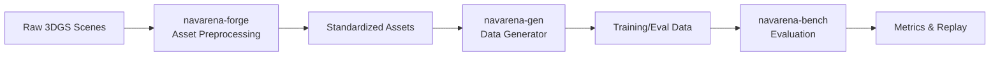

<div class="hero reveal">
  <div class="hero-content">
    <h1>NavArena</h1>
    <p>具身导航基础设施</p>
    <p class="hero-subtitle">资产自动化处理 · 数据生成 · 导航评测</p>
    <div class="hero-buttons">
      <a href="getting-started/installation/" class="md-button md-button--primary">快速开始</a>
      <a href="reference/" class="md-button">API 参考</a>
    </div>
  </div>
</div>

欢迎来到 NavArena 文档！NavArena 提供资产自动化处理、数据生成和导航评测能力，本文档包含完整的使用指南、API 参考和最佳实践。

## 整体工作流



## 谁应该阅读本文档

- **新用户** → 从 [快速开始](getting-started/installation/) 入手
- **数据工程师** → 关注 [资产预处理](asset-preprocessing/) 与 [数据生成器](data-generator/)
- **研究人员** → 关注 [评测框架](navarena-bench/)
- **开发者** → 查阅 [扩展指南](navarena-bench/extending/) 与 [API 参考](reference/)

## 核心模块

<div class="feature-grid">
  <div class="feature-card reveal">
    <div class="feature-card-icon">🔧</div>
    <h3>资产预处理</h3>
    <p>将原始 3DGS 场景转换为标准化资产，支持坐标归一化、PGM 地图生成、可导航区域估计，提供 V1 统一资产格式与 Web 查看器。</p>
    <a href="asset-preprocessing/">查看文档 →</a>
  </div>
  <div class="feature-card reveal">
    <div class="feature-card-icon">📊</div>
    <h3>数据生成器</h3>
    <p>支持 PointNav、ImageNav、ObjectNav、VLN 等任务的数据生成，多任务 Pipeline、3D GS 场景渲染与并行 Episode 生成。</p>
    <a href="data-generator/">查看文档 →</a>
  </div>
  <div class="feature-card reveal">
    <div class="feature-card-icon">🎯</div>
    <h3>评测框架</h3>
    <p>基于 3D Gaussian Splatting 和占据栅格的评测框架，支持多种导航任务与智能体（ViNT、GNM、NoMaD），含回放与可视化。</p>
    <a href="navarena-bench/">查看文档 →</a>
  </div>
</div>

## 快速示例

=== "资产预处理"

    ```bash
    cd navarena-forge
    python -m navarena_forge batch --scenes-root /path/to/scenes \
        --config pipeline.yaml --source-dataset InteriorGS
    ```

=== "数据生成"

    ```bash
    cd navarena-gen
    python scripts/generate_data.py --config configs/examples/pointnav_example.yaml

    # 并行生成
    python scripts/generate_data.py --config configs/examples/vln_zh_example.yaml \
        --parallel --num-workers 4 --batch-size 20
    ```

=== "评测"

    ```bash
    cd navarena-bench
    # 运行评测
    python -m navarena_bench.scripts.eval --config configs/eval/default_eval.yaml

    # 生成回放视频
    python scripts/replay_eval.py --results eval_results/ --output replay.mp4
    ```

## 获取帮助

- 查阅本文档及各模块 README
- 在 GitHub 提交 [Issue](https://github.com/EI-Nav/NavArena-Doc/issues)

## 参与贡献

1. Fork 本仓库
2. 创建功能分支
3. 提交更改并发起 Pull Request

---

!!! tip "下一步"
    从 [安装指南](getting-started/installation/) 开始，或查看 [快速入门](getting-started/quickstart/) 快速上手。
