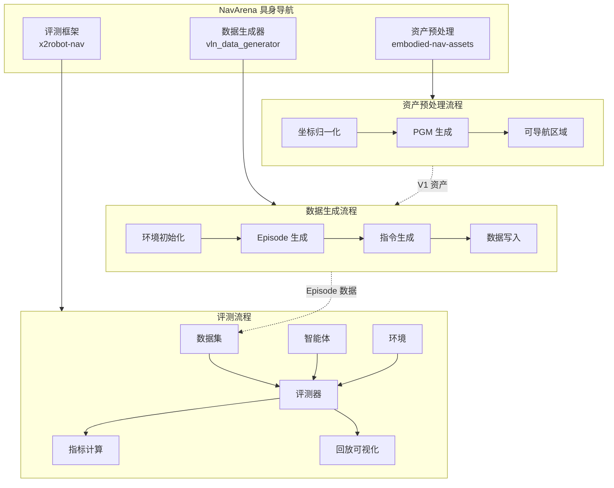

<div class="hero reveal">
  <div class="hero-content">
    <h1>NavArena</h1>
    <p>具身导航全栈解决方案</p>
    <div class="hero-buttons">
      <a href="getting-started/installation/" class="md-button md-button--primary">快速开始</a>
      <a href="api/reference/" class="md-button">API 参考</a>
    </div>
  </div>
</div>

欢迎来到 NavArena 具身导航项目的开发者文档！本文档提供了完整的项目指南、API 参考和最佳实践。

## 核心模块

<div class="feature-grid">
  <div class="feature-card reveal">
    <div class="feature-card-icon">🔧</div>
    <h3>资产预处理</h3>
    <p>将原始 3DGS 场景转换为标准化资产，支持坐标归一化、PGM 地图生成、可导航区域估计，提供 V1 统一资产格式与 Web 查看器。</p>
    <a href="asset-preprocessing/overview.md">查看文档 →</a>
  </div>
  <div class="feature-card reveal">
    <div class="feature-card-icon">📊</div>
    <h3>数据生成器</h3>
    <p>支持 PointNav、ImageNav、ObjectNav、VLN 等任务的数据生成，多任务 Pipeline、3D GS 场景渲染与并行 Episode 生成。</p>
    <a href="data-generator/overview.md">查看文档 →</a>
  </div>
  <div class="feature-card reveal">
    <div class="feature-card-icon">🎯</div>
    <h3>评测框架</h3>
    <p>基于 3D Gaussian Splatting 和占据栅格的评测框架，支持多种导航任务与智能体（ViNT、GNM、NoMaD），含回放与可视化。</p>
    <a href="x2robot-nav/overview.md">查看文档 →</a>
  </div>
</div>

## 文档结构

### 快速开始

如果您是第一次使用 NavArena，建议从这里开始：

- **[安装指南](getting-started/installation.md)** - 了解如何安装和配置两个项目
- **[快速入门](getting-started/quickstart.md)** - 通过简单示例快速上手

### 规范定义

了解项目的数据格式规范：

- **[3D GS 资产规范](definitions/gs-assets.md)** - 3D Gaussian Splatting 场景资产的统一格式定义
- **[具身导航训练数据格式](definitions/nav-data-format.md)** - 训练数据的目录结构与 Episode 格式
- **[具身导航评测数据格式](definitions/eval-data-format.md)** - 评测数据的 Episode 与轨迹格式

### 资产预处理 · 数据生成器 · 评测框架

详细文档入口： [资产预处理概述](asset-preprocessing/overview.md) · [数据生成器概述](data-generator/overview.md) · [评测框架概述](x2robot-nav/overview.md)

### API 参考

- **[API 文档](api/reference.md)** - 通用 API 参考手册
- **[数据生成器 API](api/data-generator-api.md)** - 数据生成器 API 文档
- **[评测框架 API](api/x2robot-nav-api.md)** - 评测框架 API 文档

## 项目架构



## 特性亮点

!!! success "核心特性"
    - **模块化设计** - 易于扩展和维护
    - **高质量渲染** - 基于 3D Gaussian Splatting
    - **完整工具链** - 从数据生成到模型评测
    - **丰富的文档** - 详细的 API 和使用指南
    - **活跃的社区** - 持续更新和维护

## 快速示例

=== "资产预处理"

    ```bash
    cd embodied-nav-assets
    python -m gs_asset_normalizer batch --scenes-root /path/to/scenes \
        --config pipeline.yaml --source-dataset InteriorGS
    ```

=== "数据生成"

    ```bash
    cd vln_data_generator
    python scripts/generate_data.py --config configs/examples/pointnav_example.yaml

    # 并行生成
    python scripts/generate_data.py --config configs/examples/vln_zh_example.yaml \
        --parallel --num-workers 4
    ```

=== "评测"

    ```bash
    # 运行评测
    python scripts/eval.py --config configs/eval/default_eval.yaml

    # 生成回放视频
    python scripts/replay_eval.py --results eval_results/ --output replay.mp4
    ```

## 获取帮助与贡献

如果您在使用过程中遇到问题，可以通过以下方式获取帮助：

- 查阅本文档的相关章节
- 查看项目的 README 文件
- 在 GitHub 上提交 Issue
- 联系项目维护者

我们欢迎社区贡献！如果您发现文档中的错误或希望添加新内容，请 Fork 本仓库、创建特性分支、提交更改并发起 Pull Request。

## 相关项目

- **embodied-nav-assets** - 资产预处理 Pipeline
- **vln_data_generator** - 数据生成工具
- **x2robot-nav** - 评测框架
- **visualnav-transformer** - ViNT/GNM/NoMaD 模型支持

---

准备好了吗？让我们从[安装指南](getting-started/installation.md)开始吧！
