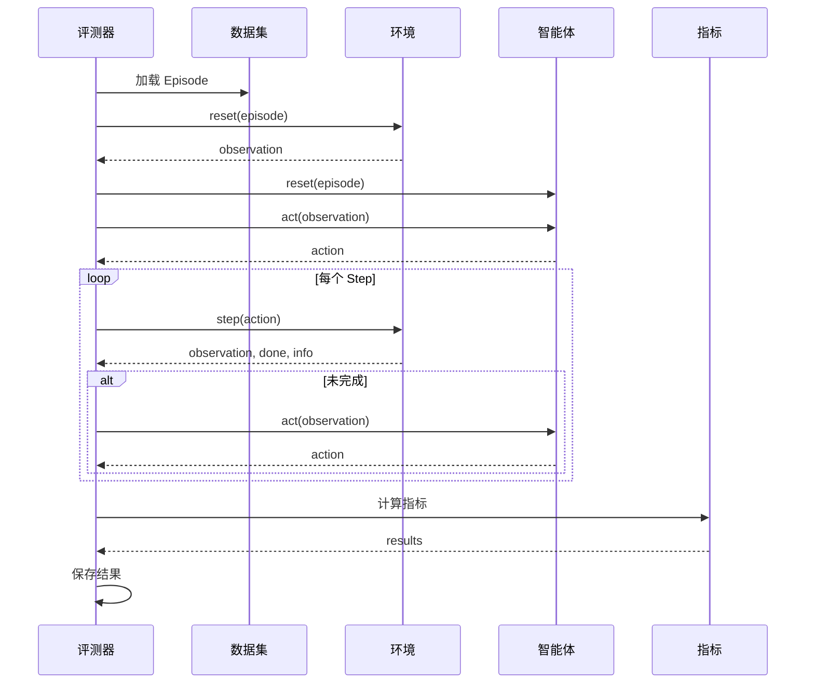

# 评测器模块

评测器模块负责协调环境、智能体和数据集进行评测，计算评测指标并保存结果。

## 概述

评测器是评测框架的核心组件，负责：

- **管理评测流程** - 协调环境、智能体和数据集
- **执行评测循环** - 运行 episode 并收集数据
- **计算指标** - 计算成功率、路径长度比等指标
- **保存结果** - 保存评测结果和轨迹数据

## 评测器类型

### PointNavEvaluator

点目标导航评测器，评测模型到达指定 3D 位置的能力。

#### 配置

```yaml
eval_type: "pointnav"

task:
  task_type: "pointnav"
  task_settings:
    success_distance: 0.5  # 成功距离（米）
```

#### Episode 格式

```json
{
  "episode_id": "001",
  "scene_path": "x2robot/17dc3367",
  "task_type": "pointnav",
  "start_state": {
    "position": [0.0, 0.0, 0.0],
    "rotation": [0.0, 0.0, 0.0, 1.0]
  },
  "goals": [
    {
      "goal_type": "position",
      "position": [5.0, 0.0, 0.0],
      "rotation": [0.0, 0.0, 0.383, 0.924]
    }
  ]
}
```

#### 评测指标

- **Success Rate (SR)**: 成功率
- **Success weighted by Path Length (SPL)**: 路径长度加权成功率
- **Navigation Error (NE)**: 导航误差

### ObjectNavEvaluator

物体目标导航评测器，评测模型找到指定类别物体的能力。

#### 配置

```yaml
eval_type: "objectnav"

task:
  task_type: "objectnav"
  task_settings:
    success_distance: 0.5
    object_categories: ["bed", "chair", "table"]
```

#### Episode 格式

```json
{
  "episode_id": "001",
  "scene_path": "x2robot/17dc3367",
  "task_type": "objectnav",
  "start_state": {
    "position": [0.0, 0.0, 0.0],
    "rotation": [0.0, 0.0, 0.0, 1.0]
  },
  "goals": [
    {
      "goal_type": "object",
      "object_category": "bed",
      "object_id": "bed_0",
      "position": [5.0, 0.0, 0.0]
    }
  ]
}
```

### ImageNavEvaluator

图像目标导航评测器，评测模型根据目标图像导航的能力。

#### 配置

```yaml
eval_type: "imagenav"

task:
  task_type: "imagenav"
  task_settings:
    success_distance: 0.5
    success_angle: 0.5  # 成功角度（弧度）
```

#### Episode 格式

```json
{
  "episode_id": "001",
  "scene_path": "x2robot/17dc3367",
  "task_type": "imagenav",
  "start_state": {
    "position": [-6.0, -1.58, 0.0],
    "rotation": [0.0, 0.0, 0.383, 0.924]
  },
  "goals": [
    {
      "goal_type": "image",
      "image_goal": {
        "image_path": "goal_images/train_000001_goal.jpg"
      },
      "position": [-0.9, -0.5, 0.0],
      "rotation": [0.0, 0.0, -0.383, 0.924]
    }
  ]
}
```

### VLNEvaluator

视觉语言导航评测器，评测模型根据自然语言指令导航的能力。

#### 配置

```yaml
eval_type: "vln"

task:
  task_type: "languagenav"

agent:
  agent_type: "language_nav"
  model_settings:
    waypoint_tolerance: 0.3
    voronoi_closeness: 0.5
```

#### VLN Episode 格式

VLN 任务需要 `instructions` 字段，格式为对象数组：

```json
{
  "episode_id": "001",
  "scene_path": "x2robot/17dc3367",
  "task_type": "vln",
  "start_state": {
    "position": [0.0, 0.0, 0.0],
    "rotation": [0.0, 0.0, 0.0, 1.0]
  },
  "instructions": [
    {
      "instruction_text": "向东北方向走约 8 米",
      "language": "zh-CN"
    }
  ],
  "goals": [
    {
      "goal_type": "position",
      "position": [5.0, 3.0, 0.0]
    }
  ]
}
```

## 评测流程



## 评测配置

### 完整配置示例

```yaml
eval_type: "pointnav"

# 环境配置
env:
  env_type: "gs"
  env_settings:
    scene_dir: "/path/to/scenes"
    camera_config: "/path/to/camera.yaml"
    enable_occupancy: true
    success_distance: 0.5
    gpu_id: null
    enable_depth: true
    enable_rgb: true
    camera_names: ["face", "left", "right"]
    image_width: 640
    image_height: 480

# 智能体配置
agent:
  agent_type: "local"
  model_path: "/path/to/model.pth"
  model_settings: {}
  device: null

# 任务配置
task:
  task_type: "pointnav"
  task_settings:
    success_distance: 0.5

# 数据集配置
dataset:
  dataset_type: "episode"
  dataset_path: "navarena_data/episodes.json"
  shuffle: false

# 评测设置
eval_settings:
  num_episodes: 100
  output_path: "./eval_results"
  max_steps_per_episode: 500
  save_trajectories: false
  save_video: false
```

## 运行评测

### 命令行运行

```bash
python -m navarena_bench.scripts.eval --config configs/eval/default_eval.yaml
```

### 覆盖配置参数

```bash
python scripts/eval.py \
    --config configs/eval/default_eval.yaml \
    --num-episodes 50 \
    --output-dir ./my_results
```

### Python API

```python
from navarena_bench.evaluator import Evaluator
from navarena_bench.configs.eval_config import EvalCfg
import yaml

# 加载配置
with open("configs/eval/default_eval.yaml", "r") as f:
    config_dict = yaml.safe_load(f)

config = EvalCfg(**config_dict)

# 创建评测器
evaluator = Evaluator.init(config)

# 运行评测
results = evaluator.evaluate()

# 查看结果
print(f"Success Rate: {results['success_rate']:.2%}")
print(f"SPL: {results['spl']:.2%}")
```

## 评测结果

### 结果格式

评测完成后，结果保存在输出目录：

```
eval_results/
├── results.json           # 总体结果
├── episode_results.json   # 每个 episode 的详细结果
└── trajectories/          # 轨迹数据（如果保存）
    ├── episode_001.json
    └── ...
```

### 总体结果

```json
{
  "num_episodes": 100,
  "success_rate": 0.75,
  "spl": 0.68,
  "navigation_error": 0.32,
  "avg_path_length": 4.5,
  "avg_geodesic_distance": 3.2,
  "avg_num_steps": 45
}
```

### Episode 结果

```json
{
  "episode_id": "001",
  "scene_path": "scene_001",
  "success": true,
  "path_length": 4.2,
  "geodesic_distance": 3.0,
  "final_distance": 0.3,
  "num_steps": 42,
  "status": "success"
}
```

## 指标说明

### Success Rate (SR)

成功率，定义为成功到达目标的 episode 比例。

```
SR = (成功 episode 数) / (总 episode 数)
```

### Success weighted by Path Length (SPL)

路径长度加权成功率，考虑路径效率。

```
SPL = (1/N) * Σ(S_i * L_i / max(L_i, G_i))

其中：
- N: 总 episode 数
- S_i: Episode i 是否成功（1 或 0）
- L_i: Episode i 的实际路径长度
- G_i: Episode i 的最短路径长度
```

### Navigation Error (NE)

导航误差，定义为最终位置到目标的平均距离。

```
NE = (1/N) * Σ(distance_to_goal_i)
```

## 自定义评测器

### 实现自定义评测器

```python
from navarena_bench.evaluator.base import Evaluator
from navarena_bench.configs.eval_config import EvalCfg

@Evaluator.register("my_eval")
class MyEvaluator(Evaluator):
    def __init__(self, config: EvalCfg):
        super().__init__(config)
        # 初始化
        
    def eval_episode(self, episode):
        """评测单个 episode"""
        # 实现评测逻辑
        result = {
            "episode_id": episode["episode_id"],
            "success": True,
            "metric1": 0.5,
            "metric2": 0.8
        }
        return result
```

### 使用自定义评测器

```yaml
eval_type: "my_eval"
```

```python
# 确保导入自定义评测器类
import my_evaluator_module

evaluator = Evaluator.init(config)
```

## 常见问题

!!! question "评测速度慢"
    减少 `num_episodes` 或 `max_steps_per_episode`，禁用轨迹保存。

!!! question "内存不足"
    禁用轨迹保存 (`save_trajectories: false`)，减少并行度。

!!! question "指标计算错误"
    检查任务配置是否正确，确保 `success_distance` 设置合理。

!!! question "Episode 格式错误"
    验证 episode JSON 格式，确保必需字段存在。

!!! tip "下一步"
    - 了解 **[回放模块](replay.md)** 的功能
    - 学习如何 **[扩展框架](extending.md)**
    - 查看 **[环境模块](environment.md)** 的详细说明
