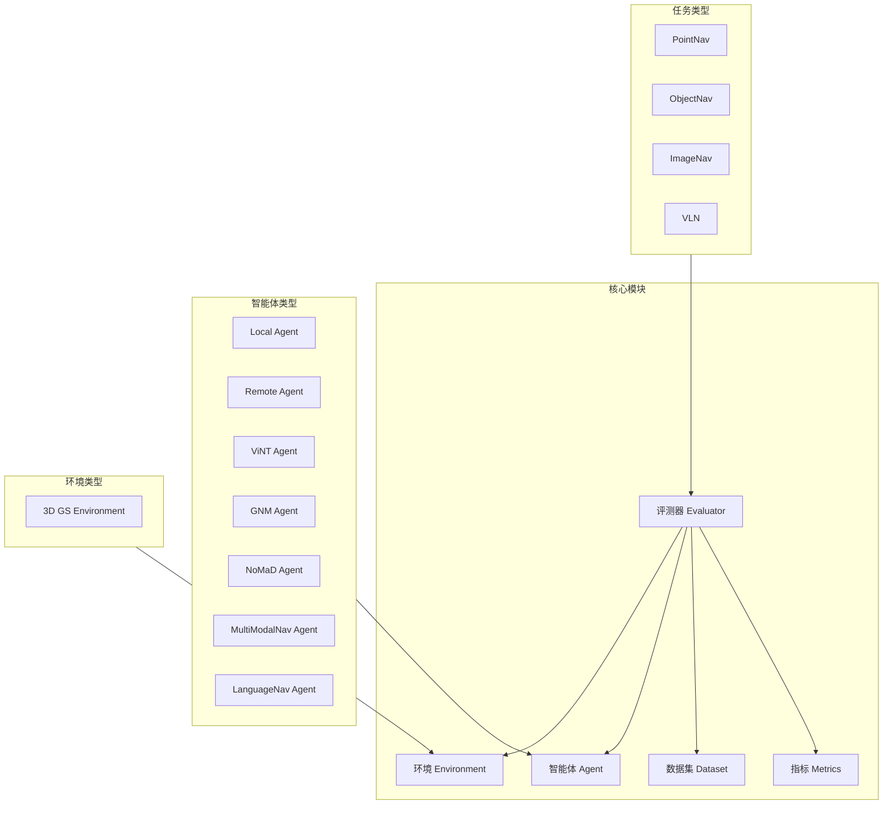
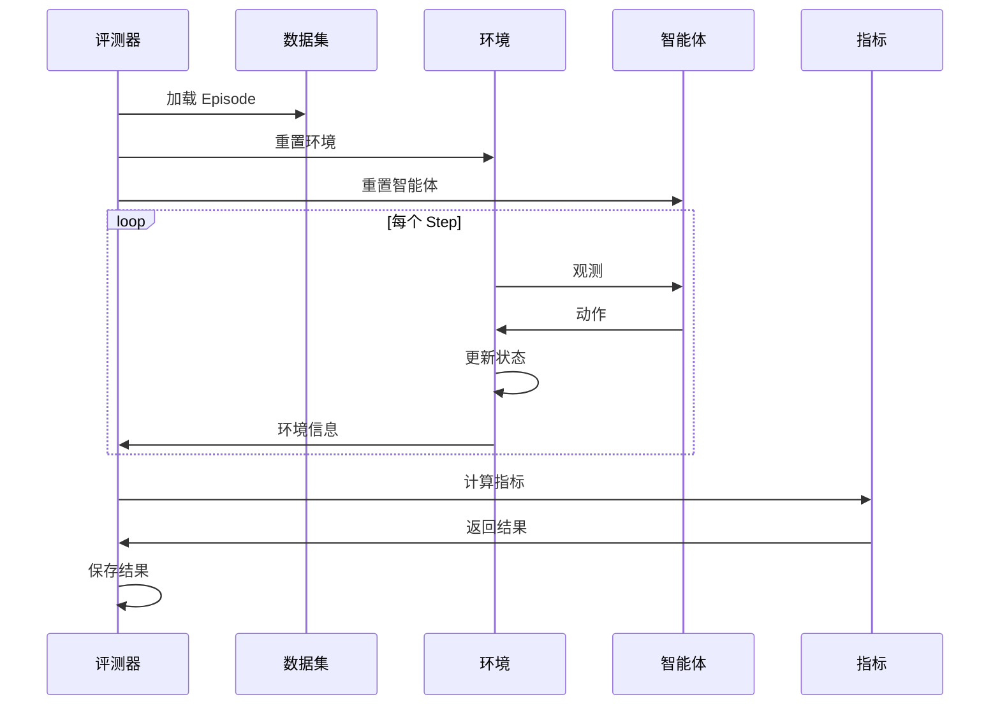

# 评测框架概述

navarena-bench 是一个基于 3D Gaussian Splatting 和占据栅格的导航模型评测框架。它提供了模块化、可扩展的评测系统，支持多种导航任务和智能体类型。

!!! info "前提条件"
    运行评测前需准备：① V1 格式场景资产（位于 `$NAVARENA_DATA_DIR/assets/`）；② 符合 [评测数据格式](../definitions/eval-data-format.md) 的 Episode 数据。

## 核心特性

评测框架提供以下核心特性：

- **模块化设计** - 采用注册机制，易于扩展新的环境、任务、评测器、智能体和指标
- **3D GS 渲染** - 基于 gsplat 进行高质量渲染
- **碰撞检测** - 基于占据栅格地图进行碰撞检测
- **多任务支持** - 支持 PointNav、ObjectNav、ImageNav、VLN 等任务
- **多智能体支持** - 支持 Local、Remote、ViNT、GNM、NoMaD、MultiModalNav、LanguageNav 等智能体
- **回放可视化** - 支持评测结果回放和可视化

## 架构设计



## 核心组件

### 评测器 (Evaluator)

评测器是框架的核心，负责协调环境、智能体和数据集进行评测。

**主要功能：**
- 管理评测流程
- 协调环境、智能体和数据集
- 计算评测指标
- 记录评测结果

**支持的评测器：**
- `PointNavEvaluator` - 点目标导航评测
- `ObjectNavEvaluator` - 物体目标导航评测
- `ImageNavEvaluator` - 图像目标导航评测
- `VLNEvaluator` - 视觉语言导航评测

### 环境 (Environment)

环境提供导航仿真的接口，包括渲染和碰撞检测。

**主要功能：**
- 3D GS 场景渲染
- 占据栅格碰撞检测
- 机器人状态管理
- 目标验证

**支持的环境：**
- `GaussianSplattingEnv` - 3D GS 环境

### 智能体 (Agent)

智能体是导航模型的接口，支持多种实现方式。

**主要功能：**
- 接收环境观测
- 生成导航动作
- 管理模型状态

**支持的智能体：**
- `LocalAgent` - 本地模型智能体
- `RemoteAgent` - 远程服务智能体
- `ViNTAgent` - ViNT 模型智能体
- `GNMAgent` - GNM 模型智能体
- `NoMaDAgent` - NoMaD 模型智能体
- `MultiModalNavAgent` - 多模态导航智能体（支持语言/图像/物体目标）
- `LanguageNavAgent` - 语言导航智能体（基于 Voronoi 路径规划）

### 数据集 (Dataset)

数据集管理评测用的 episode 数据。

**主要功能：**
- 加载 episode 数据
- 数据格式验证
- 数据迭代

**支持的数据集：**
- `EpisodeDataset` - Episode 格式数据集

### 指标 (Metrics)

指标计算导航性能指标。

**主要功能：**
- 计算成功率 (SR)
- 计算路径长度比 (SPL)
- 计算导航效率 (NE)

**支持的指标：**
- `NavigationMetrics` - 导航指标

## 数据流



## 注册机制

框架采用装饰器注册机制，可以轻松扩展新组件：

### 注册环境

```python
from navarena_bench.env.base import Env

@Env.register("my_env")
class MyEnvironment(Env):
    def __init__(self, env_config, task_config):
        super().__init__(env_config, task_config)
    # ... 实现接口方法
```

### 注册智能体

```python
from navarena_bench.agent.base import Agent

@Agent.register("my_agent")
class MyAgent(Agent):
    def __init__(self, config):
        super().__init__(config)
    # ... 实现接口方法
```

### 注册评测器

```python
from navarena_bench.evaluator.base import Evaluator

@Evaluator.register("my_eval")
class MyEvaluator(Evaluator):
    def __init__(self, config):
        super().__init__(config)
    # ... 实现接口方法
```

## Episode 数据格式

评测框架使用标准的 Episode JSON 格式：

```json
{
  "episodes": [
    {
      "episode_id": "train_000001",
      "scene_path": "x2robot/17dc3367",
      "task_type": "pointnav",
      "start_state": {
        "position": [0.0, 0.0, 0.0],
        "rotation": [0.0, 0.0, 0.0, 1.0]
      },
      "goals": [
        {
          "goal_type": "position",
          "position": [5.0, 0.0, 0.0],
          "rotation": [0.0, 0.0, 0.383, 0.924]
        }
      ]
    }
  ]
}
```

**字段说明：**
- `episode_id`: Episode 唯一标识符
- `scene_path`: 场景路径（相对于 `$NAVARENA_DATA_DIR/assets/`）
- `task_type`: 任务类型（pointnav | imagenav | objectnav | vln）
- `start_state`: 起始状态，四元数格式 `[qx, qy, qz, qw]`
- `goals`: 目标列表，需包含 `goal_type`（position | image | object）

## 评测配置

评测通过 YAML 配置文件进行配置：

```yaml
eval_type: "pointnav"

env:
  env_type: "gs"
  env_settings:
    camera_config: "${NAVARENA_DATA_DIR}/shared/camera.yaml"
    enable_occupancy: true
    success_distance: 0.5

agent:
  agent_type: "local"
  model_settings: {}
  device: null

task:
  task_type: "pointnav"

dataset:
  dataset_type: "episode"
  dataset_path: "$NAVARENA_DATA_DIR/datasets/navarena_dataset_v1/x2robot/17dc3367/pointnav"

eval_settings:
  num_episodes: 100
  output_path: "./eval_results"
  max_steps_per_episode: 500
```

## 使用流程

### 1. 准备数据

创建符合格式的 episode 数据集。

### 2. 配置评测

编辑评测配置文件。

### 3. 运行评测

```bash
python -m navarena_bench.scripts.eval --config configs/eval/default_eval.yaml
```

### 4. 查看结果

评测结果保存在输出目录，包含：
- 评测指标 JSON 文件
- 轨迹数据（可选）
- 回放数据（可选）

### 5. 生成回放

```bash
python scripts/replay_eval.py --results eval_results/ --output replay.mp4
```

## 扩展性

框架设计为高度可扩展：

- **新环境**: 继承 `Env` 基类并注册
- **新智能体**: 继承 `Agent` 基类并注册
- **新评测器**: 继承 `Evaluator` 基类并注册
- **新指标**: 继承 `Metric` 基类并注册
- **新回放器**: 继承 `BaseReplayer` 基类并注册

!!! tip "下一步"
    - 了解 **[环境模块](environment.md)** 的详细说明
    - 学习如何配置 **[智能体模块](agents.md)**
    - 查看 **[评测器模块](evaluators.md)** 的使用方法
    - 了解 **[回放模块](replay.md)** 的功能
    - 学习如何 **[扩展框架](extending.md)**
